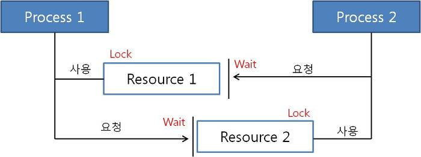
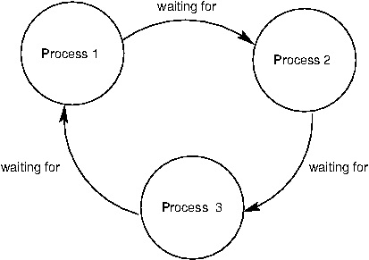
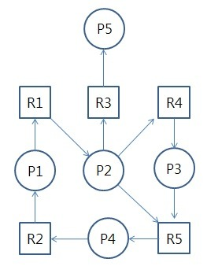
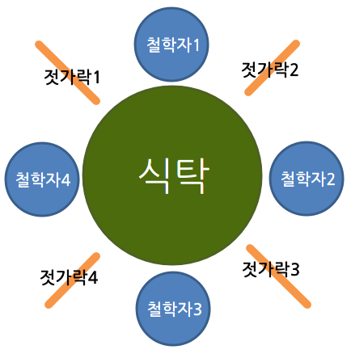

# day10-2 DeadLock(교착 상태)

## 1. DeadLock(교착 상태)
- 여러 프로세스(혹은 스레드)가 서로 상대방이 가진 자원을 기다림
=> 어느 쪽도 작업을 진행하지 못하는 상태

```text
(ex)
1. P1이 R1을 획득한다.
2. P2가 R2를 획득한다.
3. P1은 R2를 요청하지만 P2가 사용 중이므로 대기한다.
4. P2는 R1을 요청하지만 P1이 사용 중이므로 대기한다.
P1: R1 보유 → R2 대기
P2: R2 보유 → R1 대기

P1과 P2가 서로 자원을 반환하기만을 기다리므로 두 프로세스는 더 이상 진행할 수 없다.
```


## 2. 교착 상태 발생 조건
- 아래 네 가지 조건이 `동시에 성립할 때` 발생
=> 교착 상태의 필요조건(코프만 조건; Coffman Conditions)

### 2.1. 상호 배제(Mutual Exclusion)
- 하나의 자원은 한 번에 하나의 프로세스만 사용할 수 있음
- 여러 프로세스가 동시에 사용할 수 있는 자원이라면 해당 자원 때문에 교착 상태가 발생하지 않음

### 2.2. 점유 대기(Hold and Wait)
- 프로세스가 하나 이상의 자원을 보유한 상태에서 다른 프로세스가 가진 자원을 추가로 요청하며 기다림

### 2.3. 비선점(No Preemption)
- 다른 프로세스가 사용 중인 자원을 강제로 빼앗을 수 없다.
- 자원은 해당 프로세스가 사용을 마치고 스스로 반환해야 함

### 2.4. 순환 대기(Circular Wait)
- 프로세스들이 원형으로 서로의 자원을 기다림


> 네 가지 조건은 교착 상태가 발생하기 위한 필요조건임. 이 중 하나라도 성립하지 못하도록 만들면 교착 상태를 예방할 수 있음

## 3. 교착 상태 처리 방법
### 3.1. 교착 상태 예방(Prevention)
- 교착 상태의 네 가지 발생 조건 중 하나가 성립하지 못하도록 미리 제한하는 방법
- 교착 상태를 확실하게 막을 수 있지만, 자원 이용률과 시스템의 동시 처리 성능이 낮아질 수 있음

#### 상호 배제 제거
- 하나의 자원을 여러 프로세스가 동시에 사용하도록 만듦
- 동시에 사용할 수 없는 자원(프린터, 파일 쓰기 등)도 있으므로 모든 경우에 적용할 수 없음

#### 점유 대기 제거
- 프로세스가 실행되기 전에 필요한 모든 자원을 한꺼번에 할당받도록 함
```text
필요한 자원을 모두 획득 → 작업 시작
하나라도 획득 실패 → 모든 자원을 기다림
```
- 문제점
    - 당장 사용하지 않는 자원까지 미리 점유
    - 필요한 자원을 모두 얻을 때까지 실행 못함
    - 자원 이용률이 낮아질 수 있음

#### 비선점 제거
- 프로세스가 새로운 자원을 얻지 못하면 현재 보유한 자원을 반납하도록 함
```text
P1이 R1 보유 → R2 요청 실패 → R1 반납 → R1과 R2를 다시 요청
```
- CPU나 메모리처럼 상태를 저장하고 복구할 수 있는 자원에는 적용할 수 있지만, 프린터처럼 작업 도중 빼앗기 어려운 자원에는 적용하기 어려움

#### 순환 대기 제거
- 모든 자원에 번호를 부여하고 정해진 순서대로만 자원을 요청하게 함
```text
R1 → R2 → R3 순서로만 획득 가능

R2를 가진 프로세스가 R1을 추가로 요청하지 못하게 하면 원형 대기 관계가 만들어지지 않는다.
```
- 실제 프로그램에서 여러 Lock을 사용할 때도 모든 스레드가 동일한 순서로 Lock을 획득하도록 하면 교착 상태 발생 가능성을 줄일 수 있음

### 3.2. 교착 상태 회피(Avoidance)
- 자원을 요청받을 때마다 자원을 할당해도 시스템이 안전 상태를 유지하는지 검사하는 방법
- 안전 상태를 유지할 수 있으면 자원을 할당, 안전 상태를 보장할 수 없으면 프로세스를 대기시킴
- 대표적인 방법으로 `은행원 알고리즘(Banker's Algorithm)`이 있음

#### 안전 상태(Safe State)
- 모든 프로세스가 일정한 순서에 따라 필요한 자원을 얻고 정상적으로 종료할 수 있는 상태
```text
P2 완료 → 자원 반납
P1 완료 → 자원 반납
P3 완료

이처럼 모든 프로세스를 완료할 수 있는 순서가 하나 이상 존재하면 안전 상태이다.
```

#### 불안전 상태(Unsafe State)
- 모든 프로세스가 정상적으로 종료된다고 보장할 수 없는 상태
- 불안전 상태라고 해서 현재 교착 상태가 발생한건 아님. 이후 자원 요청에 따라 교착 상태로 이어질 가능성이 있음
```text
안전 상태 → 교착 상태가 발생하지 않음
불안전 상태 → 교착 상태가 발생할 가능성이 있음
교착 상태 → 이미 모든 작업이 멈춘 상태
```

## 4. 은행원 알고리즘
- 은행이 고객에게 돈을 빌려줄 때, 모든 고객의 최대 요구 금액을 충족할 수 있는지 확인한 뒤 돈을 빌려주는 방식에서 유래

[만화로 보는 은행원 알고리즘](https://velog.io/@minu-j/%EC%9A%B4%EC%98%81%EC%B2%B4%EC%A0%9C-%EB%A7%8C%ED%99%94%EB%A1%9C-%EC%95%8C%EC%95%84%EB%B3%B4%EB%8A%94-%EC%9D%80%ED%96%89%EC%9B%90-%EC%95%8C%EA%B3%A0%EB%A6%AC%EC%A6%98-%EA%B5%90%EC%B0%A9%EC%83%81%ED%83%9C-%ED%9A%8C%ED%94%BC-%EC%95%8C%EA%B3%A0%EB%A6%AC%EC%A6%98)

### 은행원 알고리즘의 한계
- 각 프로세스의 최대 자원 요구량을 미리 알아야 함
- 프로세스 수와 자원 수가 자주 변하는 환경에 적용하기 어려움
- 자원을 요청할 때마다 안전 상태를 계산하므로 오버헤드 발생
- 안전성을 지나치게 우선하면 자원이 남아 있어도 할당하지 않음 
    => 이용률이 낮아질 수 있음

## 5. 교착 상태 탐지(Detection)
- 교착 상태 발생을 허용한 뒤, 주기적으로 시스템을 검사해 교착 상태가 발생했는지 확인하는 방법
- `자원 할당 그래프(Resource Allocation Graph)`를 사용할 수 있음



- 프로세스 Pi -> 자원 Rj : 프로세스 P가 자원 R을 요청하는 것으로 현재 이 자원을 기다리는 상태
- 자원 Rj -> 프로세스 Pi : 자원 R이 프로세스 P에 할당된 것을 의미한다.
- 자원을 요청할 때마다 탐지 알고리즘을 실행하므로 오버헤드가 발생한다.

## 6. 교착 상태 회복
- 교착 상태를 일으킨 프로세스를 종료하거나 할당된 자원을 해제함으로써 회복하는 것

### 프로세스를 종료하는 방법
- 교착 상태의 프로세스를 모두 중지
- 교착 상태가 제거될 때까지 한 프로세스씩 중지

### 자원을 선점하는 방법
- 교착 상태의 프로세스가 점유하고 있는 자원을 선점하여 다른 프로세스에게 할당하며, 해당 프로세스를 일시 정지시키는 방법
- 우선순위가 낮은 프로세스, 수행된 횟수가 적은 프로세스 등을 위주로 프로세스의 자원을 선점

## 참고
### 주요 질문
- 교착상태가 무엇이고, 발생 조건에 대해 설명해주세요.
- 회피 기법인 은행원 알고리즘이 대해 설명해주세요.
- 기아 상태를 설명하는 '식사하는 철학자 문제'에 대해 설명해주세요.

### 식사하는 철학자 문제

철학자: 프로세스 또는 스레드
젓가락: 공유 자원
식사: 작업 수행
생각하는 상태: 자원을 사용하지 않는 상태

각 철학자가 식사하려면 자신의 양쪽에 있는 젓가락을 모두 획득해야 한다.

```text
철학자1: 젓가락1, 젓가락2 필요
철학자2: 젓가락2, 젓가락3 필요
철학자3: 젓가락3, 젓가락4 필요
철학자4: 젓가락4, 젓가락1 필요

[교착 상태 발생 과정]
모든 철학자가 동시에 자신의 왼쪽 젓가락을 먼저 집는다 가정

1. 철학자1이 젓가락1을 집음
2. 철학자2가 젓가락2를 집음
3. 철학자3이 젓가락3을 집음
4. 철학자4가 젓가락4를 집음

이후 각 철학자는 식사하기 위해 오른쪽 젓가락을 기다림

철학자1: 젓가락1 보유 → 젓가락2 대기
철학자2: 젓가락2 보유 → 젓가락3 대기
철학자3: 젓가락3 보유 → 젓가락4 대기
철학자4: 젓가락4 보유 → 젓가락1 대기

하지만 기다리는 젓가락은 모두 옆 철학자가 가지고 있다. 모든 철학자가 젓가락 하나를 든 채 서로 기다리기 때문에 누구도 식사를 시작하거나 젓가락을 내려놓을 수 없다.
=> 교착 상태
```

#### 교착 상태 발생 조건 확인
- 식사하는 철학자 문제에는 교착 상태의 네 가지 조건이 모두 성립한다.
- `상호 배제`: 하나의 젓가락은 한 번에 한 명의 철학자만 사용할 수 있다.
- `점유 대기`: 철학자는 젓가락 하나를 가진 상태에서 다른 젓가락을 기다린다.
- `비선점`: 다른 철학자가 가진 젓가락을 강제로 빼앗을 수 없다.
- `순환 대기`: 철학자들이 원형으로 옆 철학자가 가진 젓가락을 기다린다.

#### 해결 방법
1. 동시에 식사를 시도하는 철학자 수 제한
- 철학자가 4명이라면 최대 3명만 동시에 젓가락을 집도록 한다.
- 적어도 한 명은 젓가락 두 개를 모두 획득할 수 있으므로 전체가 동시에 대기하는 상황을 막을 수 있다.

2. 젓가락 두 개를 모두 얻을 수 있을 때만 집기
- 한쪽 젓가락만 먼저 집는 것을 허용하지 않고, 양쪽 젓가락을 모두 사용할 수 있을 때만 식사를 시작하게 한다.
- 이를 통해 젓가락 하나를 점유한 채 기다리는 `점유 대기 조건`을 제거할 수 있다.

3. 젓가락 획득 순서를 다르게 하기
- 대부분의 철학자는 왼쪽 젓가락부터 집고, 한 명의 철학자만 오른쪽 젓가락부터 집도록 한다.
- 모든 철학자가 같은 방향으로 자원을 기다리지 않게 하여 `순환 대기 조건`을 제거한다.
