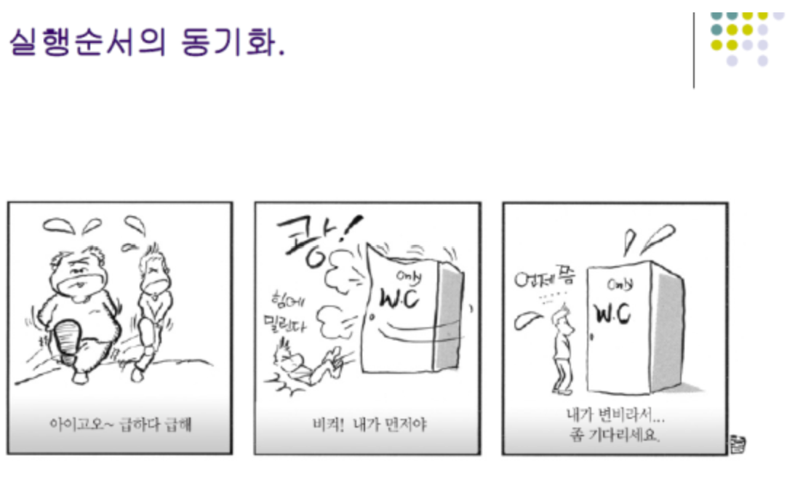
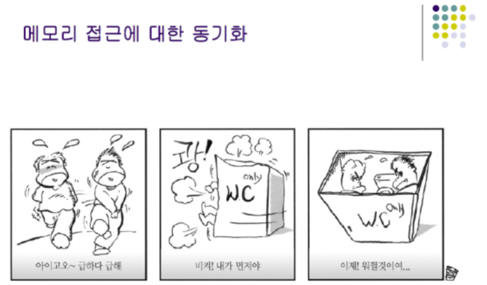
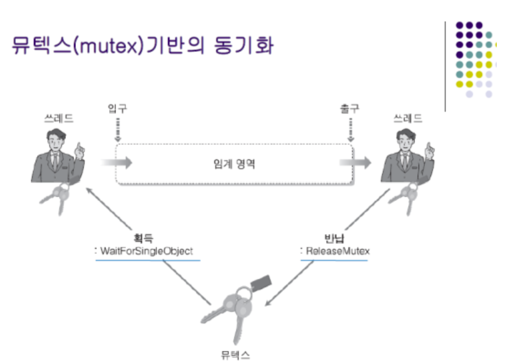
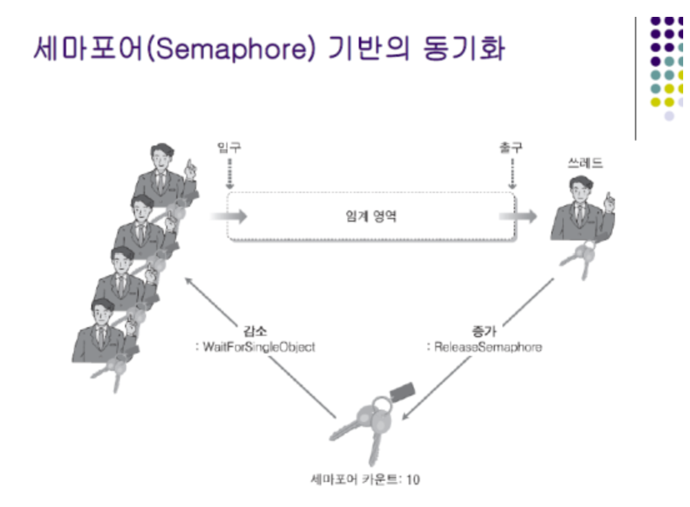
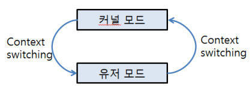

# day10-1 Synchronization(동기화)

## 1. Synchronization(동기화)
- 여러 프로세스나 스레드가 하나의 공유 자원에 동시에 접근할 때 발생할 수 있는 문제를 방지하는 기법

- 동기화 목적
    - 공유 자원에 접근할 수 있는 스레드 수 제한
    - 스레드의 실행 순서 조정
    - 공유 데이터의 일관성 유지

## 2. Synchronization이 필요한 이유
- 여러 스레드가 동일한 데이터를 동시에 수정 => 실행 결과가 예상과 달라질 수 있음

(ex) Race Condition(경쟁 상태)
두 스레드가 동시에 변수의 값 증가 -> 두번 증가해야 하지만 한 번만 증가하는 문제가 발생할 수 있음

## 3. 동기화의 종류

### 실행 순서 동기화
- 스레드가 정해진 순서에 따라 실행되도록 제어하는 방식


### 메모리 접근 동기화
- 여러 스레드가 공유 자원에 동시에 접근하지 못하도록 제한하는 방식
- 실행 순서보다는 특정 시점에 몇 개의 스레드가 공유 자원에 접근할 수 있는지가 중요


## 4. 임계 구역(Critical Section)
- 여러 스레드가 동시에 실행하면 문제가 발생할 수 있는 공유 자원 접근 코드 영역

### 임계 구역 문제의 해결 조건
1. 상호 배제(Mutual Exclusion)
- 한 프로세스 또는 스레드가 임계 구역을 실행 중이면, 다른 프로세스나 스레드는 해당 임계 구역에 들어갈 수 없어야 함

2. 진행(Progress)
- 임계 구역을 실행하는 스레드가 없을 경우, 미뤄짐 없이 진입을 원하는 스레드 중 하나가 진입할 수 있어야 함

3. 한정된 대기(Bounded Waiting)
- 한 스레드가 임계 구역 진입을 요청한 뒤 무한히 기다리지 않도록 `대기 횟수에 제한`이 있어야 함

## 5. 주요 동기화 기법
### 5.1. Mutex(뮤텍스)
- 하나의 Lock을 이용해 임계 구역에 한 번에 하나의 스레드만 접근하도록 하는 기법

```text
[특징]
- 하나의 뮤텍스는 잠금 상태와 해제 상태를 가짐
- 한 번에 하나의 스레드만 임계 구역에 들어갈 수 있음
- lock을 획득한 스레드가 잠금을 해제해야 함
- 잠금에 대한 소유권이 존재함
```


(ex) 화장실 예시
화장실 한칸, 열쇠 하나
- 열쇠를 가진 사람만 화장실에 들어갈 수 있음
- 다른 사람은 열쇠가 반환될 때까지 기다림
- 화장실을 사용한 사람이 열쇠를 반환

화장실 열쇠 = Mutex
화장실 = 공유 자원
사람 = 스레드 / 프로세스

### 5.2. Semaphore(세마포어)
- 공유 자원에 동시에 접근할 수 있는 스레드의 수를 `카운터(counter)`로 관리하는 기법
- 자원에 접근하면 counter 감소, 사용 끝나면 다시 증가


#### 세마포어의 종류
1. 이진 세마포어(Binary Semaphore): Counter가 0 또는 1
2. 카운팅 세마포어(Counting Semaphore): Counter가 2 이상일 수 ㅇ

세마포어는 일반적으로 소유권 x
=> 스레드와 세마포어 값을 증가시키는 스레드가 다를 수 있음

(ex) 화장실 예시
화장실 네 칸, 입구 전광판에 빈칸 수 표시

- 빈칸이 있으면 전광판 숫자 1 감소시키고 들어감
- 빈칸이 0이면 기다림
- 사용이 끝나면 숫자를 1 증가시킴

빈칸 수 = Semaphore Counter
화장실 여러 칸 = 제한된 개수의 공유 자원

### 5.3. Monitor(모니터)
- 공유 데이터와 그 데이터를 연산을 하나로 묶음 -> 한 번에 하나의 스레드만 내부 코드를 실행하도록 하는 고수준 동기화 구조

- 모니터가 포함하는 것
    - 공유 데이터
    - 상호 배제를 위한 Lock
    - 조건 변수(Condition Variable)
    - Wait, Wake 기능

```java
// 자바에서는 객체의 모니터를 이용해 아래와 같이 구현
synchronized (object){
    // 임계 구역
}

// 조건에 따라 스레드를 기다리게 하거나 깨울 때 아래 기능 사용 가능
wait();
notify();
notifyAll();
```

> 모니터는 뮤텍스보다 완전히 다른 목적의 도구라기보다는 Lock과 조건 변수 등을 함께 제공하는 `더 추상화된 동기화 구조`라 이해

### 5.4. 인터락 연산과 원자적 연산
인터락 함수: 값을 읽고 수정하는 작업을 하나의 중단할 수 없는 연산으로 수행
(ex: 값 읽기 -> 값 증가 -> 값 저장 /// 이 과정을 다른 스레드가 중간에 끼어들 수 없도록 처리)
=> 이러한 연산: `원자적 연산(Atomic Operation)`

## 6. 유저 모드와 커널 모드 동기화
- 동기화 기법은 구현 방식에 따라 `유저 모드에서 처리`되거나 `커널의 도움`을 받을 수 있음

### 6.1. 유저 모드 동기화
- 커널 전환 없이 처리할 수 있어 빠름
- 원자적 연산이나 스핀락 등을 사용할 수 있음
- 오래 기다려야 하는 상황에서는 CPU를 낭비할 수 있음

### 6.2. 커널 모드 동기화
- 대기 중인 스레드를 실제로 재우고 다른 스레드를 실행할 수 있음
- system call과 context switching이 발생해 상대적으로 비용이 큼
- 긴 대기 상황에서 효율적

> 실제 뮤텍스나 세마포어는 항상 한쪽 모드에서만 동작하는 것이 아니다. 경쟁이 없을 때는 유저 모드에서 빠르게 처리하고, 오래 기다려야 할 때만 커널의 도움을 받도록 구현되기도 한다.


## 7. 동기화 사용 시 주의점
- 발생할 수 있는 문제점
    - `교착 상태(Deadlock)`: 서로 상대방이 가진 자원을 기다리며 영원히 멈춤
    - `기아 상태(Starvation)`: 특정 스레드가 계속 자원을 얻지 못함
    - `성능 저하`: 지나치게 넓은 범위를 잠그면 병렬성이 감소
    - `잠금 해제 누락`: Lock을 반환하지 않아 다른 스레드가 계속 대기함 

## 참고
### 스핀락(Spin lock)
- 다른 스레드가 잠금(Lock)을 소유하고 있을 때, 반환될 때까지 멈추지 않고 계속 확인(루프)하며 대기하는 동기화 기법
- 문맥 교환(Context Switching) 비용이 들지 않아 임계 구역 작업이 아주 짧을 때 효율적
- 동작 방식: 락을 얻을 수 있을 때까지 반복문(Busy Waiting)을 돌며 상태를 확인함
