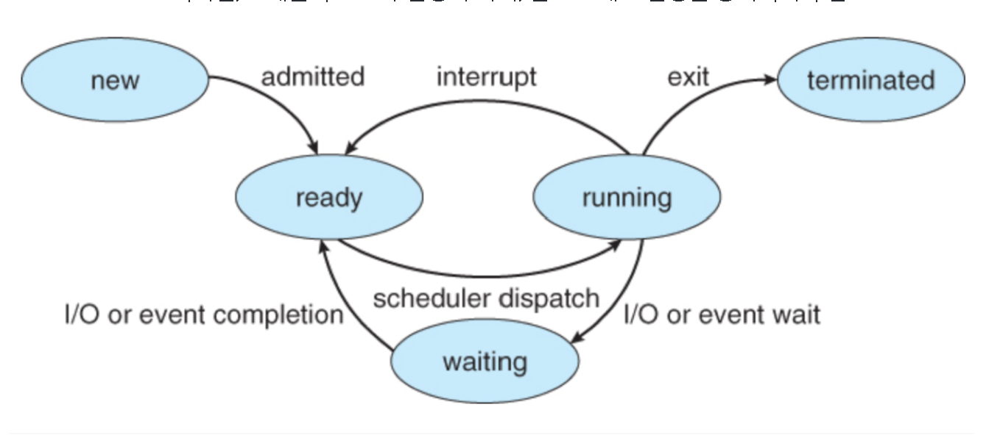
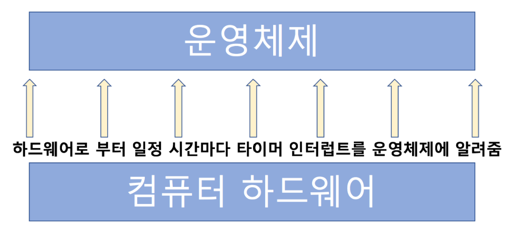
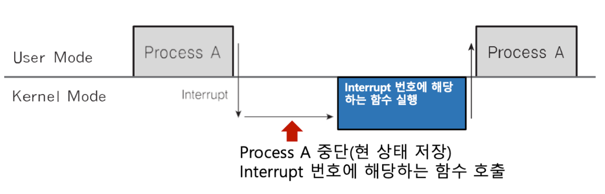

# Day 11-1 Interrupt(인터럽트)

## 1. 인터럽트란?
- CPU가 프로그램을 실행하고 있을 때, 입출력 하드웨어 등의 장치 또는 예외 상황이 발생하여 처리가 필요한 경우 CPU가 알아서 처리하는 기술

## 2. 인터럽트 필요 이유
1. 선점형 스케쥴러 구현
- 프로세스 running 중에 스케줄러가 이를 중단시키고, 다른 프로세스로 교체하기 위해 현재 실행중인 프로세스를 중단시킴
=> 스케줄러 코드가 실행되어서 현 프로세스 실행을 중단시켜야 함

2. IO Device와의 커뮤니케이션
- 저장 매체에서 데이터 처리 완료 시, 프로세스를 깨워야 함(block state->ready state)



3. 예외 상황 핸들링
- CPU가 프로그램을 실행하고 있을 때, 입출력 하드웨어 등의 장치 또는 예외 상황이 발생할 경우 CPU가 해당 처리를 할 수 있도록 알려줘야 함

## 3. 인터럽트 처리 예
- CPU가 프로그램을 실행하고 있음
    1. 입출력 하드웨어 등의 장치 이슈 발생
        - 파일 처리가 끝났다는 것을 OS에 알려주기
        - OS는 해당 프로세스 상태를 block state에서 실행 대기(ready) 상태로 변경
    2. 예외 상황 발생
        - 0으로 나누는 계산이 발생 -> 예외 발생을 OS에 알려주기
        - OS가 해당 프로세스에 대한 실행 중지/에러 표시

## 4. 주요 인터럽트
1. Divide-by-Zero Interrupt
```c
#import <stdio.h>

int main()
{
    printf("Hello World!\n");
    int data;
    int divider = 0;
    data = 1 / divider;  // 이 부분에서 인터럽트 발생
    return 0;
}
```

2. 타이버 인터럽트
- RR 스케줄러를 위해 필요


3. 입출력(IO) 인터럽트
- 프린터, 키보드, 마우스, 저장매체(SSD 등)

## 5. 인터럽트 종류
### 내부 인터럽트
주요 프로그램 내부에서 잘못된 명령 또는 잘못된 데이터 사용 시 발생
    - 0으로 나누었을 때
    - 사용자 모드에서 허용되지 않은 명령 또는 공간 접근 시
    - 계산 결과가 Overflow / Underflow
> 내부 인터럽트는 주로 프로그램 내부에서 발생하므로, 소프트웨어 인터럽트라고도 함

### 외부 인터럽트
주로 하드웨어에서 발생되는 이벤트(프로그램 외부)
    - 전원 이상
    - 기계 문제
    - 키보드 등 IO 관련 이벤트
    - Timer 이벤트
> 외부 인터럽트는 주로 하드웨어에서 발생하므로, 하드웨어 인터럽트라고도 함

## 6. 인터럽트와 IDT
인터럽트는 미리 정의되어 각각 번호와 실행 코드를 가리키는 주소가 기록되어 있음
> 어디에? IDT(Interrupt Descriptor Table)에 기록
> 언제? 컴퓨터 부팅 시 OS가 기록
> 어떤 코드? OS 내부 코드

- 항상 인터럽트 발생 시, IDT 확인

## 참고
1. 시스템콜 실행을 위해서는 강제로 코드에 인터럽트 명령을 넣어 CPU에게 실행시켜야 한다.

2. 인터럽트와 IDT, 리눅스 예시
- 0 ~ 31: 예외상황 인터럽트(일부는 정의가 안된 채로 남겨져 있음)
- 32 ~ 47: 하드웨어 인터럽트(주변장치 종류 / 개수에 따라 변경 가능)
- 128: 시스템 콜

3. 인터럽트와 프로세스
```text
1. 프로세스 실행 중 인터럽트 발생
2. 현 프로세스 실행 중단
3. 인터럽트 처리 함수 실행(OS)
4. 현 프로세스 재실행
```


4. 인터럽트와 스케줄러
- RR 스케줄러 => 수시로 타이머 인터럽트 발생

[출처](https://www.fun-coding.org/post/interrupt.html#gsc.tab=0)