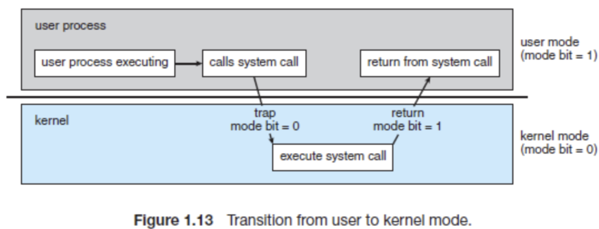
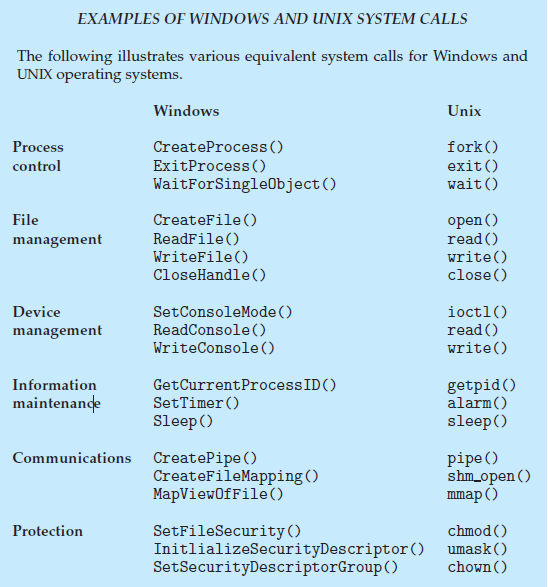

# 시스템 콜

Status: Done

# 개념

<aside>
📜

**System Call이란?**

User가 사용하는 Application이 OS(Kernel)에게 서비스를 요청하는 일종의 Interface이다.

System Call을 던지면, CPU 내부적으로 Software Interrupt가 발생하여 안전하게 Kernel mode로 전환된 뒤 OS가 일을 처리해 준다.

은행에서 일반인은 금고에 못 들어가니, 은행원에게 잡다한 일들을 시키는 그런 느낌

</aside>

---

# 실행 흐름

1. Application 실행
2. System call  요청
    1. Disk 저장이나 화면 출력 등의 작업을 위해 System call 호출 → Interrupt(Trap) 발생
3. Kernel mode 전환
    1. User mode → Kernel mode
4. OS 서비스 수행
    1. Kernel이 요청을 받아 하드웨어를 직접 제어하며 실제 작업 수행
5. 결과 반환 및 복귀
    1. 작업이 끝나면 User mode로 전환 후, 다시 Application 코드 제어권 부여

---

# 종류

