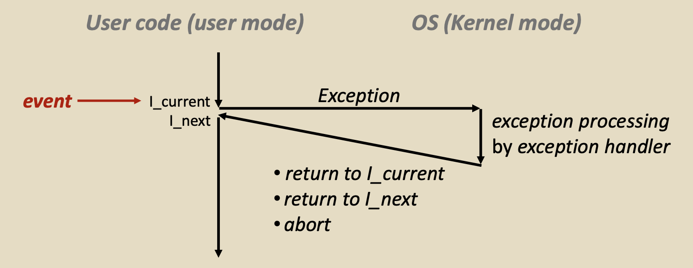
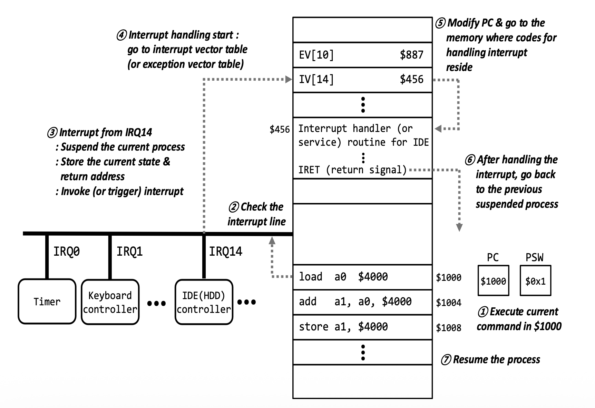

# Day 11 - 인터럽트, 시스템 콜

# 인터럽트

인터럽트(예외)는 어떤 상황에 대응하기 위해 OS에게 통제권을 넘겨주는 것이다.



이벤트 발생 시 유저보드에서 커널모드로 전환되어 OS가 해당 이벤트를 처리한 뒤 다시 유저모드로 복귀한다.

인터럽트(Interrupt)와 예외(Exception)의 차이를 알아보자.

공통점은 둘 다 CPU가 원래 하던 일을 멈추고 OS 커널에 제어권을 넘기게 만드는 이벤트라는 것이다. 하지만 누가 발생시켰는지와 CPU clock timing과의 관게에서 차이가 있다.

인터럽트는 CPU 외부에서 발생하며 비동기적으로 찾아오기 때문에 예측할 수 없다 (ex. Timer interrupt, I/O interrupt)

반면 예외는 CPU 내부에서 발생하며 현재 실행 중인 명령어 때문에 동기적으로 발생하는 이벤트이다. 예외는 Traps, Faults, Aborts로 분류된다.

### 인터럽트 (Interrupt)

외부 프로세서에 의해 발생하며 예측할 수가 없는 비동기 이벤트이다.

예외 발생 시 처리 후 그 “다음” 명령어를 실행한다.

```
#100 : 어떤 작업 수행

#101 : scanf();  // 1) system call -> Trap 발생

// 2) Keyboard I/O가 입력을 받은 후 Interrupt 발생

#102 : scanf 이후 동작 수행

// 3) Interrupt 처리 후 다음 명령인 #102를 수행
```

예를 들어 위와 같은 순서를 가진 프로그램이 있다고 하자. 어떤 작업을 수행하다가 scanf를 만나면 시스템 콜을 하게 된다 (Trap 유발). 그러면 키보드에서 입력을 받은 후 Interrupt를 발생시키고, OS에서 해당 Interrupt를 처리한 뒤 scanf “다음” 명령어를 수행한다.

### 예외 (Exception)

명령어를 실행하거나 CPU 자체로부터 유발되는 예외이다. 그래서 Software interrupt 혹은 internal interrupt라고 부른다.

#### Traps

사용자가 printf, scanf 등의 명령어를 사용하기 때문에 발생하는 동기적이고 의도적인 예외이다.

system call, breakpoint traps 등이 대표적인 예시이다. 예외 처리 후 “다음” 명령어를 수행한다.

#### Faults

의도하지는 않았지만 회복 가능한 예외이다 (회복 불가능도 존재함). 예를 들면 Page fault (recoverable), protection faults (unrecoverable), floating point exception 등이 있다.

Interrupt, Traps와 달리 예외 처리 후 “현재” 명령어를 다시 수행한다.

Faults는 코드가 수정되지 않는 한 매 수행 시마다 같은 위치에서 예외가 발생한다.

#### Aborts

Illegal instruction, paritiy error, machine check 등 의도하지 않은 예외이고, 회복도 불가능한 예외이다.

위 개념들을 표로 정리하면 다음과 같다.

| 클래스    | 원인                        | 동기/비동기 | 반환 시 동작       |
| --------- | --------------------------- | ----------- | ------------------ |
| Interrupt | 외부 장치로부터의 신호      | 비동기      | “다음” 명령어 수행 |
| Traps     | 의도된 예외                 | 동기        | “다음” 명령어 수행 |
| Fault     | 잠재적으로 회복 가능한 에러 | 동기        | “현재” 명령어 수행 |
| Abort     | 회복될 수 없는 에러         | 동기        | 리턴 없음          |

## 예외 처리 방법

예외를 처리하는 방법은 Interrupt Handler를 사용하는 것이다. 동작 과정은 다음과 같다.

1. 외부 장치나 CPU로부터 Interrupt 요청 발생
2. 현재 상태(register, pc)를 PCB에 저장 (→ context switch 발생)
3. Interrupt vector table(문제 번호, 설명, exception class, 해결책이 적힌 주소가 있음)에서 문제의 해결책이 적힌 주소를 PC(program counter)에 저장
4. ISR(Interrupt Service Routine) 실행. 앞서 저장된 PC가 가리키는 주소로 이동해 해당 예외나 인터럽트를 실제로 처리하는 프로그램(ISR)을 실행
5. ISR이 끝나면 2번 단계에서 저장된 이전 상태를 다시 CPU로 불러와 작업을 재개함



# 시스템 콜 (System Call)

시스템 콜은 응용 프로그램이 운영체제의 커널이 제공하는 서비스나 자원을 안전하게 사용할 수 있도록 요청하는 인터페이스이다.

응용 프로그램은 하드웨어와 메모리에 직접 접근할 수 없기 때문에 상호작용이 필요한 경우 운영체제가 제공하는 System Call을 사용해야 한다.

#### 동작 과정

1. API 호출 : 프로그램이 라이브러리 함수(printf, scanf 등)를 호출
2. 모드 전환 : Trap을 발생 시켜 유저 모드에서 커널 모드로 전환
3. 요청 처리 : 운영체제가 시스템 콜 테이블에서 번호를 확인하고 해당하는 커널 함수를 실행하여 작업 수행
4. 결과 반환 : 처리 결과를 프로그램에 전달하고 다시 유저 모드로 전환

#### 주요 시스템 콜의 종류

- **프로세스 제어:** 프로그램 생성, 종료, 대기 등 (`fork`, `exec`, `wait`, `exit`)
- **파일 관리:** 파일 열기, 읽기, 쓰기, 닫기 (`open`, `read`, `write`, `close`)
- **장치 관리:** 하드웨어 상태 확인 및 제어 (`ioctl`, `read`, `write`)
- **정보 유지:** 프로세스 ID 확인, 시간 설정 (`getpid`, `alarm`)
- **통신:** 프로세스 간 데이터 교환 및 네트워크 연결 (`pipe`, `socket`, `send`, `receive`)
