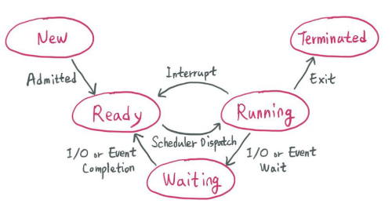
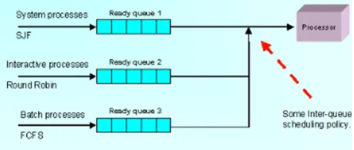
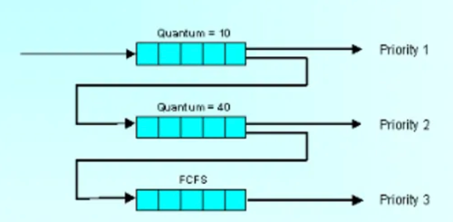

# day 12-1 CPU Scheduling

## 1. CPU Scheduling
- CPU를 효율적으로 사용하기 위해 프로세스의 스케줄(수행 순서)을 정하는 과정
> OS의 CPU 스케쥴러는 Ready 상태의 프로세스 중에서 어떤 프로세스에게 CPU를 할당할지 결정함

## 2. 선점 / 비선점 스케쥴링
### 2.1. 선점(Preemptive)
- OS가 CPU의 사용권을 선점(강제 회수)할 수 있는 경우
- 다른 process 실행을 위해 필요하다면 현재의 process를 중단시킴
- 우선 순위가 높은 프로세스를 빠르게 처리 가능함
- 우선 순위가 낮은 프로세스가 무한정 기다리는 기아 현상(starvation) 생길 수 있음

### 2.2. 비선점(Non Preemptive)
- 프로세스 종료 또는 I/O 등의 이벤트가 있을 때까지 실행을 보장시킴
- 모든 프로세스에 대한 요구를 공정하게 처리

## 3. 프로세스의 상태 전이

- `승인(Admitted)`: 프로세스 생성이 가능 -> 승인됨
- `스케쥴러 디스패치(Scheduler Dispatch)`: 준비(ready) 사애에 있는 프로세스들 중 하나를 선택하여 실행
- `인터럽트(Interrupt)`: 예외, 입출력, I/O 이벤트 등이 발생하여 현재 실행 중인 프로세스를 준비(ready) 상태로 바꾸고, 해당 작업을 먼저 처리하는 것
- `입출력 또는 이벤트 대기(I/O or Event Wait)`: 입출력/이벤트가 끝난 프로세스를 준비(ready) 상태로 전환하여 스케줄러에 의해 선택될 수 있도록 만드는 것

## 4. CPU 스케쥴링의 종류
### 4.1. 비선점 스케쥴링
1. FCFS / FIFO (First Come First Servce / First In First Out)
- 큐에 도착한 순서대로 CPU 할당
- 수행 시간이 짧은게 뒤로 가면 평균 대기 시간(average turnaround time)이 길어짐

2. SJF(Shortest Job First)
- 수행 시간이 가장 짧다고 판단되는 작업을 먼저 수행
- FCFS보다 평균 대기 시간(average turnaround time) 감소

3. HRN(Highest Response-ratio Next)
- 우선순위를 계산하여 SJF 단점 보완
- 우선순위 = (대기시간 + 서비스(실행)시간) / 서비스(실행)시간
- 실행시간이 짧거나 대기시간이 긴 프로세스인 경우 우선순위 높아짐

### 4.2. 선점 스케쥴링
1. RR(Round Robin)
- 각 프로세스에게 CPU 시간을 균등하게 할당
- 프로세스가 할당된 시간 내에 처리 완료를 못하면, 준비 큐 리스트의 가장 뒤로 보내지고 CPI 점유권은 대기 중인 다음 프로세스로 넘어감

2. MLQ(Multi-Level Queue)
- 작업들을 여러 종류의 그룹으로 나누어 여러 개의 큐를 이용하는 기법
- 각 큐는 자신만의 독자적인 스케쥴링을 가짐

3. MLFQ(Multi Level Feedback Queue)
- 입출력 위주와 CPU 위주인 프로세스의 특성에 따라 큐마다 서로 다른 CPU 시간 할당량을 부여
- 새로운 프로세스는 높은 우선순위를 가지지만 프로세스의 실행 시간이 길어질수록 점점 낮은 우선 순위 큐로 이동하며, 마지막 단계에서 FCFS 방식을 적용
- turnaround 시간과 response time에 최적화

## 참고
### CPU 스케쥴링 척도
1. Response Time
- 작업이 처음 실행되기까지 걸린 시간

2. Turnaround Time
- 실행 시간과 대기 시간을 모두 합한 시간. 작업이 완료될 때까지 걸린 시간

[출처](https://cse-gr.tistory.com/106)