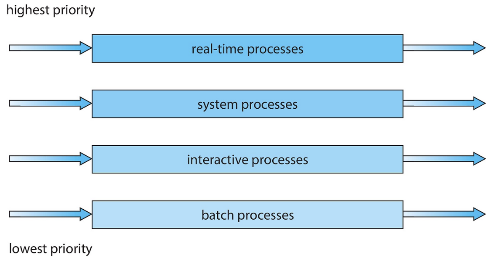

# CPU Scheduling

Date: 2026년 7월 16일
Status: Done

# 개념

<aside>
📜

**CPU Scheduling이란?**

메모리에 올라와 있는 여러 프로세스(ready 상태) 중 어떤 프로세스에게 CPU를 할당할지 결정하는 커널 코드이다.

</aside>

---

# 목적

- 공평성
    - 모든 프로세스가 자원을 공평하게 배정받아야 한다.
- 효율성
    - 시스템 자원이 유휴 시간 없이 사용되도록 스케줄링해야 하고 유휴 자원을 사용하려는 프로세스에게 우선권을 주어야 한다.
- 안정성
    - 중요 프로세스의 우선순위를 높여 먼저 작동하도록 배정함으로써 시스템 자원을 점유하거나 파괴하려는 프로세스로부터 자원을 보호해야 한다.
- 확장성
    - 프로세스가 증가해도 시스템이 안정적으로 작동하도록 조치해야 한다.
- 반응 시간 보장
    - 시스템은 적절한 시간 안에 프로세스의 요구에 반응해야 한다.
- 무한 연기 방지
    - 특정 프로세스의 작업이 무한히 연기되어서는 안 된다.

---

# 선점형 vs 비선점형

- 비선점형
    - 한 프로세스가 CPU 자원을 잡으면, 그 프로세스가 스스로 CPU를 반납할 때까지 OS가 강제로 뺏을 수 없다.
    - Context Switching Overhead가 적고 시스템이 단순
    - FCFS, SJF, HRN
- 선점형
    - 실행 중인 프로세스의 CPU 자원을 뺏어서 OS가 다른 프로세스에게 줄 수 있다.
    - RR, SRT, Multi-Level Queue, Multi-Level Feedback Queue

### FCFS (First Come, First Served)

- Ready Queue에 도착한 순서대로 CPU를 할당하는 방식
- 모든 프로세스의 우선순위가 동일
- 콘보이 효과
    - 처리 시간이 긴 프로세스를 실행하면 다른 프로세스들은 하염없이 기다리기 때문에 효율성이 떨어진다.
- 그래서 처리 시간이 짧은 작업부터 실행하는 SJF 방식이 등장함

### SJF (Shortest Job First)

- Ready Queue에 있는 프로세스 중에서 실행 시간이 가장 짧은 작업부터 CPU를 할당하는 방식
- 효율성은 좋아지지만, 프로그램 실행 시간 파악하는 작업이 현실적으로 어렵다
- 공평성에 위배된다.
- 기아 상태 → 가령 실행 시간이 긴 프로세스는 CPU 할당이 계속 연기될 수 있다.
    - Aging이라고 해서, 순서를 양보하는 횟수를 정해놓음으로써 기아 상태를 방지할 수 있으나 그 임계값 설정하는 것도 문제가 있다.

### HRN (Highest Response Ratio Next)

- SJF의 기아 상태를 해결하기 위해 만들어진 알고리즘으로, 대기 시간과 CPU 사용 시간을 고려하여 CPU를 할당하는 방식
- 여전히 공평성에 위배된다.

$\text{우선순위} = \frac{\text{대기 시간} + \text{CPU 실행 시간}}{\text{CPU 실행 시간}}$

---

### RR (Round Robin)

- 한 프로세스가 할당받은 시간 동안 작업 하다가 완료하지 못한 채로 시간이 종료되면 Ready Queue의 맨 뒤로 가서 대기한다.
- 일정 타임 슬라이스마다 순서대로 프로세스를 실행하는 방식
- 선점형 알고리즘이기 때문에 Context Switching Overhead가 추가되면 유사한 방식인 FCFS에 비해 평균 대기 시간이 더 길어지고, 콘보이 효과는 줄어든다.

### SRT (Shortest Remaining Time)

- SJF + RR
- 기본적으로 RR 방식을 사용하는데, 현재 실행 중인 프로세스의 남은 작업 시간보다 Ready Queue에 들어온 프로세스의 잔여 작업 시간이 더 적다면, 이 프로세스가 CPU를 선점하게 된다.
- SJF보다 평균 대기 시간이 짧지만, 기아 상태를 해결하지 못한다.

### MLQ (Multi-Level Queue)

- 우선순위에 따라 Ready Queue를 여러 개 사용
- 프로세스 종류에 따라 우선순위 별로 나뉜 Queue에 들어가게 되는데, 우선순위가 높은 프로세스를 가장 먼저 처리한다. → 하위 프로세스에 대해 기아 상태 발생
    - 하위 Queue에 있는 프로세스가 실행 중일 때, 상위 Queue에 새로운 프로세스가 들어오면 이 프로세스에게 CPU를 할당한다.
- 각 Queue에서 프로세스들을 실행하는 방식은 Queue마다 다르다.
    - foreground(interactive) → RR
    - background(batch) → FCFS

### MLFQ (Multi-Level Fedback Queue)

- 여러 개의 Queue를 사용하며, 높은 우선순위 Queue일수록 할당 시간이 적다.
- CPU를 오래 사용하는 프로세스는 하위 Queue로 강등, 입출력 위주라면 유지 또는 승급
- 5가지 규칙에 따라 CPU를 할당한다.
    - Priority(A) > Priority(B) 이면, A 실행 (B는 실행 x)
    - Priority(A) = Priority(B) 이면, A와 B는 RR 방식으로 실행
    (보통 응답시간 중요한 작업이 우선순위 높음)
    - 작업이 시스템에 진입하면, 가장 높은 우선순위의 큐에 놓여진다.
    - 주어진 단계에서 CPU 시간 할당량을 소진하면 우선순위는 낮아진다.
    (CPU를 몇번 양도하였는지 상관없음)
    - 일정 기간 `S`가 지나면, 시스템의 모든 작업을 최상위 큐로 이동시킨다.