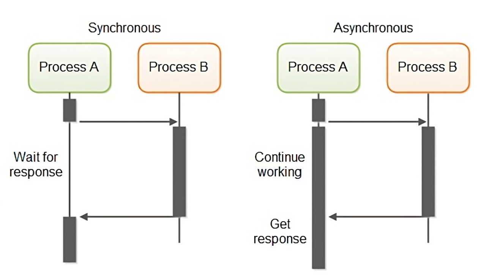
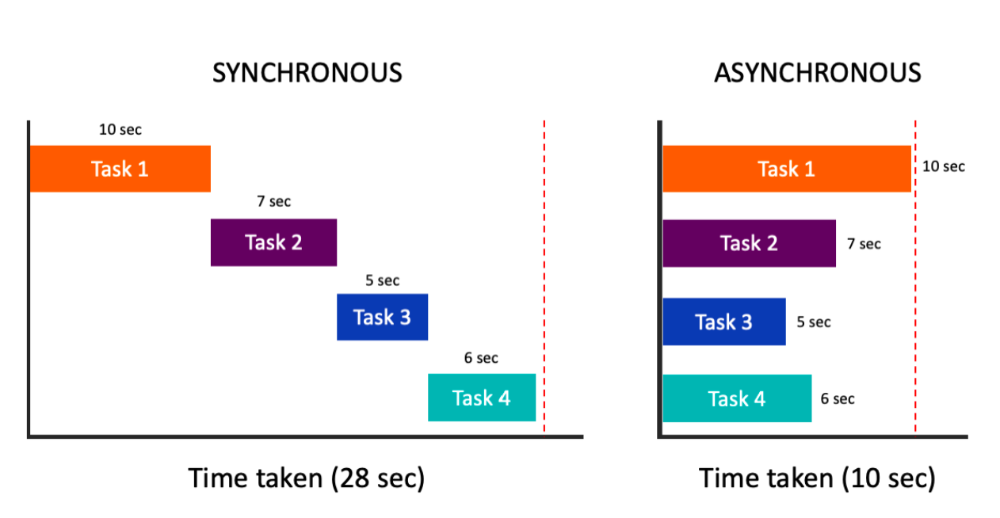
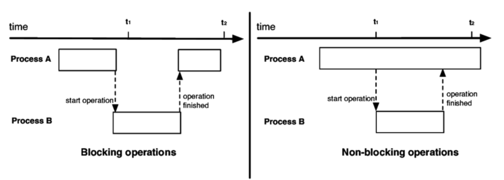

# day 13-1 동기화 / 비동기화

## 1. 동기(Synchronous) / 비동기(Asynchronous)
### 1.1 Synchronous
작업 시간을 함께 맞춰서 실행함
-> 요청한 작업에 대해 완료 여부를 따져 순차대로 처리

### 1.2. Asynchronous
요청한 작업에 대해 완료 여부를 따지지 않고 다음 작업 수행

> 동기는 작업 B가 완료되어야 다음 작업을 수행하고, 비동기는 작업 B의 완료 여부를 따지지 않고 바로 다음 작업을 수행

## 2. 비동기의 성능 이점
요청한 작업에 대해 완료 여부를 신경쓰지 않고 그 다음 작업 수행
-> I/O 작업과 같은 느린 작업이 발생할 때, 기다리지 않고 다른 작업을 차리하면서 동시에 처리(멀티 작업)
-> 시스템 성능 향상에 도움

## 3. 동기와 비동기의 작업 순서 차이
동기 작업은 요청한 작업에 대해 순서가 지켜지는 것을 말하는 것이고, 비동기 작업은 순서가 지켜지지 않을 수 있음

## 참고
### Blocking / Non-Blocking
다른 요청의 작업을 처리하기 위해 현재 작업을 block(차단, 대기) 하는가 안하는가의 유무를 나타내는 프로세스의 실행 방식

(ex) 파일을 읽는 작업
    블로킹 방식으로 읽음 -> 파일을 다 읽을 때까지 대기
    논블로킹 방식으로 읽음 -> 파일을 다 읽지 않아도 다른 작업을 할 수 있음

### 비교표
| 구분   | 판단 기준     | 핵심 질문                   |
| ---- | --------- | ----------------------- |
| 동기   | 결과 처리 방식  | 요청한 쪽이 완료 결과를 직접 확인하는가? |
| 비동기  | 결과 처리 방식  | 작업 완료를 나중에 알림받는가?       |
| 블로킹  | 제어권 반환 여부 | 호출한 스레드가 작업 완료까지 멈추는가?  |
| 논블로킹 | 제어권 반환 여부 | 작업이 끝나지 않아도 즉시 반환하는가?   |

### 비유
1. 동기 + 블로킹
- 주문한 뒤 음식이 나올 때까지 계산대 앞에서 기다린다.

2. 동기 + 논블로킹
- 주문 후 자리를 돌아다니다가, 계속 주방에 가서 음식이 나왔는지 확인한다.

3. 비동기 + 논블로킹
- 주문 후 다른 일을 하고, 음식이 나오면 진동벨로 알림을 받는다.