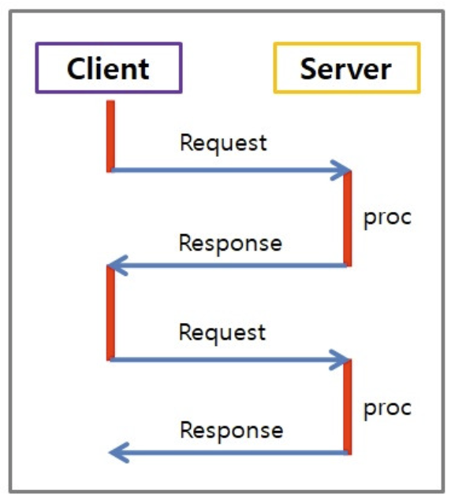
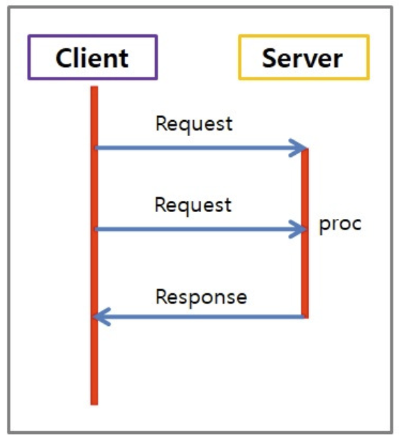
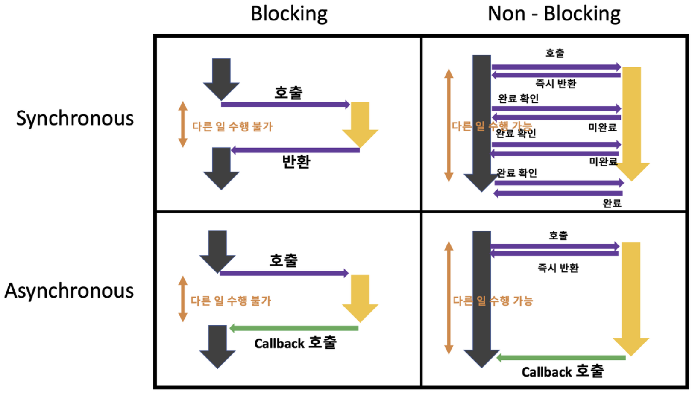

# 동기 vs 비동기

Date: 2026년 7월 20일
Status: Done

# 개념

<aside>
📜

**동기(Synchronous)**

요청과 그 결과가 동시에 일어난다는 뜻으로, 하나의 작업이 끝날 때까지 다음 작업을 시작하지 않고 대기하는 방식

- 설계가 직관적이고, 코드의 실행 순서가 보장됨
- 앞선 작업이 오래 걸리면 뒤에 있는 작업들은 무한정 대기해야 하므로, 효율성이 떨어짐

**비동기(Asynchronous)**

요청한 결과가 즉시 주어지지 않고, 작업을 요청한 뒤 결과가 나오든 말든 상관없이 다음 작업을 바로 프로세싱하는 방식

- 자원을 효율적으로 사용하여 전체적인 시스템 처리량이 늘어남
- 작업이 끝났을 때 별도의 알림(Callback, Promise, async/wait 등)을 받아 처리해야 하므로 설계와 디버깅이 복잡함

</aside>

---

# 혼동되는 개념들

#### 동기 ≠ 블로킹, 비동기 ≠ 논블로킹

- 동기 / 비동기 → 작업의 순서와 끝나는 시점
- 블로킹 / 논블로킹 → 제어권이 누구에게 있는가
    - 제어권: CPU 명령어를 실행할 수 있는 권리

### 블로킹 vs 논블로킹 개념 정의

- 블로킹
    - 다른 주체의 작업이 시작되면, 그 작업이 끝날 때까지 자신의 제어권을 완전히 넘겨주는 방식
- 논블로킹
    - 다른 주체에게 일을 맡길 때, 제어권은 내가 그대로 가지고 있는 방식

### 동기/비동기 + 블로킹/논블로킹 조합

- 동기 + 블로킹 (Sync-Blocking)
    - 제어권을 넘겨주고 작업이 끝날 때까지 순서대로 기다린다.
    - 커피를 주문하고, 직원이 커피를 다 내릴 때까지 기다린 뒤, 커피가 나오면 받아서 자리로 이동
    - DB 조회 요청을 하면, 그 결과를 받을 때까지 프로그램이 멈춰 서서 기다림
- 비동기 + 논블로킹 (Async-NonBlocking)
    - 일을 맡겨도 제어권은 내가 가지고, 작업 완료는 알림을 통해 따로 받는다.
    - 커피 주문 후 진동벨을 받고 자리로 돌아와서 할일을 하다가, 진동벨이 울리면 그때 받는다.
    - fetch(), axios로 서버에 데이터를 요청하고 다음 화면 애니메이션을 구동함
- 동기 + 논블로킹 (Sync-NonBlocking)
    - 제어권은 내가 갖고 있어서 내 할 일을 할 수 있지만, 순서를 맞춰야 하기 때문에 작업이 끝났는지 계속 물어본다.
    - 커피 주문 후 자리로 돌아와서 내 업무를 보지만, 10초마다 주문한 곳으로 가서 “커피 나왔어요?” 하고 계속 확인한다.
- 비동기 + 블로킹 (Async-Blocking)
    - 커피 주문 후 진동벨을 받았지만, 그 자리에 서서 계속 기다리는 상황

