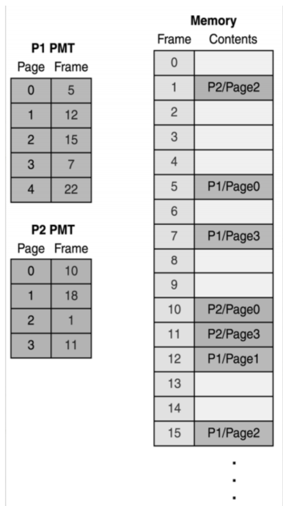
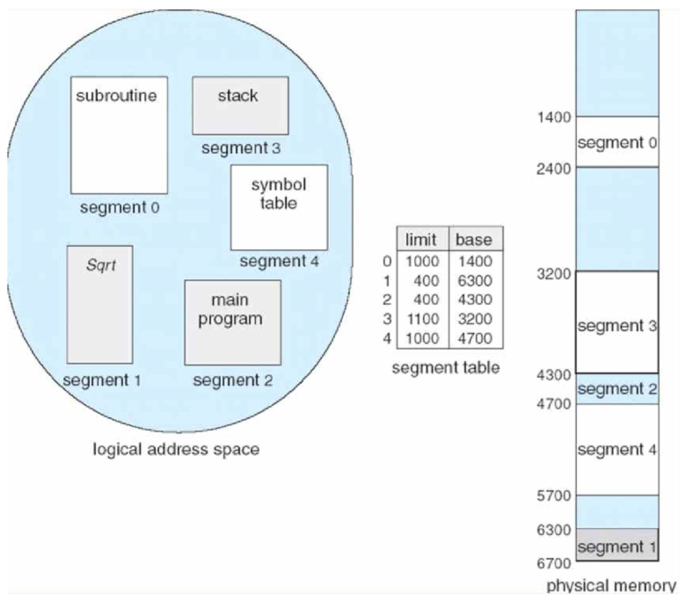

# 페이징 & 세그멘테이션

Status: Done

# 개념

<aside>
📜

**Paging & Segmentation**

다중 프로그래밍 시스템에서 다수의 프로세스를 수용하기 위해 메모리에 프로그램을 적재하기 위한 메모리 관리 기술의 일종

메모리 관리에 대해 알아보자!

</aside>

---

# 메모리 관리

## 연속 메모리 관리

→ 프로그램 전체가 하나의 커다란 공간에 연속적으로 할당되어야 한다.

- 고정 분할 기법
    - 고정된 크기만큼 분할 → 내부 단편화 발생
    - 내부 단편화: 고정 크기가 10k일 때 프로세스가 7k만 사용하면 3k를 낭비하는 꼴이다.
- 동적 분할 기법
    - 파티션들이 동적으로 생성되며 적재하는 프로그램 크기만큼 할당 → 외부 단편화 발생
    - 외부 단편화: 메모리 할당, 해제의 반복으로 동적 파티션들 사이사이에 작은 메모리가 남게 되는데, 이로써 전체적으로 메모리는 남아있지만 연속된 공간이 없어 할당할 수 없게 됨

## 불연속 메모리 관리

→ 프로그램의 일부가 서로 다른 주소 공간에 할당될 수 있다. 외부 단편화 해소를 위해 페이징, 내부 단편화 해소를 위해 세그멘테이션이라는 개념이 도입되었다.

MMU에서 페이지(page번호, offset), 세그멘트(segment번호, offset)의 물리적 주소를 찾아 메모리를 참조하는 방식으로 동작한다.

- 페이징
    - 프로세스를 일정한 크기의 페이지로 분할해서 메모리에 적재하는 방식
    - 하나의 프로세스가 사용하는 메모리 공간이 연속적일 필요가 없어짐
    - 각 프로세스가 갖고 있는 페이징 테이블을 참조하여, 각 프로세스의 조각들이 메모리의 몇 번 프레임에 적재되어 있는지 알 수 있음
    - 외부 단편화를 해결하지만, 내부 단편화가 발생할 수 있다. (페이지 단위를 작게 하면 어느 정도는 해결 가능)

- 세그멘테이션
    - 프로세스를 논리적 단위인 세그멘트로 분할해서 메모리에 적재하는 방식
    - 분할 방식 측면에서 페이징 기법과 다를 뿐, 매핑 테이블의 동작 방식이 동일함
    - 내부 단편화 문제를 해소하지만, 외부 단편화 문제가 생길 수 있음
    

