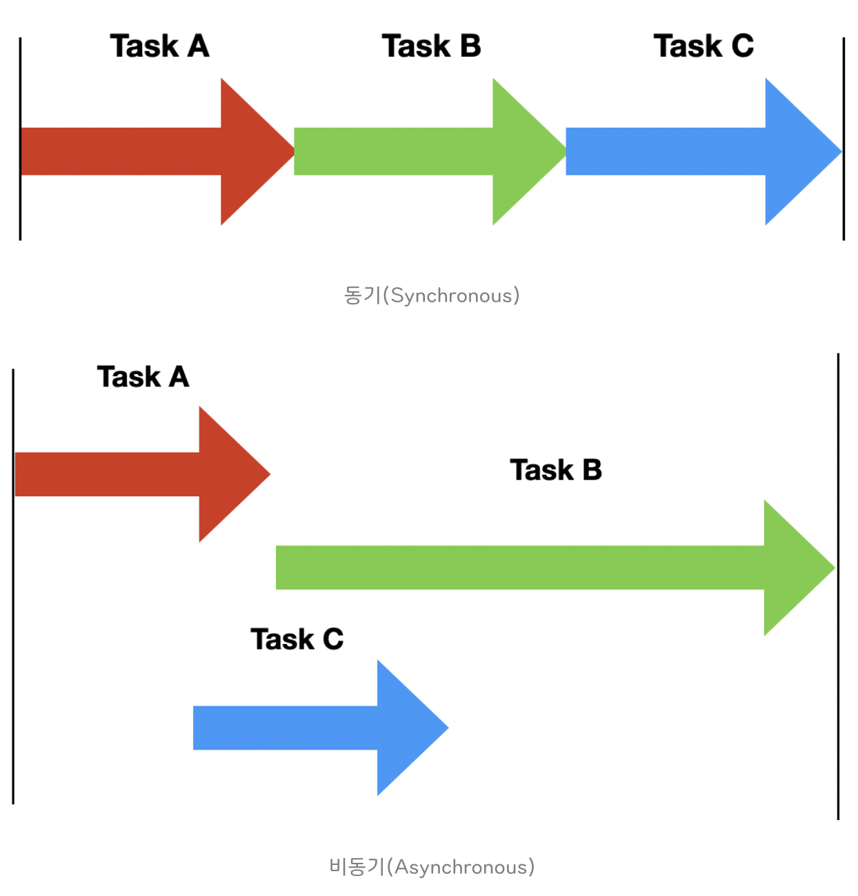
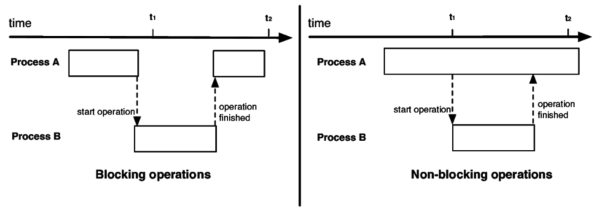

# Day 13 - 동기 vs 비동기, 페이징 & 세그멘테이션

# 동기 vs 비동기

동기와 비동기의 핵심 차이는 작업을 요청한 후 결과가 올 때까지 기다리는지 여부이다.

### 동기 (Synchronous)

- 요청을 보낸 후 결과가 올 때까지 기다리는 방식
- 장점 : 구현이 단순, 흐름을 이해하기 쉬움
- 단점 : CPU가 기다리는 시간 발생, 자원 활용 비효율적임

### 비동기 (Asynchronous)

- 작업을 요청한 후 기다리지 않고 다른 작업을 수행. 이후 결과가 도착 시 처리함
- 콜백 함수를 통해 작업이 끝남을 알 수 있음
- 장점 : CPU 활용률 증가, 응답성 향상
- 단점 : 구현 복잡, 순서 제어가 어려움

## 블록킹 vs 논블록킹

블록킹과 논블록킹은 현재 작업이 Block(대기) 되는지이다. 동기/비동기와 독립적인 개념이다.

### 블록킹 (Blocking)

- A 함수가 B 함수를 호출하면, 제어권이 B에게 넘어감
- A 함수는 제어권이 없기 때문에, B 함수가 작업을 끝낼 때까지 대기 상태가 됨

### 논블록킹 (Non-Blocking)

- A 함수가 B 함수를 호출해도 제어권은 그대로 A가 가지고 있음
- B 함수는 함수 실행과 동시에 리턴해 버리고 A 함수는 멈추지 않고 본인 작업을 계속 수행함

### 동기, 비동기, 블록킹, 논블록킹

1. 동기 + 블록킹

   요청을 보내면 결과가 올 때까지 기다렸다가 처리

2. 동기 + 논블록킹

   결과는 직접 확인해야 하지만(polling), 기다리지는 않음

3. 비동기 + 블록킹

   비동기 요청을 보내고, 결과가 올 때까지 기다림 (잘 안쓰임)

4. 비동기 + 논블록킹

   비동기 요청을 보내고, 바로 반환되어 다른 작업을 수행하다가 비동기 작업이 끝나면 콜백 함수로 알려줌

   성능이 중요한 곳에서 주로 쓰임

# 페이징 & 세그멘테이션

## 배경

연속된 메모리 할당 시 외부 단편화 문제가 발생한다.

예를 들어 빈공간이 100MB인데, 20MB 씩 5군데로 조각나 있으면 전체적인 공간은 충분함에도 불구하고 50MB의 요청이 실패하게 된다.

이를 해결하기 위해 메모리 공간을 고정된 크기(주로 4KB)로 쪼개서 관리하고 이 조각을 페이지라고 부른다.

## 페이징

페이징은 프로세스의 주소 공간을 Page 단위로 나누고, 물리 메모리를 같은 크기의 프레임(Fame)으로 나누어 관리하는 메모리 기법이다. (공룡책에서는 Pyshical 메모리의 페이지를 프레임이라고 표현함)

CPU가 메모리에 접근하기 위해서는 각 페이지들이 실제 물리 메모리의 어디에 위치해 있는지 알아야하는데 이때 쓰이는게 **페이지 테이블**이다. 페이지 테이블을 통해 `페이지 번호 → 프레임 번호`를 관리한다.

예를 들어 CPU가 (page 3, offset 100)을 조회하면 실제로는 (frame 1, offset 100)으로 변환되어 물리 메모리에 접근하는 것이다. 이 과정을 Address translation이라고 부른다.

## 세그멘테이션

페이징은 프로세스를 임의의 고정 크기로 나누는 방식이였다면, 세그멘테이션은 코드 영역, 전역 변수 영역, 함수, 힙, 스택 등 프로그램의 논리적 단위 각각을 하나의 세그먼트로 취급한다. 따라서 프로세스의 주소도 페이지 번호가 아니라 <Segement Number, Offset> 형태로 관리한다.

페이징 테이블처럼 각 세그먼트를 관리하기 위해 세그먼트 테이블이 존재한다.

또한, 세그멘테이션의 이점으로는 보호와 공유 기능이다.

예를 들어, 코드 영역은 읽기 전용으로, 데이터 영역은 읽기와 쓰기 모두 가능하도록 설정할 수 있다. 또한, 여러 프로세스가 동일한 라이브러리 코드를 사용할 때 하나의 코드 세그먼트를 공유할 수도 있다. 즉, 세그먼트 별로 접근 권한을 다르게 하고, 공유에도 용이하다.

## 결론

페이징과 세그멘테이션 둘 다 유사한 개념이지만 현재는 페이징 기법만 사용된다.

세그멘테이션을 사용할 경우 외부 파편화 문제가 발생하기 때문이다. 이를 해결하기 위해 컴팩션(파편화된 free space를 합치는 것)을 주기적으로 해주어야 하는데 이는 비용이 큰 작업이다.

페이징과 세그멘테이션을 합친 Paged Segmentation도 있지만 세그먼트와 페이지가 동시에 존재해 주소 변환도 두 번 해야한다는 단점이 존재한다.
