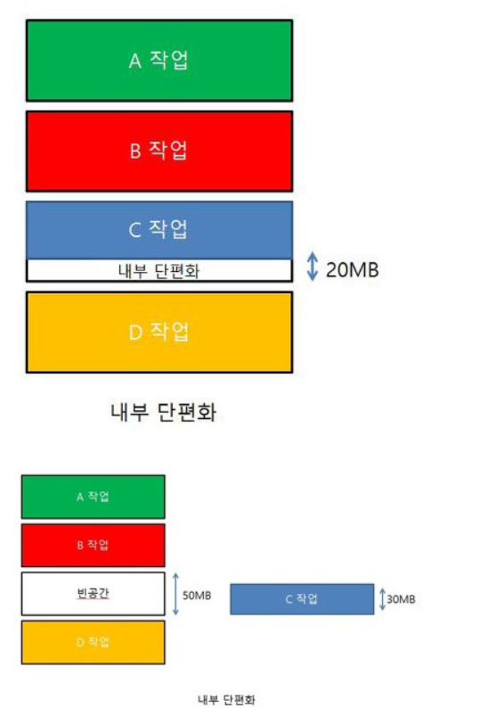
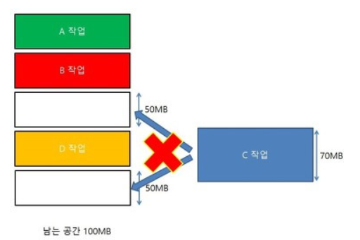

# day14-2 단편화(Fragmentation)

## 메모리 단편화
RAM에서 메모리의 공간이 작은 조각으로 나뉘어져 사용 가능한 메모리가 충분히 존재하지만 할당이 불가능한 상태

### 내부 단편화(Internal Fragmentation)
-> Segmentation (Variable size)

메모리를 할당할 때 Process가 필요한 양보다 더 큰 메모리가 할당되어서 메모리 공간이 낭비되는 상황

(어떤 프로그램을 OS가 4kb를 할당해 주었는데, 사실상 1kb만 사용하고 있을 때 3kb만큼 내부 단편화 발생)

### 외부 단편화(External Fragmentation)
-> Paging(Fixed size)

메모리가 할당되고 해제되는 작업이 반복될 때 작은 메모리 중간중간에 사용하지 않는 메모리가 많이 존재해서 `총 메모리 공간은 충분하지만 실제로 할당할 수 없을 때`

## 메모리 단편화 해결 방법

### 1. 페이징 기법 - 가상 메모리 사용, 외부 단편화 해결
보조기억장치, 가상메모리를 같은 크기의 블로으로 나눈 것을 페이지라 하고, RAM을 페이지와 같은 크기로 나눈 것을 프레임이라고 함

- 페이징 기법이란?
    - 사용하지 않는 프레임을 페이지(가상 메모리)에 옮기고, 필요한 메모리를 페이지 단위로 프레임에 옮기는 기법
    - 페이지와 프레임을 대응시키기 위해 `Page Mapping 과정이 필요해서 Paging table을 만듬`

### 2. 세그먼테이션 기법 - 가상 메모리 사용, 내부 단편화 해결
세그먼테이션 기법은 가상메모리를 서로 크기가 다른 논리적 단위인 `세그먼트로 분할`해서 메모리에 할당하여 실제 메모리 주소로 변환을 함

- 각 세그먼트는 연속적인 공간에 저장되어 있음
- mapping을 위해 마찬가지로 Segment Table이 필요
- 프로세스가 필요한 메모리공간 만큼 할당해주기 때문에 내부 단편화 발생 x
- 중간에 메모리를 해체하면 생기는 외부단편화 문제는 발생 ㅇ