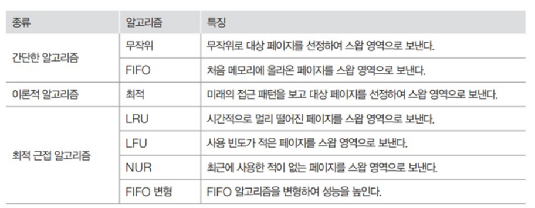
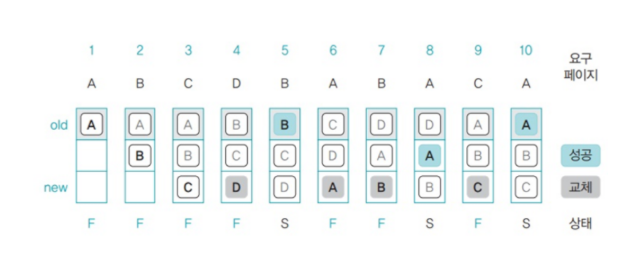
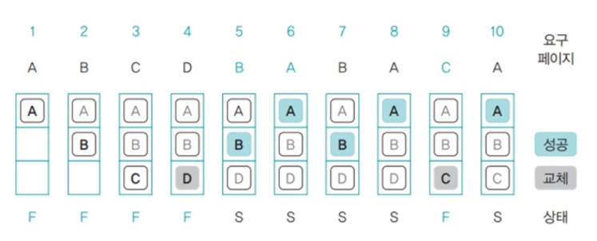
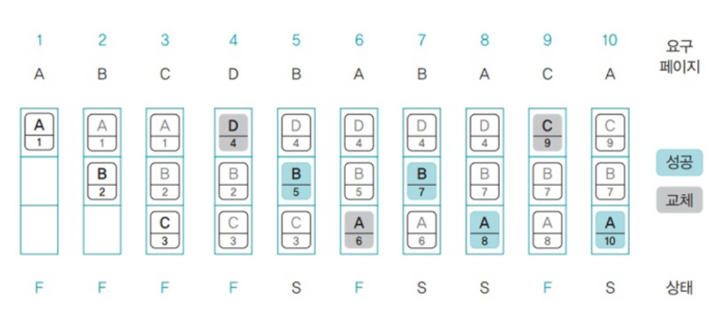
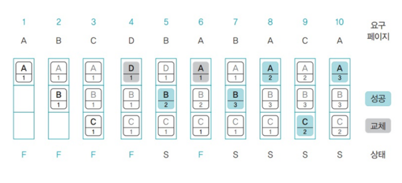
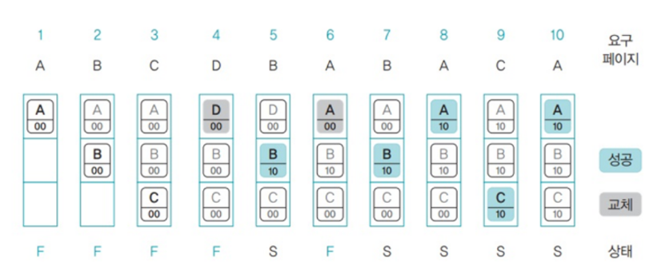

# day14-1 페이지 교체 알고리즘

## 페이지 교체 알고리즘

메모리가 꽉 찼을 때 어떤 페이지를 스왑 영역으로 내보낼지 결정하는 알고리즘

### 1. FIFO 페이지 교체 알고리즘
- 선입선출 페이지 알고리즘(FIFO; First In Fisrt Out)
    - 큐로 구현
    - 맨 위에 있는 페이지 -> 가장 오래된 페이지
    - 새로운 페이지 -> 맨 아래 삽입
    - 맨 위에 있는 페이지에 자주 사용되는 페이지가 있을 수 있음 -> 성능 떨어질 수도
    

### 2. 최적(OPT) 페이지 교체  알고리즘
- 앞으로 사용하지 않을 페이지를 스왑 영역으로 옮김
- 미래의 메모리 접근 패턴을 보고 대상 페이지를 결정 -> 성능이 좋지만 미래의 접근 패턴을 안다는 것이 불가능하여 실제로 구현할 수 없음

4번을 보면 D를 넣기 위해 앞으로 사용할 페이지에 A,B,C가 있는지 본다.
페이지 C가 9번으로 가장 늦게 사용되므로 스왑 영역으로 보냄

### 3. LRU 페이지 교체 알고리즘
- LRU; Least Recently Used; 최근 최소 사용 페이지 교체 알고리즘
- 가장 오랫동안 사용되지 않은 페이지를 스왑 영역으로 옮김

### 4. LFU 페이지 교체 알고리즘
- LFU; Least Frequently Used; 최소 빈도 사용 알고리즘
- 페이지가 몇번 사용되었는지를 기준으로 대상 페이지 선정
- FIFO 페이지 교체 알고리즘보다 성능은 우수하지만 페이지 접근 횟수(빈도)를 표시하는데 추가 공간이 필요하므로 그만큼 메모리가 낭비됨

### 5. NUR 페이지 교체 알고리즘
- NUR; Not Used Recently; LRU, LFU 페이지 교체 알고리즘과 성능이 비슷하면서도 불필요한 공간 낭비 문제를 해결
- 추가 비트 2개만 사용하여 미래를 추정
    - `참조 비트`: PTE의 접근 비트를 가리킴(접근하면 1)
    - `변경 비트`: PTE의 변경 비트를 가리킴(변경되면 1)

| 등급 |  R |  M | 의미                |  교체 우선순위 |
| -- | -: | -: | ----------------- | -------: |
| 0  |  0 |  0 | 최근 사용 안 함, 수정 안 됨 | 가장 먼저 교체 |
| 1  |  0 |  1 | 최근 사용 안 함, 수정됨    |      2순위 |
| 2  |  1 |  0 | 최근 사용됨, 수정 안 됨    |      3순위 |
| 3  |  1 |  1 | 최근 사용됨, 수정됨       |    가장 나중 |

- 가장 먼저 (0,0)인 페이지를 선정하고 없다면 (0,1) -> (1,0) -> (1,1) 순서로 선정됨
- 만약 모든 페이지가 (1,1)이 되면 모든 페이지 비트를 (0,0)으로 초기화 한다.

## 참고
### PTE(Page Table Entry)
- 페이지 테이블의 각 항목
- 페이지 테이블은 가상 페이지와 실제 메모리의 페이지 프레임을 연결하고, PTE에는 해당 페이지의 상태 정보가 저장됨