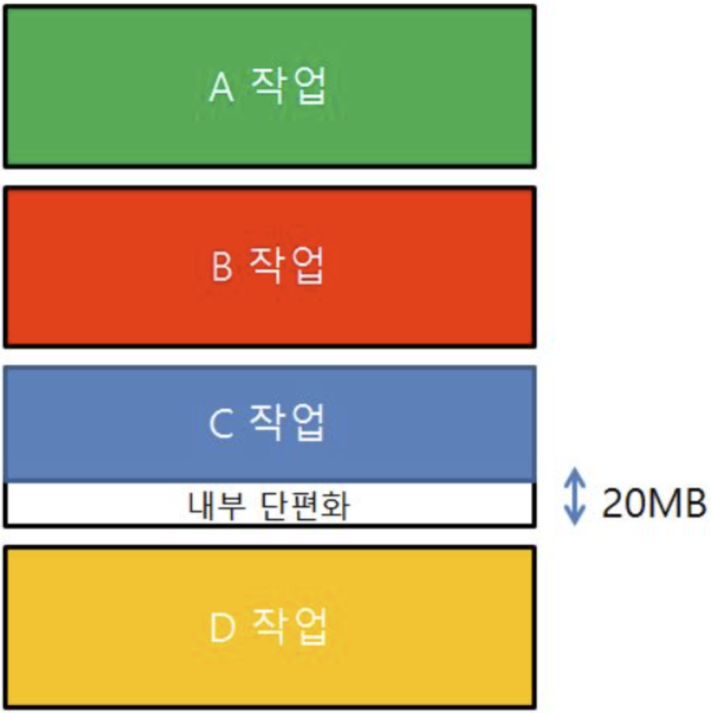
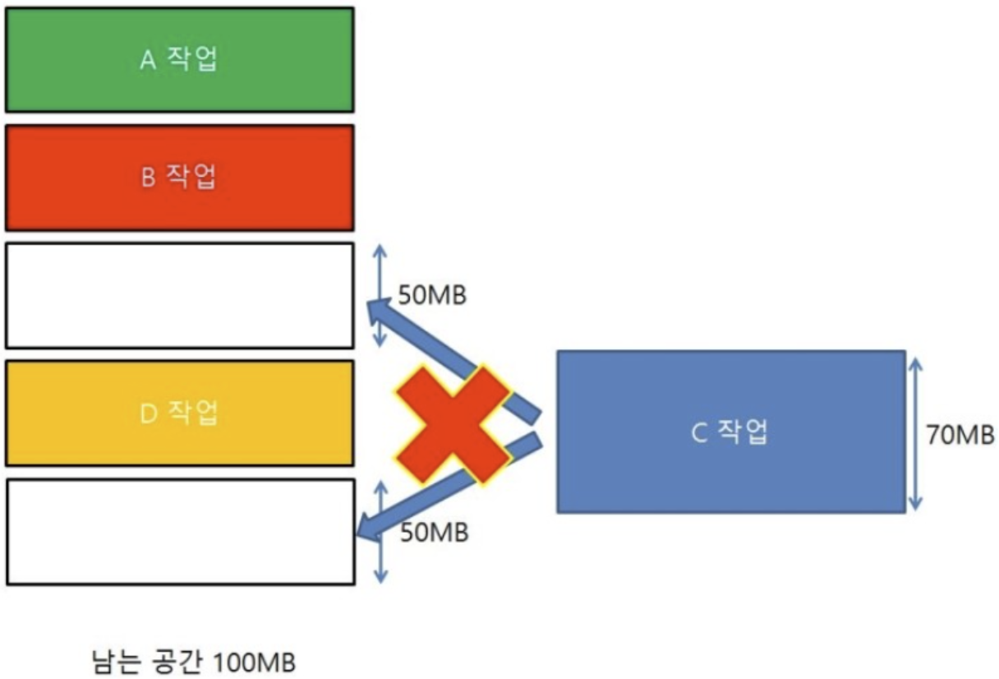

# 단편화

Status: In progress

# 개념

<aside>
📜

**Fragmentation**

메모리 공간이 잘게 쪼개져서 실제 사용할 수 있는 총 메모리 공간은 충분함에도 불구하고, 데이터를 할당하지 못해 메모리가 낭비되는 현상

내부 단편화, 외부 단편화로 나뉜다!

</aside>

---

## 내부 단편화

- 메모리를 고정된 크기로 잘라 제공할 떄 발생 (고정 분할 방식, 예 - paging)
- 4KB짜리 고정 상자에 1KB 데이터를 담으면, 상자 내부에 3KB의 빈 공간이 낭비된다.

---

## 외부 단편화

- 메모리를 동적으로 할당하고 해제하는 과정에서 발생 (가변 분할 방식, 예 - segmentation)
- 동적 할당 및 해제 과정에서 중간중간에 작은 빈 공간이 흩어져 생긴다. 전체 빈 공간을 합치면 6KB로 충분함에도 불구하고, 연속된 5KB 데이터는 올릴 수 없다.
- Compaction(조각모음)이라고 해서 흩어진 조각들을 연속된 공간으로 모을 수 있지만, 연산 오버헤드가 크다.
- Paging 기법을 적용함으로써 해결할 수 있다. (약간의 내부 단편화는 감수해야함)
- 가변 분할 방식을 그대로 사용하기 위한 메모리 배치 알고리즘들
    - First-fit
        - 메모리를 탐색하다가 가장 먼저 발견한, 들어갈 수 있는 빈 공간에 바로 데이터를 저장
        - 탐색 속도가 가장 빠름
    - Best-fit
        - 빈 공간을 전부 훑어보고, 들어갈 수 있는 공간 중 가장 fit한 곳에 데이터를 저장 → 자투리 공간이 가장 적게 남음
        - 미세한 크기의 자투리 공간들이 수없이 양산될 수 있음
    - Worst-fit
        - 들어갈 수 있는 빈 공간들 중 가장 큰 곳에 억지로 할당
- Linux 커널에서 제공하는 Slab Allocator라는 것도 있다.
    - 비슷한 크기의 객체들을 따로 모아놓고 재사용

