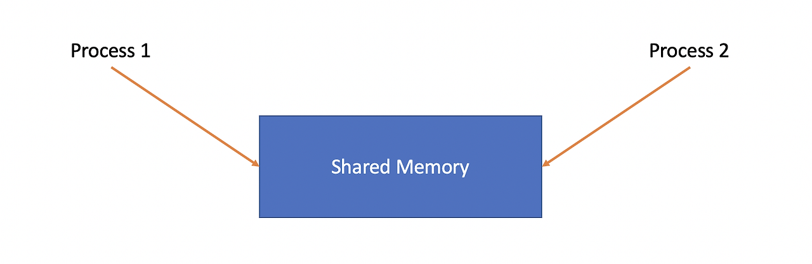
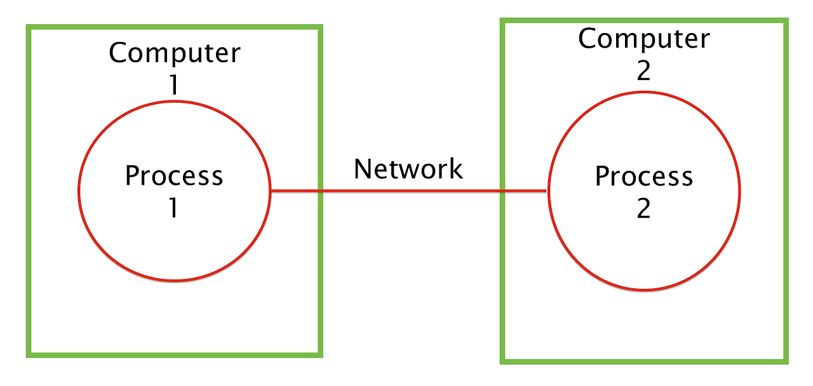
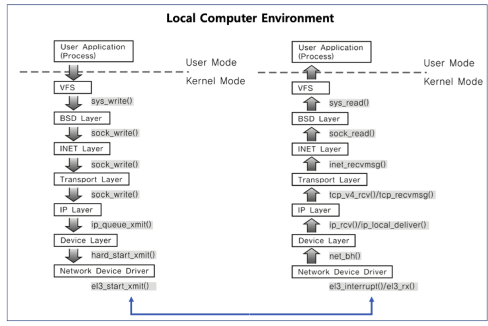
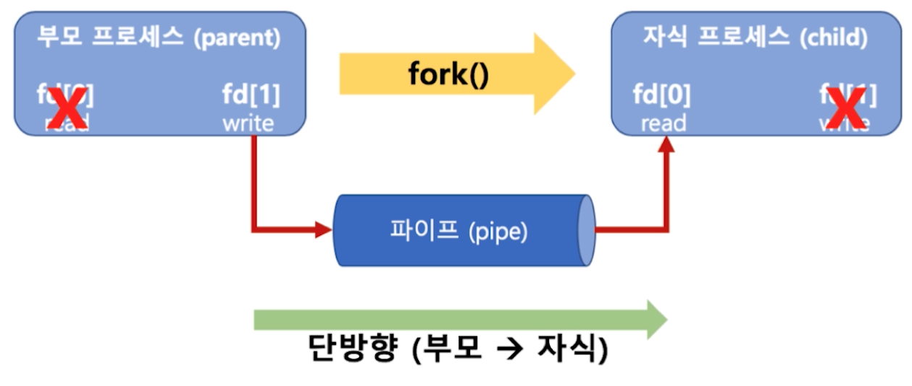
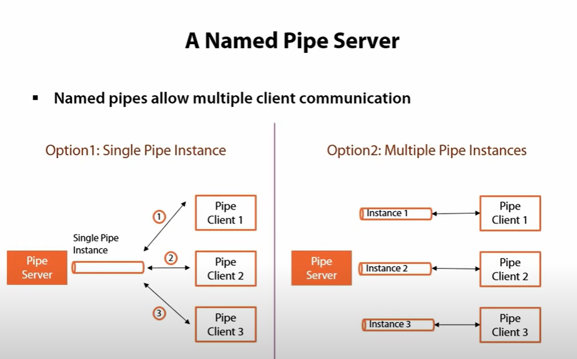
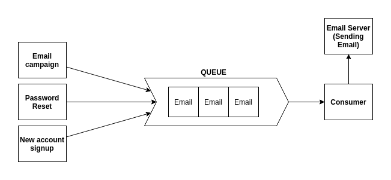

# day15-1 IPC (Inter Process Communication)

## 1. IPC (Inter Process Communication)
- 하나의 컴퓨터 안에서 실행되는 프로세스 간에 발생하는 통신

## 2. IPC의 종류
공유 메모리, 소켓, 파이프, 메시지 큐, 세마포어

### 2.1. 공유 메모리



- 여러 프로세스가 서로 통신할 수 있도록 메모리를 공유하는 것
- 어떤 매개체를 통해 데이터를 주고받는게 아닌 `메모리 자체를 공유`
-> 불필요한 데이터 복사와 같은 `오버헤드가 발생하지 않아 가장 빠름`
- 같은 메모리 영역을 여러 프로세스가 공유하기 때문에 읽고 쓰는 과정에서의 동기화가 필요

### 2.2. 소켓



- `네트워크 인터페이스 (TCP, UDP, HTTP 등)을 기반으로 통신하는 것`을 의미
- 본래 목적은 네트워크 간 통신. IPC에도 활용
- 한 컴퓨터 내에 여러 프로세스 간 통신이 아닌, 각각의 다른 컴퓨터의 프로세스간 데이터를 교환하기 위해 사용되며 양 PC가 서로 port를 정해 대화하기 때문에 `서버-클라이언트 구조`를 가짐



- 소켓을 사용하여 통신 시 위 이미지와 같이 계층을 타고 내려가면서 송신함.
- 송신받은 컴퓨터에서는 아래 계층부터 위로 올라가서 대상 프로세스가 수신을 하는 방식으로 IPC가 이루어짐

### 2.3. 파이프
- 네임드 파이프, 익명 파이프로 나뉨
- 부모, 자식 프로세스간 통신을 위해 사용되며 다른 네트워크 상에서는 사용이 불가능함
- 파이프 내에 데이터 용량도 제한되어있음
- `쓰기 프로세스`가 `읽기 프로세스`보다 더 빠르게 데이터를 처리할 수 없음



- `익명 파이프`: 프로세스 사이의 FIFO 기반의 통신채널을 만들어 통신하는 것
    - 파이프는 단방향 통신 -> 양방향 통신을 하고자하면 아래와 같이 두 개의 익명 파이프를 만들어야 함
    
    



- `네임드 파이프`: 익명 파이프에서 확장된 개념
    - 부모-자식 프로세스 뿐만 아닌 다른 네트워크 상에서도 통신할 수 있는 파이프를 의미함
    - 보통 서버용 파이프, 클라이언트용 파이프를 구분해서 동작


```text
 익명 파이프와 네임드 파이프의 차이
 > 익명 파이프: 부모-자식 프로세스간에서만 사용. 네트워크 간 통신에서 사용 x
 > 네임드 파이프: 부모-자식에서 확장되어 네트워크 간 통신에서도 사용 ㅇ
```

### 2.4. 메시지 큐


- 메시지를 큐 자료구조 형태로 관리하는 버퍼를 만들어 통신하는 것을 말함
- 메시지 지향 미들웨어를 구현한 시스템(Message Oriented Middleware / MOM)을 구현한 시스템으로 아래 과정을 가짐
    1. 프로세스가 메시지를 보내거나 받기 전 큐를 초기화
    2. 보내는 프로세스의 메시지는 큐에 복사되어 받는 프로세스에 전달

> 메시지 큐, 언제 사용하는가?

```text
일반적인 클라이언트-서버 구조에서는 사용자가 요청을 하면 서버가 처리 후 즉각적으로 클라리언트에게 응답을 함
메시지 큐에서는 소비자(클라이언트-서버 구조로 치면 서버)가 메시지를 어느 시점에 가져가서 처리하는지 보장하지 않음
-> 클라이언트 입장에서는 언젠가는 메시지 큐에 넣어둔 데이터가 언제 처리되는지는 알 수 없습
-> 애플리케이션에서 즉각적인 처리와 피드백이 필요한 요청에 대해 사용하기보다는 부가적인 기능에 사용하는 것이 적합 (비밀번호를 찾기 위해 또는 회원가입 인증을 받기 위한 이메일 수신을 요청했을 때, 요청하자마자 인증 메일이 오지 않는 것과 같이 사용자에게 어느정도의 응답지연이 허용되는 경우 메시지 큐가 사용됨)
```

- 메시지 큐의 장점
    - 비동기
        - 프로세스의 완료를 기다리지 않고 동시에 다른 작업을 처리하는 비동기적 처리 방식 -> 큐에 넣어놓고 나중에 처리해도 됨
        - 동기 처리가 가지는 많은 데이터가 요청되는 경우에 대해서는 응답지연이 발생하지 않음
        - 서비스간 결합도가 낮아짐 -> 확장성 좋아짐 
    - 보장성
        - 메시지 큐에 보관된 데이터는 결국에는 모두 처리가 된다는 확실한 보장 제공

[출처](https://rlaehddnd0422.tistory.com/241)