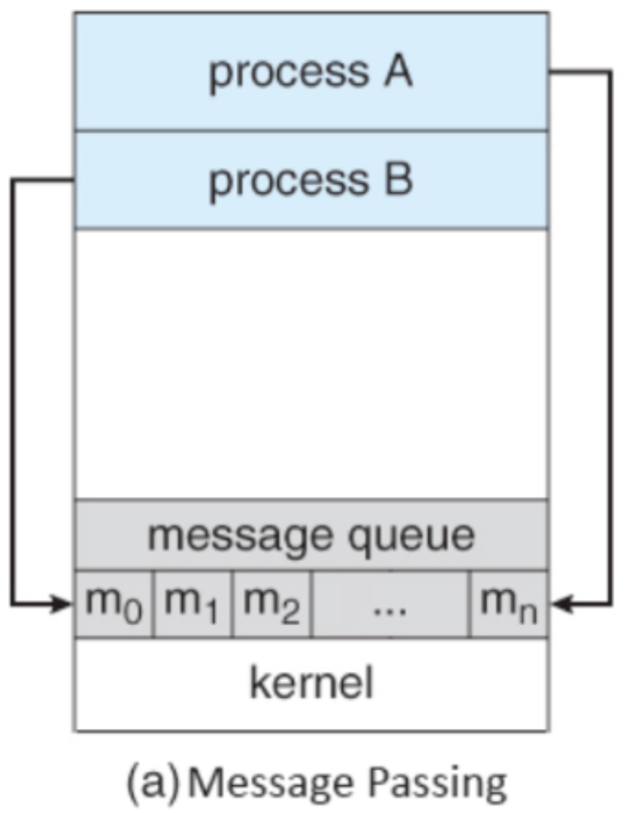
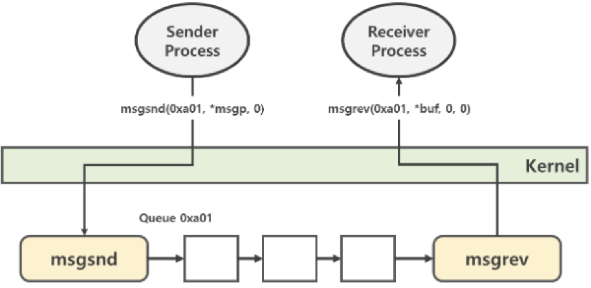
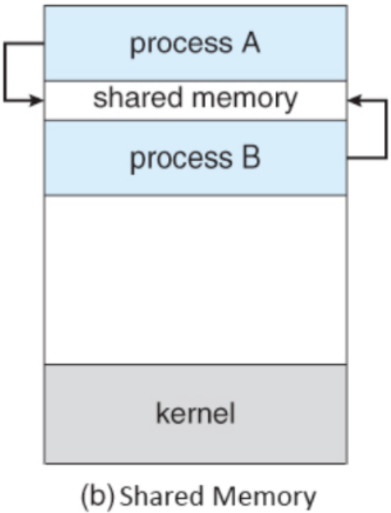
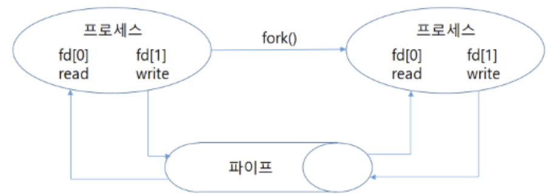
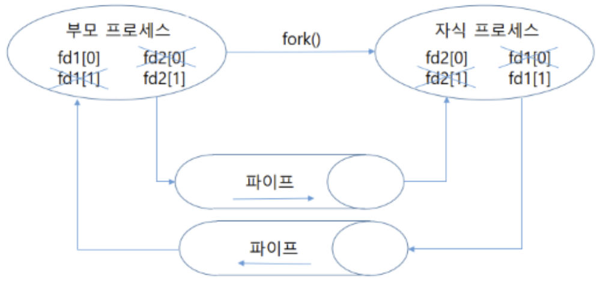
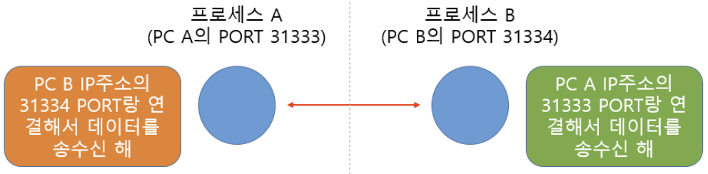

# IPC

Date: 2026년 7월 22일
Status: Done

# 개념

<aside>
📜

**IPC (Inter-Process Communication)**

독립된 프로세스 간에 데이터를 주고 받는 방식으로서, 메세지 전달방식과 공유 메모리 방식, pipe, socket 등이 있다.

</aside>

---

# 메세지 전달방식

**메모리엔 커널이 직접 관리하는 일부 공간(메세지 큐)이 있는데, 이 공간에 각 프로세스들이 메세지를 던져주면, OS가 대리로 전달한다.**

- msgsnd(), msgrcv() 같은 system call로 동작
- 운영체제 개입하므로 커널 의존성이 높고, 속도가 느림
- 직접 통신
    - 메세지 큐로 자원을 전달하면, 커널이 그 자원을 다른 프로세스에게 전달
- 간접 통신
    - 메세지 큐로 자원을 전달하면, 다른 프로세스가 이 메세지 큐를 참조해서 자원을 읽어감

---

# 공유메모리 방식

OS는 공유메모리를 사용하는 system call을 지원해서, 서로 다른 프로세스들이 그들의 주소 공간 중 일부를 공유할 수 있다.

- shmget(), shmat(), shmdt(), shmddr, shmctl() 등의 system call로 동작
- 프로세스가 공유 메모리 할당을 요청하면 커널은 해당 프로세스에 공유 메모리 공간을 할당, 이 공간에 어떤 프로세스라도 다 접근할 수 있음
- OS라는 중재자 없이 프로세스가 메모리에 직접 접근하므로 빠르게 동작하지만, 동기화 문제가 발생할 수 있음

---

# 기타

- pipe
    - 송신, 수신이 동시에 안됨
    - 단방향 통신이기 때문에 서로 주고 받기 위해선 pipe를 추가해야함

- socket
    - 각 프로세스가 고유한 port번호를 통해 socket을 만들어 통신

