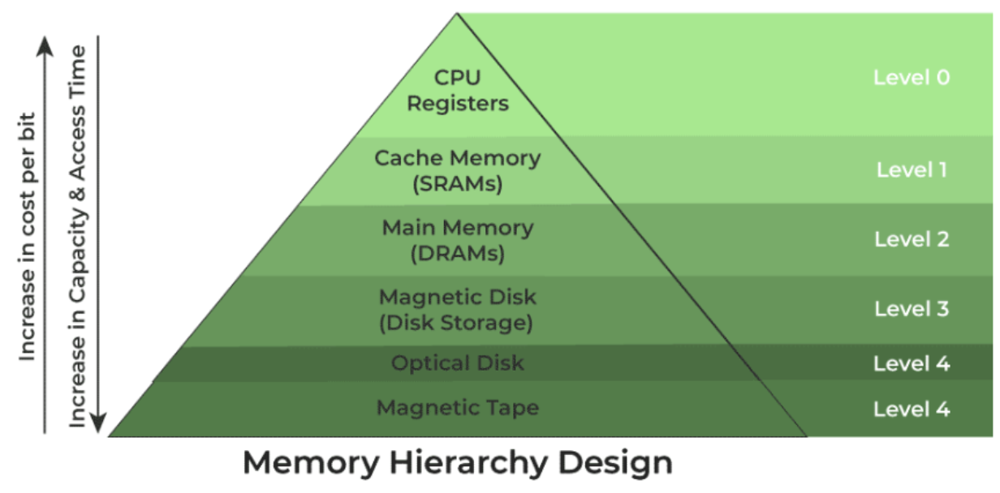
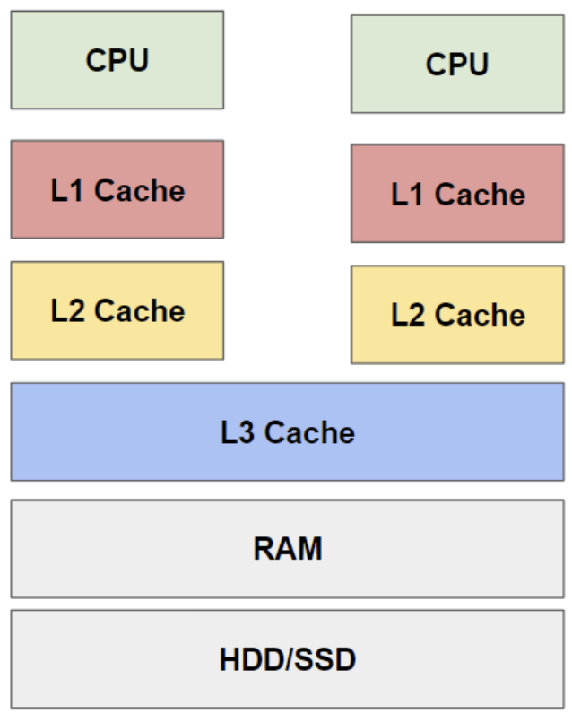
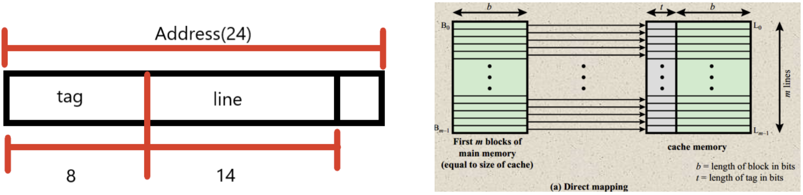
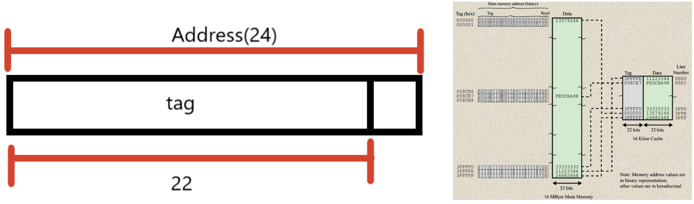
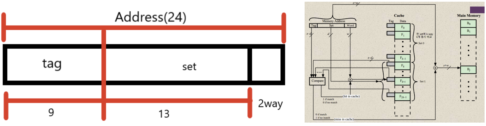

# Memory & Cache Locality

Status: Done

# 개념

<aside>
📜

**Memory**

일시적 또는 장기간 데이터를 저장하는 디지털 시스템

메모리 계층 구조와 캐시의 참조 지역성이라는 특성을 알아보자!

</aside>

---

# 메모리 계층

| 분류 | 속도 | 용량 |
| --- | --- | --- |
| CPU Register | 가장 빠름 | 가장 적음 |
| Cache(L1, L2, L3) | 빠름 | 적음 |
| 주기억장치(RAM) | 보통 | 보통 |
| 보조기억장치(SSD, HDD) | 낮음 | 가장 많음 |

---

## Register

- CPU에 위치한 작은 임시 기억 장치

---

## Cache

- 데이터를 미리 복사해 놓는 임시 저장소
- 빠른 장치와 느린 장치간의 속도 차이에 따른 병목 현상을 줄이기 위한 장치이다.
- 가장 큰 단점으로, 상당히 비싸다.
    - Register와 DRAM의 데이터 교환에서의 병목 현상을 Cache가 해결
- L1 Cache
    - 보통 CPU 안에 내장되어 데이터 사용 및 참조에 가장 먼저 사용
- L2 Cache
    - L1 Cache와 용도, 역할이 비슷하고 용량이 큰 반면 속도가 느림
    - CPU 회로판에 별도의 칩으로 내장
- L3 Cache
    - L1, L2 Cache와 동일한 원리로 작동
    - 보통 메인보드에 내장됨

## Cache Locality

- 기억장치 내의 정보를 균일하게 접근하는 것이 아닌 어느 한 순간에 특정 부분을 집중적으로 참조하는 특성
- 시간 Locality
    - 최근 사용한 데이터에 다시 접근하려는 특성
    - 메모리 상의 같은 주소에 여러 차례 읽기/쓰기를 수행할 경우, 상대적으로 효율성을 높일 수 있음
- 공간 Locality
    - 최근 접근한 데이터를 이루고 있는 공간이나 가까운 공간에 접근하는 특성
    - 메모리 주소를 순서대로 접근한다면 주소 하나만 참조한다기 보다, 해당 블록 전체를 캐시에 가져옴으로써 효율성이 크게 향상됨

## Cache Mapping

- 주기억장치로부터 캐시 메모리로 데이터를 가져오는 방법으로 3가지가 있다.
- Direct Mapping
    - 단순 로직으로 가격이 저렴하고 속도가 빠름
    - 접근하려는 데이터의 메모리 주소에 따라 캐시 매핑 주소가 결정됨
    - 떄문에 캐시가 비어있어도 conflict miss가 잦은 빈도로 발생
        
        
        
- Associative Mapping
    - 메모리로부터 가져온 데이터가 캐시의 어느 공간이든 저장될 수 있음
    - 캐시를 참조할 때 데이터 탐색 비용(tag 비교)이 크지만 conflict miss로 인한 miss rate이 줄어듦
        
        
        
- Set-Associative Mapping
    - 막연히 캐시의 아무 공간에 데이터를 저장하기 보다, 구역을 나눠서 저장함으로써 데이터 탐색 시간을 줄이는 방식
    - direct mapping 방식으로 set을 찾고, associative 방식으로 set 내의 각 라인의 주소 값을 비교하여 데이터를 얻음
        
        