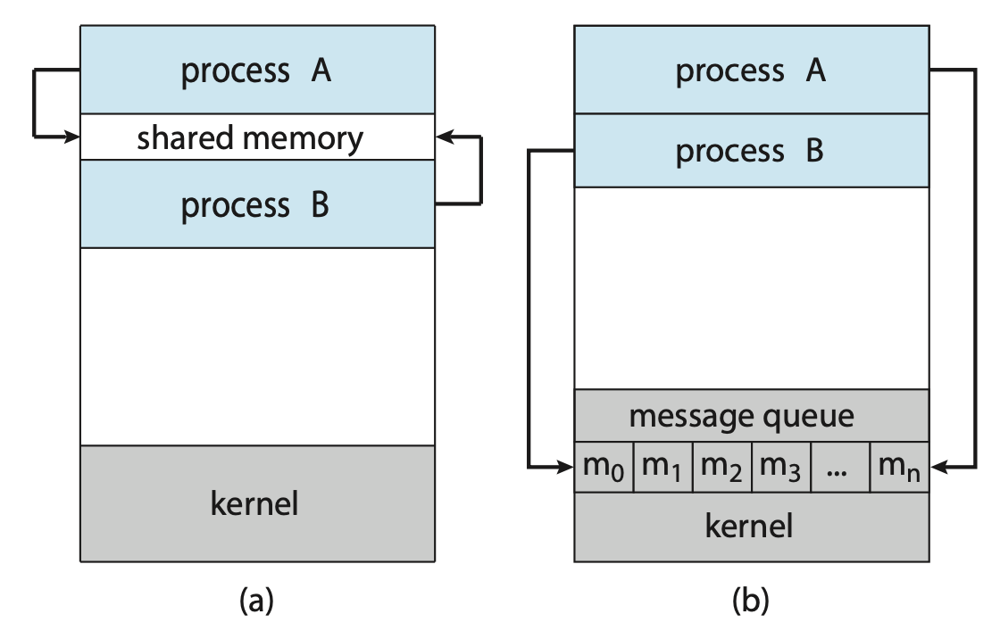

# Day 15 - IPC, 메모리, Locality

# IPC

IPC(프로세스 간 통신)은 프로세스 간 통신 방법을 의미한다.

프로세스는 독립적인 프로세스와 협력적인 프로세스로 나뉜다.

독립적인 프로세스는 말그대로 현재 실행 중인 다른 프로세스들과 데이터를 공유하지 않는 프로세스이고, 협력적인 프로세스는 현재 실행 중인 다른 프로세스에 영향을 주거나 받는 프로세스이다.

#### 왜 필요할까?

협력 프로세스는 정보 공유, 계산 속도 향상, 작업 분할, 사용자 편의성 등을 위해 서로 데이터를 교환해야 한다. 하지만 일반적으로 각 프로세스는 독립적인 메모리 공간을 가지고 있어 다른 프로세스가 접근할 수 없다. 이를 위해 IPC 기법이 필요하다.

프로세스 간 메세지 교환은 크게 공유 메세지(shared message)와 메세지 전달(message passing) 모델이 있다.



### 공유 메모리 (Shared Memory)

> 여러 프로세스가 같은 메모리 공간을 공유하는 방식

운영 체제가 공유 메모리 영역을 생성하고 각 프로세스가 해당 영역을 자신의 주소 공간에 매핑하여 사용한다.

#### 장점

- 매우 빠름
- 커널 개입이 거의 없음
- 대용량 데이터 전송에 적합

#### 단점

- 동기화가 필요
- Race Condition 발생 가능

### 메세지 전달 (Message Passing)

> 공유 메모리를 만들지 않고 운영체제를 통해 메세지를 주고 받는 방식

```c
Process A
    |
 send()
    |
 Kernel
    |
receive()
    |
Process B
```

운영체제가 중간에서 메세지를 복사해서 전달한다.

#### 장점

- 구현이 간단하고 동기화 문제가 줄어든다
- 분산 시스템에 적합하다

#### 단점

- 커널을 반드시 거쳐야 한다
- Context Switching이 발생한다
- 공유 메모리보다 느리다

### 대표적인 IPC 기법

| IPC 종류                      | IPC 모델        | 공유 매개체            | 통신 단위           | 통신 방향                      | 사용 범위        | 주 사용 상황                   | 장점                            | 단점                                   |
| ----------------------------- | --------------- | ---------------------- | ------------------- | ------------------------------ | ---------------- | ------------------------------ | ------------------------------- | -------------------------------------- |
| **Shared Memory**             | Shared Memory   | 공유 메모리            | Memory              | 양방향                         | 동일 시스템      | 대용량 데이터 공유             | **가장 빠름(Zero Copy)**        | 동기화(Mutex, Semaphore) 필수          |
| **Memory Mapped File (mmap)** | Shared Memory   | 파일 + 메모리          | Page                | 양방향                         | 동일 시스템      | 파일 공유, DB, 캐시            | 파일을 메모리처럼 사용          | 파일 관리 필요                         |
| **Pipe**                      | Message Passing | 커널 Pipe Buffer       | Byte Stream         | 단방향                         | 부모-자식        | `fork()`한 프로세스 간 통신    | 구현이 간단                     | 부모-자식 관계, 양방향은 Pipe 2개 필요 |
| **Named Pipe**                | Message Passing | 커널 Pipe Buffer(파일) | Byte Stream         | 양방향 가능(읽기/쓰기 FD 별도) | 동일 시스템      | 서로 관계없는 프로세스 간 통신 | 파일 이름으로 접근 가능         | 네트워크 통신 불가                     |
| **Message Queue**             | Message Passing | 커널 Queue             | **Message(구조체)** | 양방향                         | 동일 시스템      | 메시지 단위 통신               | 메시지 경계 유지, 우선순위 가능 | 커널 복사 비용 발생                    |
| **Socket**                    | Message Passing | Socket Buffer          | Stream / Datagram   | 양방향                         | 동일·원격 시스템 | Client-Server 통신             | 다른 컴퓨터와 통신 가능         | 네트워크 오버헤드                      |

---

# 메모리 구조


1. 코드 영역 (텍스트 영역)

   실행할 프로그램의 코드가 저장되는 영역이다. CPU는 코드 영역에 저장된 명령어를 하나씩 가져가서 처리한다.

2. 데이터 영역 (static 영역)

   전역 변수와 지역 변수가 저장되는 영역으로, 프로그램이 시작되는 동시에 할당되며, 프로그램이 종료되면 함께 소멸한다.

3. 힙 영역 (Heap)

   사용자가 직접 관리하는 영역이며 메모리 공간이 동적으로 할당 및 해제된다.

4. 스택 영역 (Stack)

   함수의 호출에 따른 지역변수와 매개변수가 저장되는 영역으로, 컴파일 시 크기가 결정된다. 함수의 호출과 함께 할당되고, 함수의 호출이 종료되면 소멸한다.

---

# Locality

> 프로그램이 실행될 때 메모리 내의 특정 데이터나 명령어에 집중적으로 접근하는 특성

### Temporal Locality (시간 지역성)

> 최근 참조했던 데이터를 다시 참조할 가능성이 높다

```c
for (int i = 0; i < 1000; i++) {
    sum += arr[0];
}
```

위와 같은 for문에서 `arr[0]`이 계속 사용됨

반복문 변수(i), 루프 내부 변수, 자주 호출되는 함수 등이 대표적인 예시이다.

### Spatial Locality (공간 지역성)

> 어떤 주소를 접근하면 그 주변 주소도 곧 접근할 가능성이 높다

```c
for (int i = 0; i < 1000; i++) {
    sum += arr[i];
}
```

위 와 같은 for문에서 `arr[0]`, `arr[1]`, `arr[2]` 처럼 연속된 메모리를 접근함

배열, 구조체, 순차 파일 읽기 등이 대표적이 예시이다.

### 필요성

운영체제가 미래의 메모리 접근을 예측하게 함으로써 메모리 접근 횟수와 지연 시간을 줄여 결과적으로 성능을 향상시킨다.

예를 들어

```c
// 1번 코드
int main(){
	...
    for(int i = 0; i<10; i++){
    	for(int j = 0; j<10; j++){
        	sum += array[i][j];
        }
    }
    ...
}

// 2번 코드
int main(){
	...
    for(int i = 0; i<10; i++){
    	for(int j = 0; j<10; j++){
        	sum += array[j][i];
        }
    }
}
```

1번과 2번 코드의 동작은 동일하지만, 실행 시간에 있어 차이가 존재한다. 그 이유는 1번 코드의 경우 Spatial Locality가 적용되어 주변 데이터들을 캐시에 저장하여 활용할 수 있지만, 2번 코드의 경우 순차적으로 접근하지 않기 때문에 Spatial Locality를 활용하지 못해 메모리 접근에 더 많은 시간이 소요된다.
