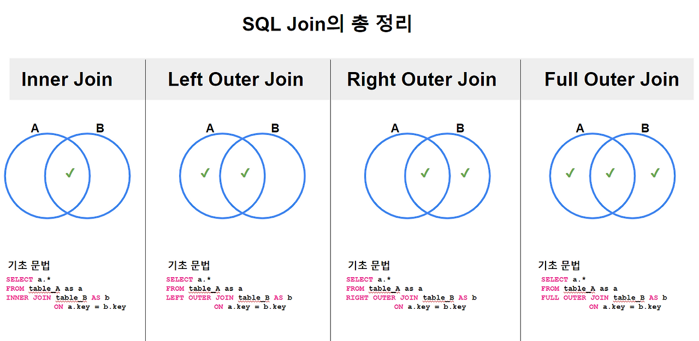
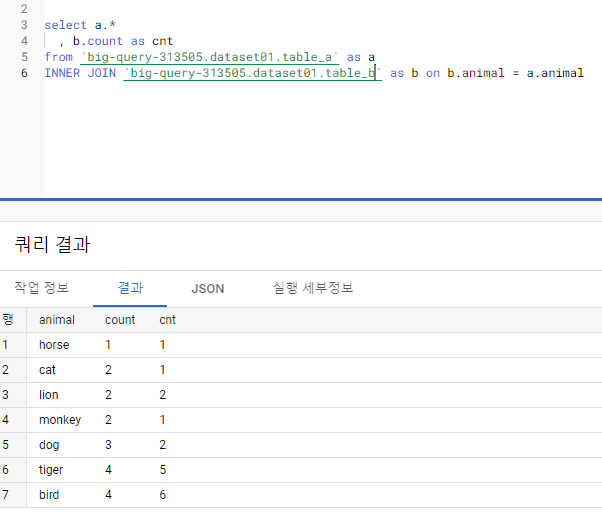
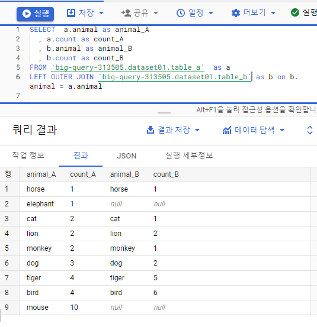
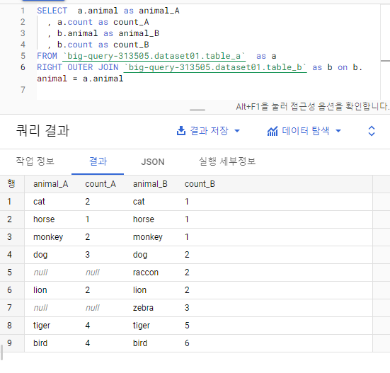
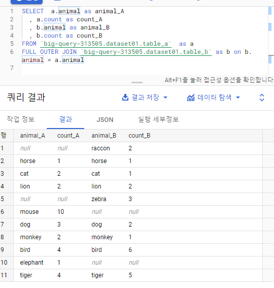

# day16 Key 종류 / SQL Injection / Join

## 1. Key 종류

### key란
- 데이터베이스에서 테이블의 행을 식별하거나 테이블 간의 관계를 연결하기 위해 사용하는 속성 또는 속성의 집합

1. Super Key(슈퍼키)
- 테이블에서 각 행을 유일하게 식별할 수 있는 하나 이상의 속성 집합
- 행을 구분할 수만 있다면 불필요한 속성이 포함되어도 됨

```text
학생(학번, 주민번호, 이름)

슈퍼키 예시

- 학번
- 주민번호
- 학번 + 이름
- 주민번호 + 이름
```

2. Candidate Key(후보키)
- 각 행을 유일하게 식별할 수 있는 최소한의 속성 집합
- 유일성과 최소성을 만족해야 함
- `유일성`: 하나의 키 값으로 하나의 행만 식별 가능
- `최소성`: 키를 구성하는 속성 중 하나라도 제거하면 행을 식별할 수 없음

```text
학생(학번, 주민번호, 이름)

후보키
- 학번
- 주민번호
```

3. Primary Key(기본키)
- 후보키 중에서 테이블을 대표하도록 선택한 키
- 중복된 값을 가질 수 없음
- NULL 값을 가질 수 없음
- 한 테이블에 하나만 지정 가능

```sql
CREATE TABLE 학생(
    학번 INT PRIMARY KEY,
    이름 VARCHAR(20)
);
```

4. Alternate Key(대체키)
- 후보키 중 기본키로 선택되지 않은 나머지 키

```text
후보키: 학번, 주민번호
기본키: 학번
대체키: 주민번호
```

5. Foreign Key(외래키)
- 다른 테이블의 기본키 또는 유일키를 참조하는 속성
- 테이블 사이의 관계를 연결하는 데 사용
- 참조 무결성을 유지해야 함

```sql
CREATE TABLE 부서(
    부서코드 INT PRIMARY KEY,
    부서명 VARCHAR(20)
);

CREATE TABLE 사원(
    사원번호 INT PRIMARY KEY,
    이름 VARCHAR(20),
    부서코드 INT,
    FOREIGN KEY (부서코드) REFERENCES 부서(부서코드)
);

```

6. Composite Key(복합키)
- 두 개 이상의 속성을 조합하여 만든 키
- 하나의 속성만으로는 행을 식별할 수 없을 때 사용

```sql
CREATE TABLE 수강(
    학번 INT,
    과목코드 INT,
    PRIMARY KEY (학번, 과목코드)
);

```

7. Unique Key(유일키)
- 특정 속성의 값이 중복되지 않도록 제한하는 키
- 기본키와 달리 일반적으로 NULL을 허용할 수 있음
- DBMS에 따라 NULL 처리 방식은 다를 수 있음

```sql 
CREATE TABLE 회원(
    회원번호 INT PRIMARY KEY,
    이메일 VARCHAR(100) UNIQUE
);

```


## 2. SQL Injection
### SQL Injection이란
- 사용자 입력값에 악의적인 SQL문을 삽입하여 데이터베이스를 비정상적으로 조작하는 공격
- 입력값을 SQL문에 직접 연결할 때 발생할 수 있음

### SQL Injection으로 발생할 수 있는 문제
- 로그인 인증 우회
- 개인정보 조회
- 데이터 수정 및 삭제
- 관리자 권한 획득
- 데이터베이스 구조 노출
- 서비스 장애 발생

### 예방 방법
1. Prepared Statement 사용
- SQL문과 사용자 입력값을 분리하여 처리
- 입력값을 SQL 명령어가 아닌 데이터로 인식함

2. 입력값 검증
- 허용할 문자, 길이, 형식을 미리 정함
- 예상하지 못한 특수문자나 비정상적인 입력을 차단

3. 최소 권한 원칙 적용
- 애플리케이션이 사용하는 DB 계정에 필요한 권한만 부여
- 일반 서비스 계정에 DROP, ALTER 등의 권한을 주지 않음

4. 오류 메시지 최소화
- SQL 오류 내용이나 테이블 구조를 사용자에게 그대로 노출하지 않음

5. 비밀번호 암호화
- 비밀번호를 평문으로 저장하지 않고 안전한 해시 알고리즘을 사용
- SQL Injection 예방과는 별개지만 계정 정보 보호에 중요

```text
[핵심]
- 문자열 연결로 SQL 문을 만들면 위험함
- 가장 중요한 대응 방법은 Prepared Statement 또는 매개변수화된 쿼리 사용
- 입력값 검증과 최소 권한 설정을 함께 적용해야 함
```

## 3. Join
### Join이란
- 두 개 이상의 테이블을 관련된 속성을 기준으로 연결하여 데이터를 조회하는 연산



1. INNER JOIN
- 교집합에 해당하는 개념




- 결과 설명
    - A, B 각각 존재하는 동물 종류는 9가지였다.  
    - A와 B에 모두 동시에 존재하는 동물은 총 7 종류로 나왔다. 
    - 즉 7개의 교집합만을 산출해서 보여준 것이다. 

- 실무 예시: 신발 제품과 의류 제품을 모두 구매한 고객들이 궁금하다면 사용 가능

2. LEFT OUTER JOIN
- FROM "Table"에 초점을 맞춘 Join




- 결과 설명
    - A에 해당하는 동물들은 모두 호출 되었다. 
    - B에서는 A와 동일한 종이 있는 경우에만 호출되었다. 
    - B에서는 Elephant와 Mouse가 없는 것을 확인할 수 있었다. 

- 실무 예시: 신발을 구매한 사람들 중 티셔츠를 동시에 산 사람들과 아닌 사람을 구분해서 보고 싶은 경우

3. RIGHT OUTER JOIN
- OUTER JOIN "TABLE"에 초점을 맞춘 Join



- 결과 설명
    - 이것은 LEFT OUTER JOIN 결과와 거의 동일한데, 그 방향성이 FROM에 있는지 혹은 JOIN에 있는지 차이다. 
    - 그 결과 이번에는 B는 모두 호출되었지만, A는 racoon과  zebra가 없기 때문에 결과가 나타나지 않았다. 
    - 그래서 보통 실무에서 이 함수의 사용 빈도는 낮은 편이지만, 그래도 알아두면 좋다. 

4. FULL OUTER JOIN
- 모든 데이터 조회를 위한 합집합 개념



- 결과 설명
    - 이번에는 A와 B에 존재하는 모든 동물의 종이 조회가 되었다. 
    - 그래서 A에는 racoon과 zebra 빼고 모두 호출된 반면, B에서는 elephant와 mouse를 제외하고 모두 호출 되었다. 
    - 이 경우 모든 데이터를 조회할 수 있는 장점이 있는 대신, 데이터 처리 리소스 비용이 많이 드는 단점 또한 있으니 적절하게 사용해야 한다. 

- 실무 예시: 신발과 패딩을 구매한 사용자들 패턴 중 모든 경우의 수를 불러와야 할 경우