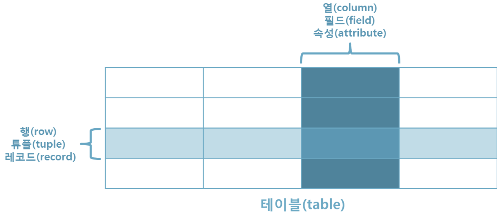
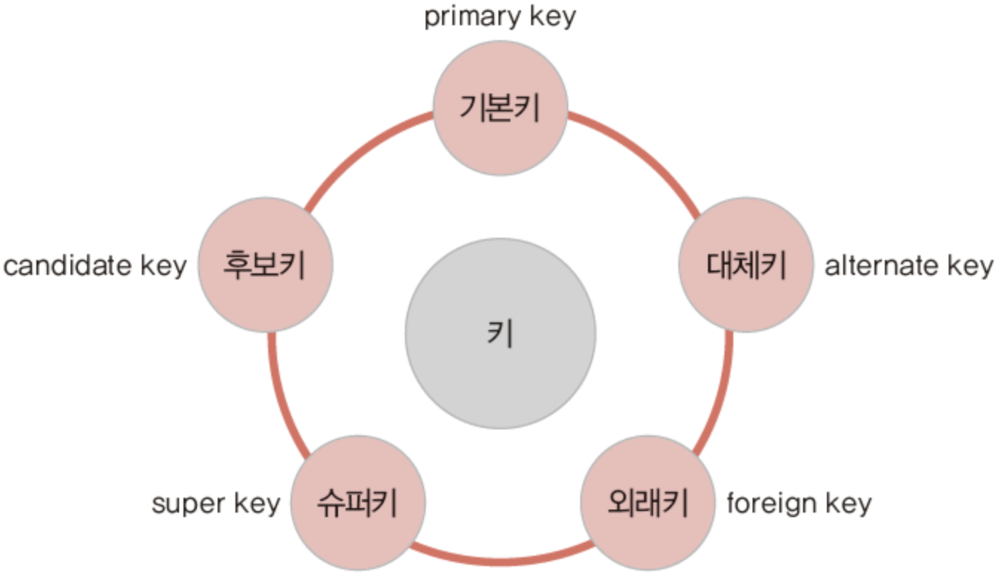
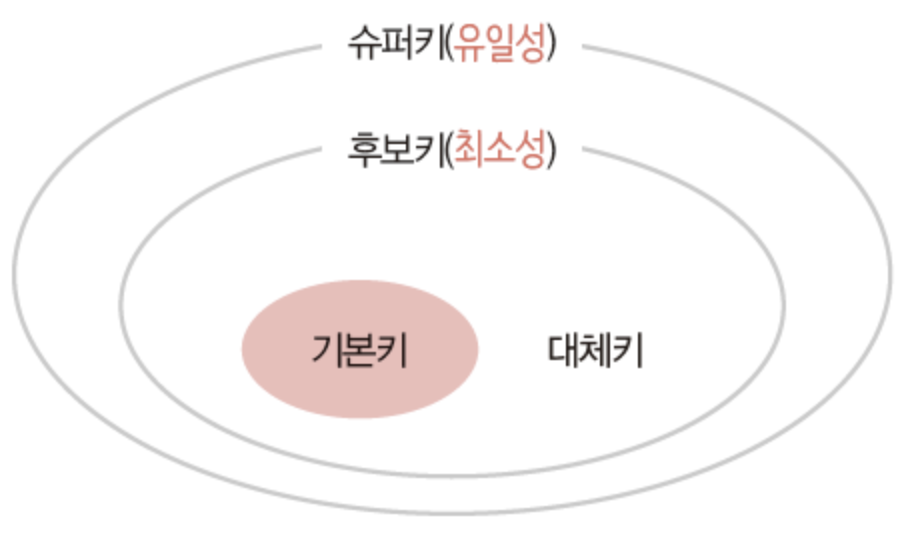
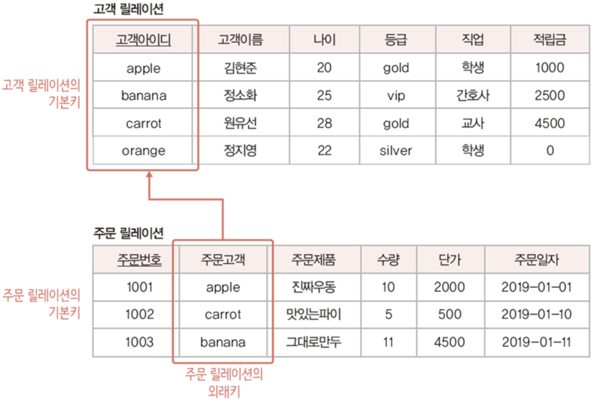
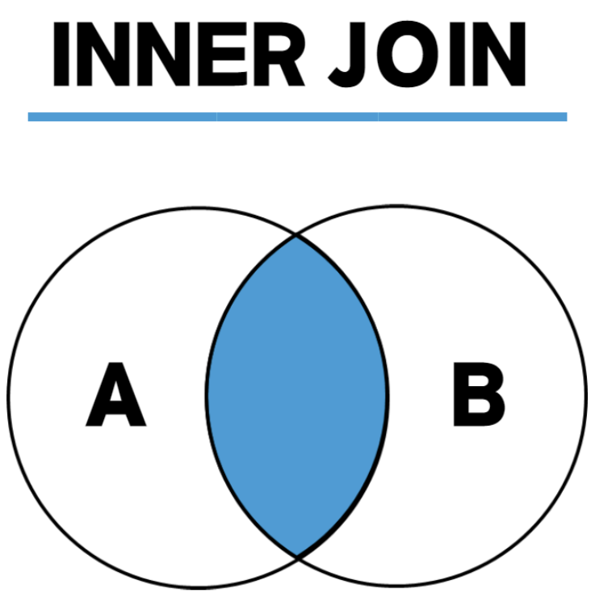
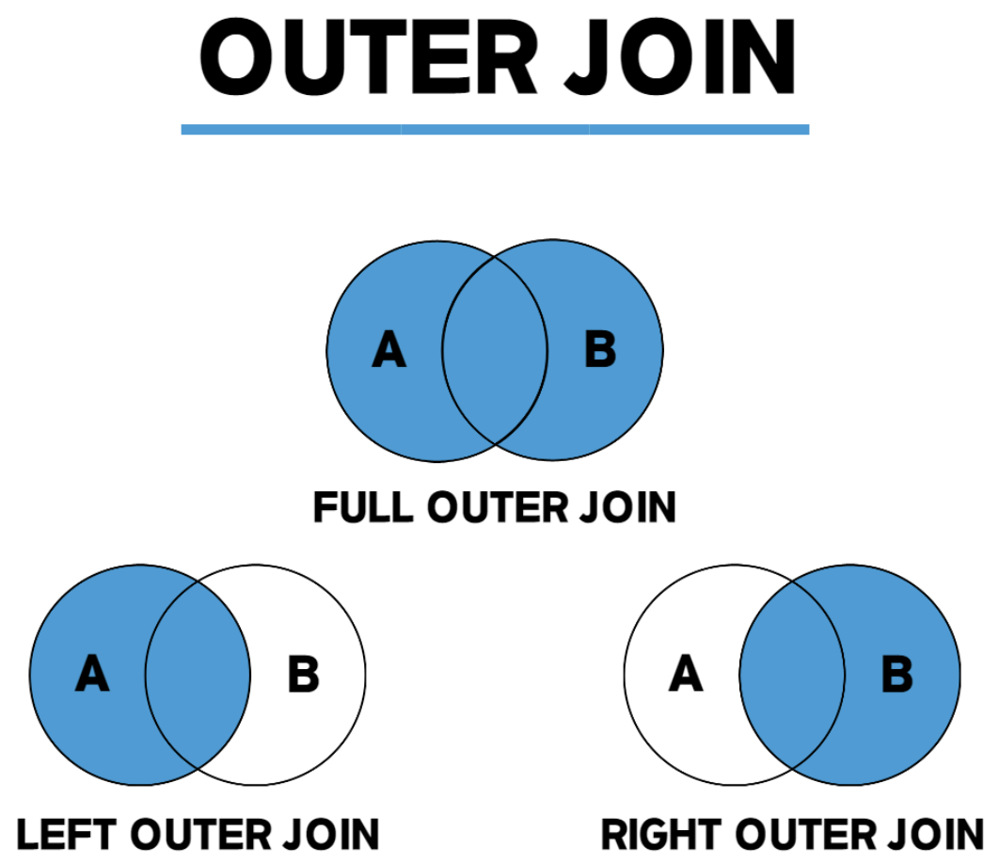
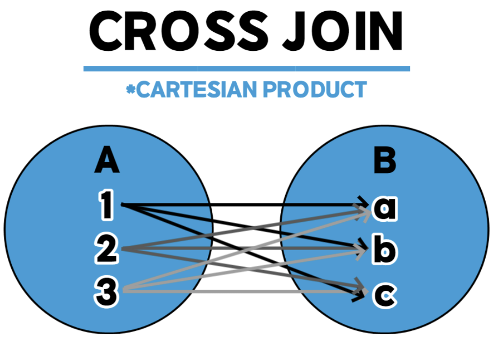

# Key, Join

Date: 2026년 7월 23일
Status: Done

# 개념

<aside>
📜

**Key**

검색, 정렬 시 튜플을 구분할 수 있는 기준이 되는 속성 또는 속성의 집합

아래에서 키의 종류에 대해 알아보자!

**Join**

두 개 이상의 테이블이나 데이터베이스를 **연결**하여 데이터를 검색하는 방법

여러 방식의 Join에 대해 알아보자!



</aside>

---

# Key 종류





## 후보키 (Candidate Key)

튜플을 유일하게 구별하기 위해 꼭 필요한 최소한의 속성 또는 속성의 집합

- **유일성** : Key로 하나의 튜플 유일하게 구별 가능
- **최소성** : 꼭 필요한 속성으로 구성

## 기본키 (Primary Key)

여러 후보키 중에서 기본적으로 사용할 키

- 후보키 1개 -> 해당 후보키 기본키
- 후보키 여러 개 -> 데이터베이스 사용 환경 고려해 적합한 것 선택
- Not Null
- Unique

## 슈퍼키 (Super Key)

유일성은 만족하지만 최소성은 만족하지 않는 속성 또는 속성의 집합

- 예시: `(학번 + 이름 + 나이)`를 묶어서 사람을 식별할 수는 있지만, 굳이 이름과 나이가 없어도 학번만으로 식별 가능하므로 최소성이 깨진다. 이런 묶음이 슈퍼키이다.

## 외래키 (Foreign Key)

어떤 릴레이션에 소속된 속성 또는 속성 집합이 다른 릴레이션의 기본키가 되는 키, 다른 테이블의 기본키를 참조하는 속성



---

# Join 종류

## Inner Join

- 두 테이블에 모두 존재하는(조건이 일치하는) 데이터만 가져옵니다.
- 예시: `부서 테이블`과 `직원 테이블`을 조인할 때, 소속 부서가 배정된 직원들만 결과로 나온다. (신설 부서나 아직 부서가 없는 신입사원은 제외됨)
- 두 테이블을 같은 테이블로 채우면 Self Join (각각 별칭을 정의해야함)

```sql
SELECT <열 목록>
FROM <첫 번째 테이블>
    INNER JOIN <두 번째 테이블>
    ON <조인 조건>
[WHERE 검색 조건]

#INNER JOIN을 JOIN이라고만 써도 INNER JOIN으로 인식한다.
```



## Outer Join

- 조건이 맞지 않는 데이터도 버리지 않고 기준을 정해 가져오고 빈자리는 `NULL`로 채운다.
- Left Outer Join
    - 왼쪽 테이블의 모든 데이터를 가져오고, 오른쪽 테이블은 조건이 맞는 것만 붙여준다.
    - 일치하지 않으면 NULL
- Right Outer Join
    - 오른쪽 테이블의 모든 데이터를 가져오고, 왼쪽을 붙여준다.
- Full Outer Join
    - 양쪽 테이블의 모든 데이터를 무조건 가져오고, 매칭 안 되는 곳은 전부 NULL로 채운다.

```sql
SELECT <열 목록>
FROM <첫 번째 테이블(LEFT 테이블)>
    <LEFT | RIGHT | FULL> OUTER JOIN <두 번째 테이블(RIGHT 테이블)>
     ON <조인 조건>
[WHERE 검색 조건]
```



## Cross Join

- 두 테이블 간에 가능한 모든 경우의 수를 조합한다.
- 데이터 10개인 테이블과 데이터 20개인 테이블을 크로스 조인하면 200개의 튜플이 생성된다.

```sql
SELECT *
FROM <첫 번째 테이블>
    CROSS JOIN <두 번째 테이블>
```

