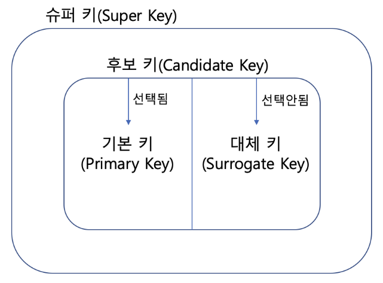

# Day 16 - DB Key 종류, SQL 인젝션, Join

# Key 종류

1. 슈퍼키(Super Key) : **유일성은 만족**하지만 **최소성은 만족하지 않는** 키
2. 복합키(Composite Key) : **2개 이상의 속성**을 사용한 키
3. 후보키(Candidate Key) : **유일성과 최소성을 만족**하는 키. 기본키가 될 수 있는 후보
4. 기본키(Primary Key) : 후보키 중에서 선택된 키로 NULL 값을 가질 수 없고, 기본키로 선택된 속성에는 중복되는 값이 들어갈 수 없음
5. 대체키(Surrogate Key) : 후보키 중에 기본키로 선택되지 않은 키
6. 외래키(Foreign Key) : 테이블 간의 기본키를 참조하는 속성. 테이블 간의 관계를 나타내기 위해 쓰임



# SQL Join

## 조인의 종류

### INNER JOIN - 내부 조인

> 두 테이블에서 조건이 일치하는 행만 결합

- JOIN … ON 구문
  - JOIN 대신 INNER JOIN이라고 써도 같은 의미임

```sql
SELECT 컬럼1, 컬럼2, ...  -- 조회할 컬럼 지정
FROM 테이블1              -- 기준 테이블
JOIN 테이블2 ON 테이블1.컬럼 = 테이블2.컬럼;  -- ON: 결합 조건
```

- WHERE 구문 (동등 조인)

```sql
SELECT 컬럼1, 컬럼2, ...
FROM 테이블1, 테이블2
WHERE 테이블1.컬럼 = 테이블2.컬럼;
```

두 방식은 표기법만 다르지 실제 결과는 동일함

### CROSS JOIN - 교차 조인

> 두 테이블의 모든 가능한 조합을 생성

예를 들어 A 테이블에 행이 3개, B 테이블에 행이 2개 있었다면 결과는 총 6개의 행임

```sql
SELECT *           -- *는 모든 컬럼을 의미합니다
FROM A CROSS JOIN B;
```

### OUTER JOIN - 외부 조인

> 한쪽 테이블의 모든 행을 포함하고, 반대쪽에 일치하는 행이 없으면 NULL로 채우는 조인

예를 들어 아래 두 테이블이 있다고 하자.

사원 테이블

| **사원번호** | **이름** |
| ------------ | -------- |
| 1            | 김감자   |
| 2            | 이고구마 |
| 3            | 박옥수수 |

부서 테이블

| **사원번호** | **부서명** |
| ------------ | ---------- |
| 1            | 개발팀     |
| 2            | 디자인팀   |

여기서 LEFT OUTER JOIN을 하게 되면 왼쪽 테이블인 사원 테이블의 모든 행을 포함하고, 오른쪽에 일치하는 값이 없으면 NULL이 된다.

```sql
SELECT *
FROM 사원 LEFT OUTER JOIN 부서
ON 사원.사원번호 = 부서.사원번호;
```

| **사원.사원번호** | **이름** | **부서.사원번호** | **부서명** |
| ----------------- | -------- | ----------------- | ---------- |
| 1                 | 김감자   | 1                 | 개발팀     |
| 2                 | 이고구마 | 2                 | 디자인팀   |
| 3                 | 박옥수수 | NULL              | NULL       |

박옥수수만 부서가 지정되지 않았으므로 NULL로 표기된다.

이번엔 반대로 RIGHT OUTER JOIN의 결과를 보자. 사원번호가 일치하는 김감자와 이고구마만 표시된다.

```sql
SELECT *
FROM 테이블1 RIGHT OUTER JOIN 테이블2
ON 테이블1.컬럼 = 테이블2.컬럼;
```

| **사원번호** | **부서명** | **부서.사원번호** | 이름     |
| ------------ | ---------- | ----------------- | -------- |
| 1            | 개발팀     | 1                 | 김감자   |
| 2            | 디자인팀   | 2                 | 이고구마 |

### SELF JOIN - 자기 참조 조인

> 같은 테이블을 두 번 참조하는 조인

하나의 테이블 안에서 서로 연결된 행이 있을 때 사용한다. 예를 들어, 사원 테이블에 사원 별 상사 번호도 있는 경우 사용한다.

```sql
SELECT e1.컬럼, e2.컬럼
FROM 테이블 e1 JOIN 테이블 e2
  ON e1.컬럼A = e2.컬럼B;
```

같은 테이블을 두 번 쓰므로 반드시 별칭으로 구분되어야 한다.

## 조인의 분류

> **세타 조인 ⊃ 동등 조인 ⊃ 자연 조인**

| **조인 종류**            | **설명**                                                                                                                                                                                         |
| ------------------------ | ------------------------------------------------------------------------------------------------------------------------------------------------------------------------------------------------ |
| 세타 조인 (Theta Join)   | 모든 비교 연산자(`=`, `>`, `<`, `>=`, `<=`, `!=`)를 사용하는 조인. '세타(θ)'는 비교 연산자를 나타내는 수학 기호[**[6]**](https://jeongcheogi.edugamja.com/coding/sql/sql-join#user-content-fn-6) |
| 동등 조인 (Equi Join)    | 세타 조인 중 등호(=)만 사용하는 조인                                                                                                                                                             |
| 자연 조인 (Natural Join) | 동등 조인에서 중복 컬럼을 제거한 조인                                                                                                                                                            |

# SQL Injection

SQL Injection은 SQL쿼리에 악의적인 코드를 삽입해 DB를 조작하거나 데이터를 탈취하는 보안 취약점이다.

사용자의 입력을 검증하지 않고, 입력값을 그대로 SQL 쿼리에 포함시킬 때 발생한다.

대응 방안으로는 Prepared Statement 및 매개변수화된 쿼리 적용, 저장된 프로시저 사용, 최소 권한 적용, Error Message 노출 금지 등이 있다.

## 공격 종류

### Classic SQL Injection

가장 기본적인 방식으로, 사용자 입력값에 악의적인 SQL 코드를 삽입하여 실행된다.

```sql
-- 정상적인 쿼리
SELECT * FROM users WHERE username = 'admin' AND password = 'pass';

-- 공격 쿼리
SELECT * FROM users WHERE username = 'admin' OR 1=1 -- ' AND password = 'pass';
```

위 공격 쿼리를 통해 관리자 정보 혹은 사용자 정보를 탈취할 수 있다.

### Error-based SQL Injection

의도적으로 SQL 구문 오류를 유발하여 DB 에러 메세지에 포함된 정보를 노출시키는 공격이다.

```sql
SELECT * FROM users WHERE id = 1 AND extractvalue(1, concat(0x7e, database()));
```

위 쿼리를 통해 DB 이름을 에러 메세지를 통해 알 수 있다.

### Blind SQL Injection

공격자가 쿼리의 결과를 직접 확인할 수 없을 때 사용하는 기법이다.

참/거짓 질문에 대해서 서버가 응답하는 성공/실패 메세지를 통해 DB 정보를 추측한다.

1. Boolean-based Blind SQL Injection

   > 참/거짓 조건으로 응답 변화 관찰

   ```sql
   SELECT * FROM users WHERE username = 'admin' AND 1=1 -- (참)
   SELECT * FROM users WHERE username = 'admin' AND 1=2 -- (거짓)
   ```

2. Time-based Blind SQL Injection

   > 특정 조건이 참이면 쿼리가 실행되도록 딜레이를 추가하여 응답 시간을 관찰

   ```sql
   SELECT IF(1=1, SLEEP(5), 0); -- 참이면 5초 지연
   ```

### Union-based SQL Injection

> `UNION` 키워드를 사용해 악의적인 쿼리를 추가해 다른 테이블의 데이터를 반환한다

UNION 키워드는 두 개의 쿼리문에 대한 결과를 통합해 하나의 테이블로 보여주는데, 정상적인 쿼리문에 UNION 키워드를 사용해 인젝션에 성공하면, 원하는 쿼리문을 실행할 수 있게 된다.

```sql
SELECT username, password FROM users
UNION ALL
SELECT database(), user();
```

### Stored SQL Injection

> 공격자가 악의적인 코드를 DB에 영구저장하여 다른 사용자가 접근할 때마다 실행되게 한다

### Second-order SQL Injection

> 입력값이 즉시 실행되지 않고, 다른 프로세스에서 나중에 실행될 때 악용되는 방식이다

예를 들어 사용자가 악의적인 데이터를 입력하고, 관리자가 이를 시스템에서 실행할 때 발생한다.

### Out-of-Band SQL Injection

> 네트워크를 통해 데이터를 노출시키거나, 서버 로그 등을 활용해 데이터를 추출하는 방식이다

## 대응 방안

### 데이터베이스 프로시저 및 코드 제한

> 사전에 입력을 제한하고 수행할 수 있는 프로시저의 유형을 제한시킨다

1. Prepared Statement 및 매개변수화된 쿼리 적용
   - 허용되는 SQL 코드를 미리 정의하고, 특정 매개 변수만 쿼리에 전달하여 실행한다
   - SQL과 데이터를 분리해 인젝션을 방지한다
2. 저장된 프로시저 사용
   - 재사용 가능한 SQL 문으로, 악의적인 사용자가 데이터베이스에서 직접 코드를 실행하지 못하도록 방지한다
   - 입력 매개변수의 데이터 유형을 제한하여 잘못된 데이터가 입력되는 것을 차단한다

### 데이터베이스 입력 유효성 검사 및 정리

입력 유효성 검사는 데이터가 미리 정해진 기준에 따라 올바르게 검사되고 형식이 지정되었는지 확인하며, 입력 정리는 유효하지 않거나 안전하지 않은 문자를 제거하고 필요에 따라 다시 포맷하여 입력을 수정(또는 "삭제")한다

### 최소 권한 엑세스 적용

> 사용자가 자신의 역할을 수행하는 데 필요한 최소한의 권한만 부여받도록 제한하는 보안 원칙이다
