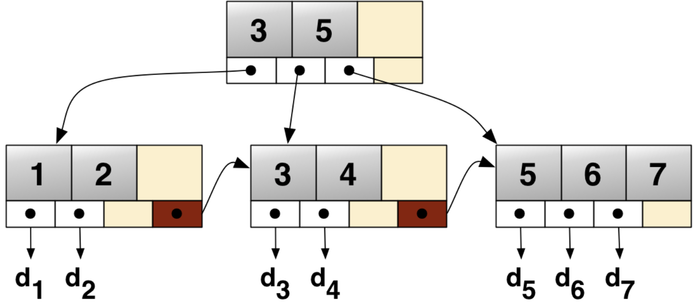

# Index

Status: Done

# 개념

<aside>
📜

**Index**

DB 테이블에서 데이터를 빠르게 검색할 수 있도록 도와주는 자료구조

테이블의 특정 컬럼에 대해 별도의 데이터 구조(Hash, B-Tree 등)를 만들어, 전체 테이블을 일일이 탐색하지 않아도 된다.

→ 데이터 변경 성능을 희생하고, 데이터의 읽기 속도를 높인다.

다음과 같이 생성, 삭제, 재구성이 가능

```sql
CREATE INDEX 인덱스명 ON 테이블명(컬럼명); -- 인덱스 생성

DROP INDEX 인덱스명; -- 인덱스 삭제

ALTER INDEX 인덱스명 REBUILD; -- 인덱스 재구성
```

</aside>

---

# Index 종류

## Hash Table

- Key-Value를 갖고 있어 빠른 데이터 조회가 장점
- 데이터가 늘어날 때마다 Rehashing 해주어야 함
- Equality 비교만 가능하고, Range Scan 불가능 → 이거 때문에 제약이 크다.
- 2개 이상의 컬럼에 대한 인덱스의 경우 전체 속성에 대한 조회만 가능
    - 일부 컬럼만 골라서 조회 불가능

## B-Tree (Balanced)

- 규칙
    - 최상단을 root, 최하단을 leaf, 그 사이 노드를 branch 라고 한다.
    - 노드의 데이터 수가 N개라면, 자식 노드 수는 N+1개여야 한다.
    - leaf 노드로 가는 모든 경로는 그 길이가 같아야 한다.
    - 이진 트리처럼 각 노드는 정렬되어 있다.
- 한계
    - Balanced 상태를 유지하기 위해 데이터가 추가되면, 꽉찬 노드를 쪼개는 Split 작업이 필요하다.
        - 이 과정에서 막대한 system overhead가 발생함
    - Range Scan의 비효율성
        - 20에서 30이라는 Range Scan 요청이 들어왔을 때, 20을 찾은 뒤 연속해서 21, 22를 찾아야 하는데, 데이터가 트리의 위아래 여기저기에 흩어져 있으므로, 탐색하는 속도가 느리다.
        - 이 부분을 해결하기 위해 B+Tree가 등장함

## B+Tree

- B-Tree와 기본 규칙은 유사하지만, 실질적인 데이터가 leaf 노드에만 존재한다는 점이 다르다.
    - leaf 노드의 데이터들은 Linked List처럼 순차적으로 연결되어 있어 B-Tree에서의 비효율적인 Range Scan 문제를 해결함
    - 메모리를 더 확보함으로써 더 많은 키들을 수용할 수 있고 트리의 높이가 낮게 유지될 수 있다.



---

# 기타

- 분류에 따라 Clustering or not, Unique or not 등 여러 index 종류가 있다.
- B*Tree가 단골 출제 요소이기 때문에 이 부분 위주로 공부하는 것이 좋다.