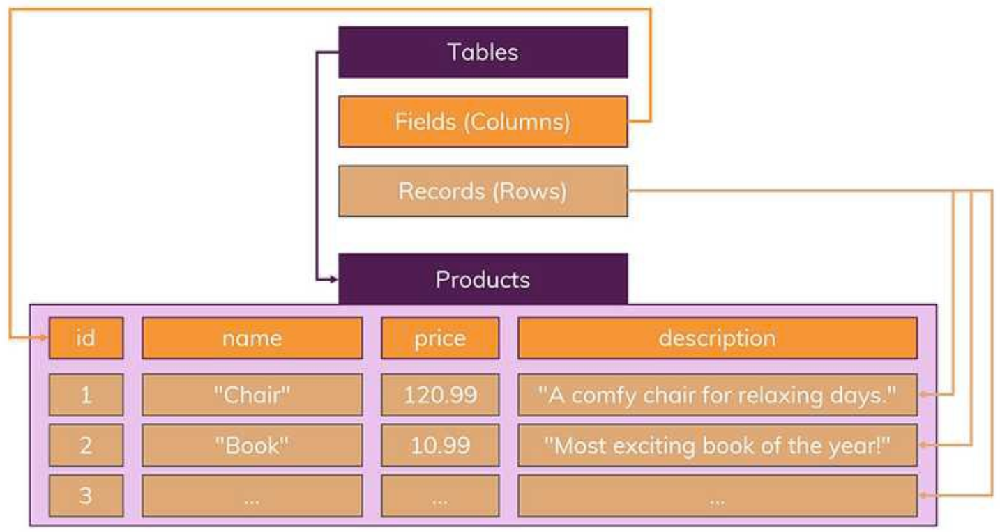
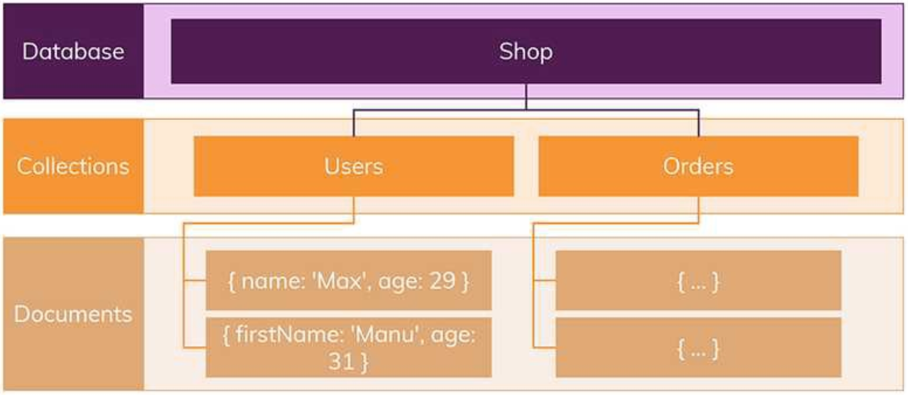

# SQL vs NoSQL

Date: 2026년 7월 24일
Status: Done

# 개념

<aside>
📜

**SQL (Structured Query Language)**

RDBMS에서 정형 데이터 관리를 위해 사용되는 프로그래밍 언어

**NoSQL (Not only SQL)**

비관계형 데이터베이스에서 비정형 데이터 관리를 위해 사용되는 프로그래밍 언어로서, 일부 SQL 명령도 지원한다.

</aside>

---

# SQL Database

## 특징

- 스키마로 정의된 테이블에 데이터가 record로서 저장된다.
- 스키마를 준수하지 않는 record는 추가할 수 없다.
    - 스키마는 나중에 수정하기 힘들다.
- 테이블 간의 관계를 통해 데이터를 여러 테이블에 분산할 수 있다.
    - 데이터들의 중복을 피할 수 있다.
    - 데이터 무결성 보장

## 확장성

- 수직 확장이 용이하다.
    - CPU, RAM, SSD 기능을 추가하여 성능을 높임으로써 서버 부하를 늘릴 수 있다.

## 속성

- ACID라는 네 가지 속성을 통해 트랜잭션을 성공적으로 처리하고 높은 수준의 신뢰성을 유지한다.
    - 원자성(Atomicity) : 모든 트랜잭션은 완전히 성공하거나 실패해야 하며 시스템 장애가 발생하더라도 부분적으로 완료된 상태로 둘 수 없다.
    - 일관성(Consistency) : 데이터베이스는 모든 단계에서 검증하고 손상을 방지하는 규칙을 따라야 한다.
    - 격리(Isolation) : 동시 트랜잭션은 서로 영향을 미칠 수 없다.
    - 내구성(Durability) : 트랜잭션은 최종적이며 시스템 오류조차도 전체 트랜잭션을 롤백 할 수 없다.

## 예시

- MySQL
- PostgreSQL
- Oracle
- MariaDB

---

# NoSQL Database

## 특징

- 비정형 데이터에 대한 동적 스키마를 허용하기 때문에 사용하면서 새 속성과 필드를 추가할 수 있다.
- 추가적인 Join 연산이 필요 없지만 데이터가 중복된다.
    - 특정 데이터를 같이 사용하는 모든 collection에서 데이터를 동시에 업데이트 해야하는데, 이 때문에 데이터 변경이 잦다면 SQL이 유리하다.
- 데이터가 애플리케이션이 필요로 하는 형식으로 저장되기 때문에 읽기 속도가 빠르다.
- record → document
table → collection

## 확장성

- 수직, 수평 확장이 용이하다.
    - Sharding이라고 해서, 거대한 DB나 네트워크를 여러 개의 작은 조각으로 나누어 분산 저장하여 관리할 수 있다. (수평 확장)

## 속성

- CAP 정리에 따라 다음 세 가지 속성 중 두 개만 한 번에 보장할 수 있는 절충안을 허용한다.
    - 일관성(Consistency): 모든 요청은 가장 최근 결과 또는 오류를 수신한다. MongoDB는 강력한 일관성 시스템의 예이며, Cassandra와 같은 다른 시스템은 최종 일관성을 제공한다.
    - 가용성(Availability): 모든 요청에 오류가 없는 결과가 있다.
    - 파티션 허용 오차(Partition tolerance): 노드 간의 지연이나 손실이 발생해도 시스템 작동이 중단되지 않는다.

## 예시

- Redis
- MongoDB
- ElasticSearch
- Cassandra
- HBase