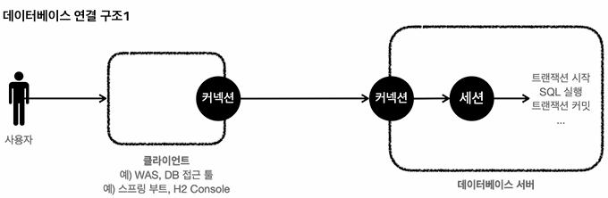
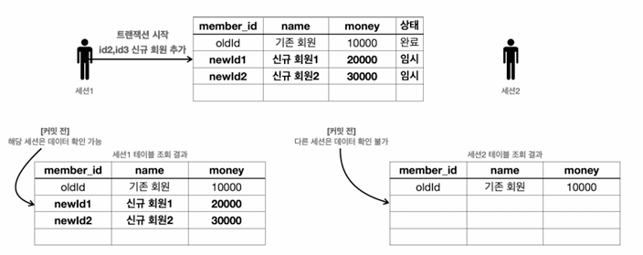

# day18 Transaction 트랜잭션

## 1. 개념
- 직역하면 '거래'
- 데이터베이스에서의 트랜잭션: `하나의 거래를 안전하게 처리하도록 보장해주는 것`
- 데이터를 저장할 때 파일 저장이 아닌 데이터베이스에 저장하는 이유 중하나가 트랜잭션 지원임
- 커밋(COMMIT): 하나의 트랜잭션이 모두성공해서 데이터베이스에 반영되는 것
- 롤백(ROLLBACK): 작업 중 하나라도 실패해서 거래 이전으로 되돌리는 것


## 2. 트랜잭션 원칙 ACID
### Atomicity 원자성
- 트랜잭션 내에서 실행한 작업들은 마치 하나의 작업인 것처럼 `모두 성공하거나 실패`해야함

### Consistency 일관성
- 모든 트랜잭션은 일관성 있는 데이터베이스 상태를 유지해야함
- 데이터베이스에서 정한 무결성 제약 조건을 항상 만족해야 함

### Isolation 격리성
- 동시에 실행되는 트랜잭션들이 서로에게 영향을 미치지 않도록 격리함
- `동시에 같은 데이터를 수정하지 못하도록 해야함`

### Durability 지속성
- 트랜잭션을 성공적으로 끝내면 그 결과가 항상 기록되어야 함
- 중간에 시스템에 문제가 발생해도 데이터베이스 로그 등을 사용해 성공한 트랜잭션 내용까지 복구할 수 있어야 함


## 3. 데이터베이스 연결 구조와 DB 세션



- 클라이언트는 서버에 연결을 요청하고, 커넥션을 맺게 됨. 이때 DB 서버는 내부에 세션이라는 것을 만듦
- 앞으로 해당 커넥션을 통한 요청은 이 세션을 통해 실행하게 됨 (연결된 세션이 SQL을 실행함)
- 세션은 트랜잭션을 시작하고, 커밋 또는 롤백을 통해 트랜잭션을 종료함
- 커넥션 풀이 10개의 커넥션을 생성 -> 세션도 10개 만들어짐


## 4. 자동 커밋, 수동 커밋

```sql

set autocommit false; //수동 커밋 모드 설정
insert into member(member_id, money) values ('data3',10000);
insert into member(member_id, money) values ('data4',10000); 
commit; //수동 커밋

```

- 기존의 CRUD를 했을 때 별도의 커밋 없이 조회가 되는 이유는 기본적으로 autoCommit 기능이 활성화되어 있기 때문
- 위 코드와 같이 autoCommit기능을 비홣성화 해두면 커밋되지 않음. 이후에 꼭 commit 또는 rollback을 호출해야 함
- 수동 커밋 모드나 자동 커밋 모드는 한번 설정하면 해당 세션에서는 계속 유지됨. 중간에 변경 가능


## 5. 트랜잭션 동작 원리

### 트랜잭션 사용법
- 데이터 변경 쿼리를 실행하고 데이터베이스에 그 결과를 반영하려면 commit을 호출
- 데이터베이스에 그 결과를 반영하고 싶지 않으면 rollback을 호출



- 데이텁이스에 결과를 반영하는 commit, rollback이 호출되기 전까지는 해당 트랜잭션을 관리하는 세션에서 임시로 데이터를 저장함
- 이후 커밋을 하면 다른 세션에서도 조회가 가능함

## 6. DB LOCK (DB 락)
- 세션 A에서 커밋을 수행하지 않았는데 세션 B에서 동시에 같은 데이터를 수정하게 될 경우, `원자성 위반`
- 이를 방지하기 위해 세션이 트랜잭션을 시작하고 수정하는 동안 다른 세션에서 해당 데이터를 수정할 수 없게 막아야 함 -> LOCK(락)


## 7. 트랜잭션 격리수준

- 동시에 실행되는 트랜잭션끼리 `서로의 작업 내용을 얼마나 차단할지 정하는 단계`

### 7.1. READ UNCOMMITTED
- 다른 트랜잭션이 아직 커밋하지 않은 데이터도 읽을 수 있음

``` text

A: 잔액 10만원 -> 5만원으로 수정
A: 아직 COMMIT하지 않음
B: 잔액 5만원을 조회
A: ROLLBACK -> 다시 10만원

=> B는 실제로 확정되지 않은 5만원을 잃었다

```

- 발생 가능: `Dirty Read`
- 격리 수준이 가장 낮음
- 동시 처리 성능은 높음

#### 비유: 다른 사람이 작성중인 문서를 저장하기도 전에 옆에서 읽는 것

### 7.2. READ COMMITTED
- 다른 트랜잭션이 커밋한 데이터만 읽을 수 있다

```text

A: 잔액 10만 원 조회
B: 잔액을 5만 원으로 수정 후 COMMIT
A: 다시 조회 → 5만 원

=> A가 같은 데이터를 두 번 조회했는데 결과가 달라질 수 있다.
```

- Dirty Read 방지
- 발생 가능: Non-Repeatable Read
- 많은 데이터베이스에서 기본값으로 사용

#### 비유: 다른 사람이 문서를 저장한 후에만 읽을 수 있지만, 읽는 도중 문서 내용이 바뀔 수 있는 것

### 7.3. REPEATABLE READ
- 한 트랜잭션 안에서 같은 데이터를 여러 번 조회해도 동일한 결과를 보장함

```text

A: 잔액 10만 원 조회
B: 잔액을 5만 원으로 수정 후 COMMIT
A: 다시 조회 → 여전히 10만 원

```

- Dirty Read 방지
- Non-Repeatable Read 방지
- 발생 가능: Phantom Read

예를 들어 A가 조건에 맞는 회원을 조회하는 동안 B가 새로운 회원을 추가하면, 다시 조회했을 때 행 개수가 달라질 수 있다.

#### 비유: 문서를 읽기 시작한 순간의 복사본을 계속 보는 것. 다만 새 페이지가 추가되는 현상은 보일 수 있다.

### 7.4. SERIALIZABLE
- 트랜잭션을 순서대로 하나씩 실행한 것처럼 처리함

```text

A 트랜잭션 실행 완료
→ B 트랜잭션 실행

```

- Dirty Read 방지
- Non-Repeatable Read 방지
- Phantom Read 방지
- 격리 수준이 가장 높음
- 동시 처리 성능은 가장 낮음

#### 비유: 한 사람이 문서 작업을 완전히 끝낸 뒤 다음 사람이 작업하는 것

### 정리

```text

RU → RC → RR → SERIALIZABLE

커밋 안 한 것도 읽음 → 커밋한 것만 읽음 → 반복 조회 보장 → 완전 순차 처리

```

## 참고
[출처](https://haburu23.tistory.com/25)

#### Dirty Read
- 다른 트랜잭션이 아직 커밋하지 않은 데이터를 읽는 현상

#### Non-Repeatable Read
- 한 트랜잭션에서 같은 행을 두 번 조회했는데 값이 달라지는 현상

#### Phantom Read
- 한 트랜잭션에서 같은 조건으로 두 번 조회했는데 행의 개수가 달라지는 현상

```text

Dirty Read = 확정 전 값을 읽음
Non-Repeatable Read = 같은 행의 값이 바뀜
Phantom Read = 행 자체가 생기거나 사라짐

```