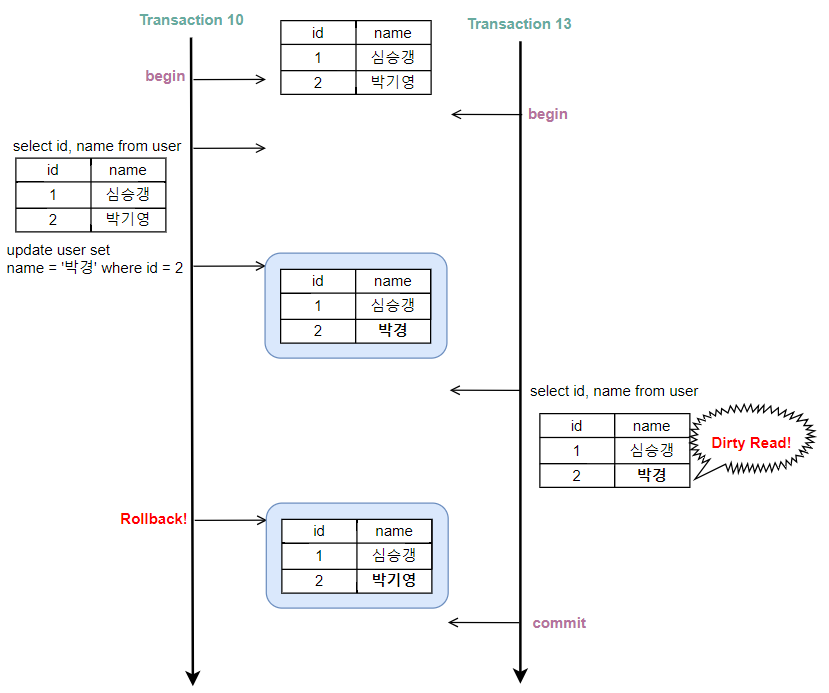

# Day 18 - 트랜잭션, 트랜잭션 격리수준

# Transaction

> 데이터베이스의 상태를 변화시키기 위해 수행하는 작업 단위

상태를 변화시킨다는 것은 SQL 질의어(SELECT, INSERT, DELETE, UPDATE)를 이용해 DB에 접근하는 것이고, 이 작업의 단위는 하나 이상의 명령문으로 이루어져 있다.

### 특징 (ACID)

#### 원자성 (Atomicity)

트랜잭션 연산은 모두 정상적으로 실행되거나 하나도 실행되지 않아야 한다.

#### 일관성 (Consistency)

트랜잭션의 작업 처리 결과는 항상 일관성 있어야 한다.

#### 독립성 (Isolation)

하나의 트랜잭션이 실행 중일 때 다른 트래잭션이 끼어들 수 없다.

#### 지속성 (Durability)

성공적으로 완료된 트랜잭션의 결과는 영구적으로 DB에 저장되어야 한다.

# Transaction Isolation Level

트랜잭션의 격리 수준은 총 4단계로 이루어져 있다.

```
READ UNCOMMITED  // 제일 약함
READ COMMITED
REPEATABLE READ
SERIALIZABLE     // 제일 강함
```

### READ UNCOMMITED

다른 트랜잭션에서 커밋되지 않은 데이터에 접근할 수 있게 하는 격리 수준이다.

가장 약한 격리 수준이며, 일반적으로 사용하지 않는 격리 수준이다.

그 이유는 아직 커밋되지 않은 데이터를 이용해 트랜잭션을 처리했는데 해당 데이터가 나중에 롤백되거나 하면 데이터 정합성이 깨지기 때문이다.

또한 이 경우 다음과 같은 동시성 문제들이 발생한다.

| 문제                | 의미                                         | 예시                                             |
| ------------------- | -------------------------------------------- | ------------------------------------------------ |
| Dirty Read          | 커밋되지 않은 데이터를 읽음                  | 다른 트랜잭션이 롤백하면 잘못된 데이터를 읽은 것 |
| Non-Repeatable Read | 같은 데이터를 두 번 읽었는데 값이 달라짐     | 다른 트랜잭션이 수정 후 커밋                     |
| Phantom Read        | 같은 조건으로 조회했는데 결과 행 수가 달라짐 | 다른 트랜잭션이 새로운 행을 추가/삭제            |



### READ COMMITED

다른 트랜잭션에서 커밋된 데이터로만 접근할 수 있게 하는 격리 수준이다.

MySQL을 제외하고 대부분 이를 기본 격리 수준으로 사용한다. (MySQL은 REPEATABLE READ를 기본 격리 수준으로 가짐)

다만 이 경우에도 Non-Repeatable READ와 Phantom READ는 발생할 수 있다. 그 이유는 트랜잭션 A가 `id`가 1인 `name`을 `홍길동`으로 수정하려고 하고 있고, 트랜잭션 B는 `id=1`인 `name`을 조회하고 있는 상황이라고 하자. A가 아직 커밋되기 전에 B가 `id = 1`을 조회하게 되면 기존에 커밋되어 있던 `심승갱`이라는 이름이 조회된다. 이후 A가 커밋을 수행한 뒤 B가 다시 조회하면 이번에는 `홍길동`이 조회된다. 즉, 하나의 트랜잭션 내에서 동일한 데이터를 두 번 조회했음에도 결과가 달라지는 Non-Repeatable READ가 발생한다.

Phantom READ의 경우에는 트랜잭션 A가 특정 행을 삭제하는 명령을 수행하고 있는데 그 연산 앞뒤로 B가 제거대상을 조회하면 처음에는 데이터가 있었지만 A가 수행되고 나면 해당 데이터를 찾을 수가 없다.

### REPEATABLE READ

트랜잭션이 같은 데이터를 여러 번 조회하더라도 항상 동일한 결과를 보장하는 격리 수준이다.

Dirty Read와 Non-Repeatable READ를 방지한다.

이것도 예시와 함께 살펴보자.

```sql
-- A
BEGIN;

SELECT name
FROM member
WHERE id = 1;
-- 결과: 심승갱

-- 여기서 애플리케이션이 다른 작업 수행
-- (계산, 외부 API 호출, 사용자 입력 대기 등)

SELECT name
FROM member
WHERE id = 1;
-- 결과:
-- Read Committed  → 홍길동
-- Repeatable Read → 심승갱

COMMIT;
```

```sql
-- B
BEGIN;

UPDATE member
SET name = '홍길동'
WHERE id = 1;

COMMIT;
```

위와 같은 트랜잭션 A, B가 있다. A가 같은 데이터를 두 번 조회하고 그 사이에 B가 수행된다고 하자.

이를 시간 순으로 표현하면 다음과 같다.

```sql
세션 A                    세션 B
---------------------------------------------
BEGIN;

SELECT -> 심승갱

                           BEGIN;
                           UPDATE
                           COMMIT;

SELECT
(Read Committed → 홍길동)
(Repeatable Read → 심승갱)

COMMIT;
```

Repeatable READ에서는 하나의 트랜잭션 내부에서 데이터 접근 시 스냅샷을 만들어 데이터를 조회해서 여러 번 조회해도 같은 결과를 반환하지만, Read Committed는 그렇지 않다.

그렇기 때문에 Repeatable READ에서는 Dirty Ready와 Non-Repeatable READ 모두 방지할 수 있는 것이다.

### Serializable

한 트랜잭션에서 사용하는 데이터를 다른 트랜잭션에서 접근할 수 없는 격리 수준이다.

완벽한 읽기 일관성을 제공하여 Phantom Read를 비롯한 모든 부정합 문제를 해결한다.

다만, 동시 처리 능력이 다른 격리 수준에 비해 떨어져 데이터베이스에서 거의 사용되지 않는다.

트랜잭션이 중간에 끼어들지 못하는 이유는 SELECT 쿼리 시 S-Lock을, INSERT, UPDATE, DELETE시 X-Lock을 걸어버리기 때문이다.
