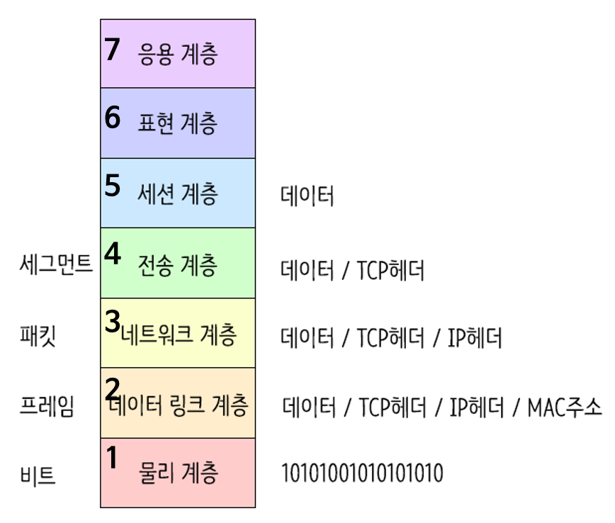

# day 19 OSI 7계층, TCP/UDP

## OSI 7계층

- 네트워크 통신이 일어나는 과정을 7단계로 나눈 국제 표준화 기구(ISO)에서 정의한 네트워크 표준모델
- 1계층(물리 계층) ~ 7계층(응용 계층)으로 구성
- 각 계층을 지날 때마다 `Header`가 붙게됨
- 수신측은 `역순으로 헤더 분석`

### 1계층 - 물리 계층(Physical Layer)
- 주로 전기적, 기계적, 기능적인 특성을 이용해서 통신 케이블로 데이터를 전송하는 물리적인 장비
- 단지 데이터 전기적인 신호(0,1)로 변환해서 주고받는 기능만 함
- 통신 단위: 비트(Bit); 0과 1로만 나타냄; 전기적으로 On, Off 상태
- 장비: `통신 케이블, 리피터, 허브` 등

### 2계층 - 데이터링크 계층(DataLink Layer)
- 물리계층을 통해 송수신되는 정보의 오류와 흐름을 관리하여 `안전한 통신의 흐름을 관리`
- 프레임에 물리적 주소(MAC address)를 부여하고 에러검출, 재전송, 흐름제어를 수행
- 전송 단위: 프레임(Frame)
- 장비: `브리지, 스위치, 이더넷` 등(여기서 MAC주소를 사용)

> 브릿지나 스위치를 통해 MAC 주소를 가지고 물리계층에서 받은 정보를 전달함

### 3계층 - 네트워크 계층(Network Layer)
- 데이터를 목적지까지 가장 안전하고 빠르게전달
- 라우터(Router)를 통해 경로(Route)를 선택하고 주소(IP)를 정한 다음, 경로에 따라 패킷을 전달함
- IP 헤더 붙음
- 전송 단위: `패킷(Packet)`
- 장비: `라우터`

### 4계층 - 전송 계층(Transport Layer)
- `port 번호`, 전송방식(TCP/UDP) 결정
- TCP 헤더 붙음
    - TCP: 신뢰성, 연결지향적
    - UDP: 비신뢰성, 비연결성, 실시간

- 두 지점간의 신뢰성 있는 데이터를 주고 받게 해주는 역할
- 신호를 분산하고 다시 합치는 과정을 통해서 에러와 경로를 제어

### 5계층 - 세션 계층(Session Layer)
- 주 지점간의 프로세스 및 통신하는 호스트 간의 연결 유지
- TCP/IP 세션 체결, 포트번호를 기반으로 `통신 세션` 구성
- API, Socket

### 6계층 - 표현 계층(Presentation Layer)
- 전송하는 `데이터의 표현방식`을 결정(ex. 데이터 변환, 압축, 암호화 등)
- 파일인코딩, 명령어를 포장, 압축, 암호화
- JPEG, MPEG, GIF, ASCII 등

### 7계층 - 응용 계층(Application Layer)
- 최종 목적지
- 응용 프로세스와 직접 관계하여 일반적인 응용 서비스를 수행(ex. explore, chrome 등)
- HTTP, FTP, SMT, IMAP, POP3, Telnet 등과 같은 프로토콜이 있음

[출처](https://lxxyeon.tistory.com/155)

## TCP / UDP
- 컴퓨터들이 서로 데이터를 주고받을 때 사용하는 규칙
- 신뢰성, 속도, 연결 방식에 차이가 있음

### TCP (전송 제어 프로토콜)
- 연결형: 데이터를 보내기 전 먼저 상대와 연결을 맺음(3-way handshaking)
- 신뢰성 보장: 데이터가 잘 갔는지 확인하고, 빠진 데이터가 있으면 다시 보냄
- 느린 속도: 확인하는 과정이 많아 UDP보다 조금 느림
- 주요 용어: HTTP, 이메일, 파일 전송 등

### UDP (사용자 데이터그램 프로토콜)
- 비연결형: 연결 과정 없이 바로 데이터를 던지듯 보냄
- 신뢰성 없음: 데이터가 유실되어도 다시 보내지 않고 그대로 진행
- 빠른 속도: 확인 절차가 없어 속도가 매우 빠름
- 주요 용어: 실시간 영상 스트리밍, 온라인 게임, DNS 조회