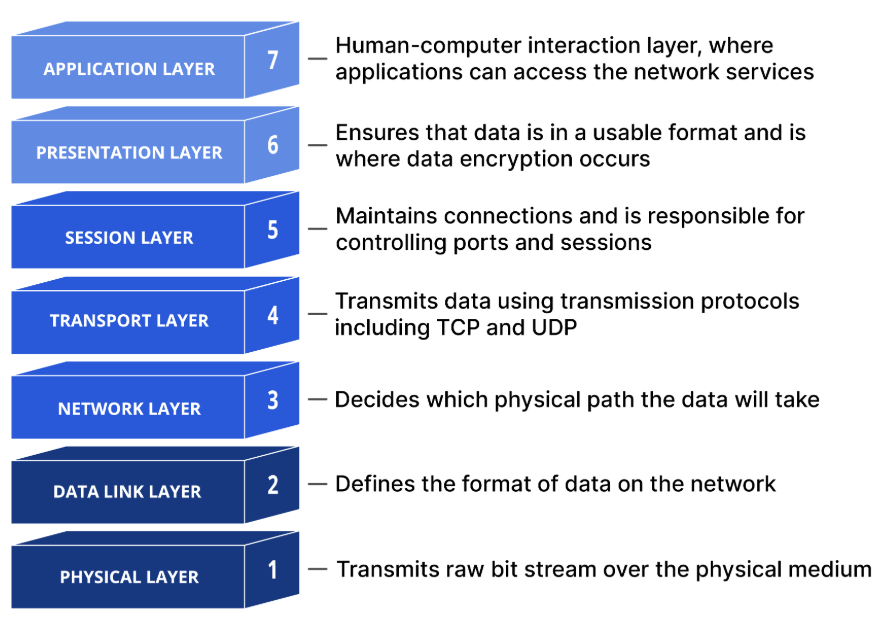
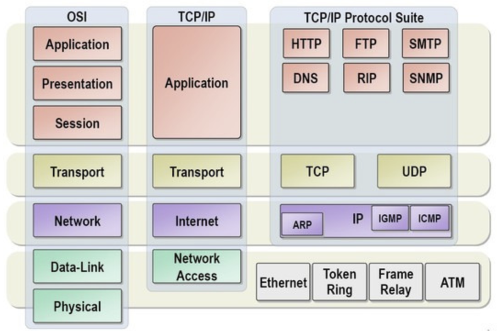
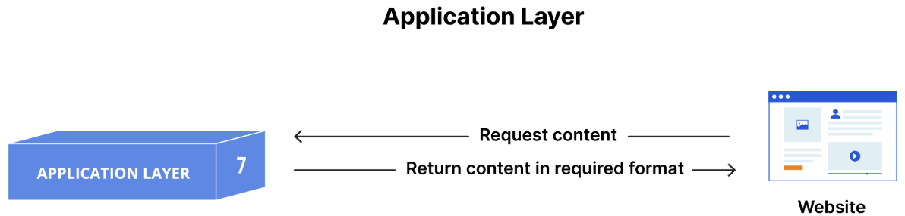
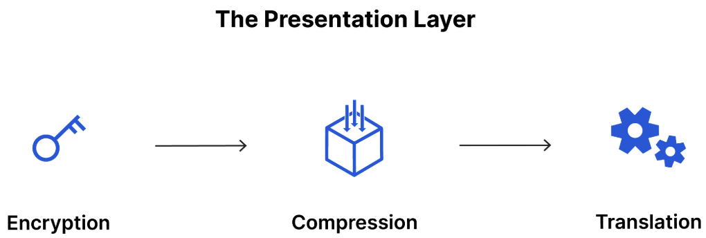
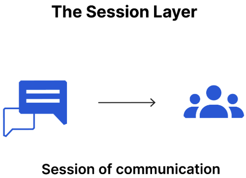
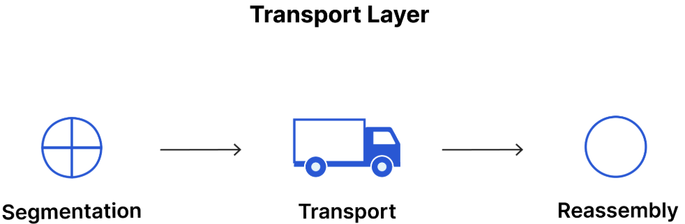
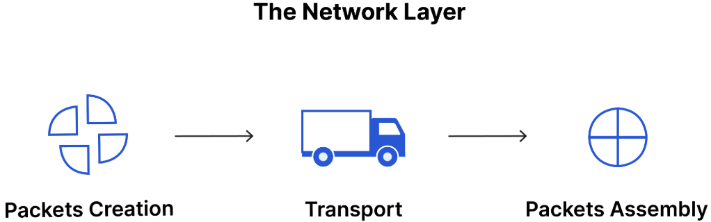
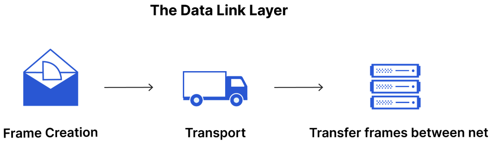
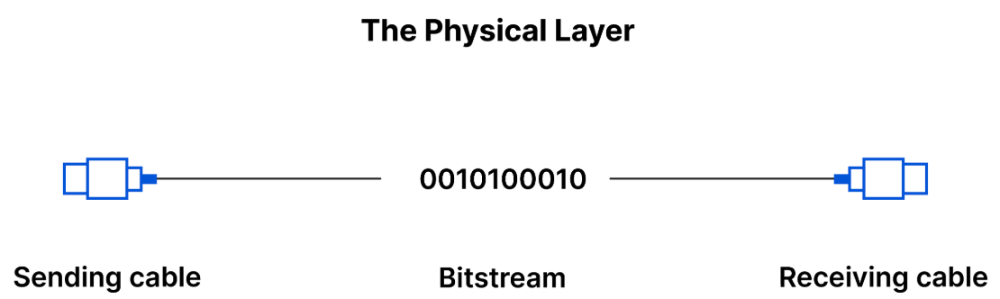

# OSI 7계층

Date: 2026년 7월 28일
Status: Done

# 개념

<aside>
📜

**OSI 7계층**

국제표준화기구(ISO)에서 네트워크 통신이 일어나는 과정을 7개의 단계로 나눈 표준 모델

</aside>

---

## Application Layer

- 사용자의 데이터와 직접 상호작용하는 유일한 계층
- 소프트웨어가 사용자에게 의미 있는 데이터를 제공하기 위해 의존하는 프로토콜과 데이터를 조작
- 프로토콜
    - HTTP, SMTP(이메일)

## Presentation Layer

- 애플리케이션이 소비할 수 있도록 데이터를 준비
- 데이터 변환, 암호화, 압축

## Session Layer

- 두 기기 사이의 통신을 시작하고 종료하는 일을 담당
- 교환 중인 모든 데이터를 전송할 수 있도록 충분히 세션을 개방한 다음, 리소스를 낭비하지 않기 위해 세션을 닫음

## Transport Layer

- 세션 계층에서 데이터를 가져와 Network Layer로 보내기 전에 Segment라는 조각을 분할
- 흐름 제어
    - 연결 속도가 빠른 송신자가 연결 속도가 느린 수신자를 압도하지 않도록 최적의 전송 속도 결정
- 오류 제어
    - 데이터 수신이 완료되었는지 확인하고, 수신되지 않은 경우 재전송을 요청하여 최종 수신자에 대해 오류 제어를 수행

## Network Layer

- 서로 다른 두 네트워크 간 데이터 전송을 용이하게 함
    - 같은 네트워크에선 Data Link Layer까지만 있으면 됨
- Transport Layer의 Segment를 Packet이라는 더 작은 단위로 세분화하여 수신 장치에서 이러한 패킷을 다시 조립
- 라우팅
    - 데이터가 표적에 도달하기 위한 최상의 물리적 경로를 찾음
- 프로토콜
    - IP, ICMP, IGMP, IPsec

## Data Link Layer

- 동일한 네트워크에 있는 두 개의 장치 간 데이터 전송을 용이하게 함
- Network Layer에서 Packet을 가져와서 Frame이라고 하는 더 작은 조각으로 세분화
- 흐름 제어 및 오류 제어 기능

## Physical Layer

- 1 또는 0의 문자열인 Bitstream으로 변환하여 물리적 장비를 통해 전달
    - 물리적 장비로는 케이블, 스위치 등이 있음

