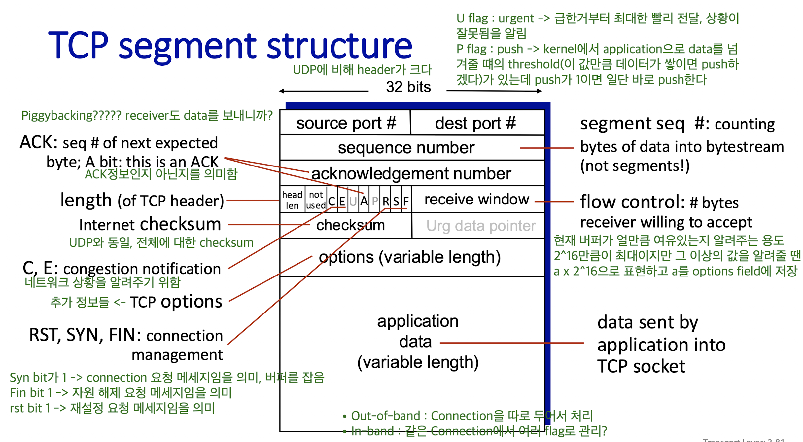
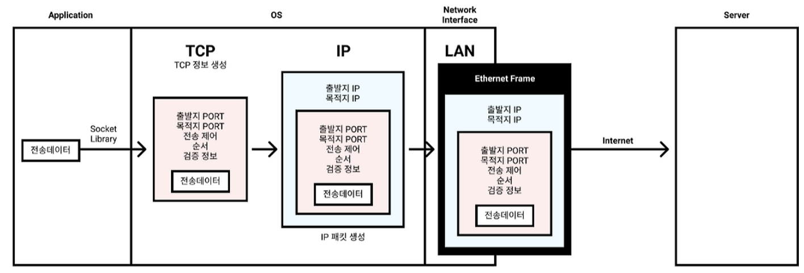
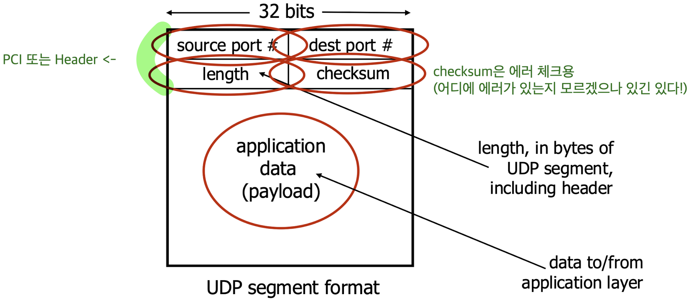

# TCP / UDP

Status: Done

# 개념

<aside>
📜

**TCP / UDP**

Transport Layer에서 사용되는 프로토콜

두 프로토콜의 차이점을 자세히 알아보자~

</aside>

---

# TCP (Transmission Control Protocol)

- IP 규칙으로만 통신하기에 부족하거나 불안정하던 여러 단점들을 보완해, 패킷 전송을 제어하여 신뢰성을 보증
    - IP 규칙으로 써있는대로 목적지에 도착했다면, TCP 규칙대로 올바르게 도착했는지 하나하나 따진다고 보면 됨
- 전송 데이터에 출발 Port 번호, 도착 Port 번호, 순서 등의 정보를 덧붙인다.
- 운영체제와 독립적으로 작동하므로 시스템과 디바이스 간 상호 운용성이 향상된다.
- 데이터를 전송할 때 오류를 검사하여 전송된 데이터가 목적지에 온전하게 도달하도록 보장한다.
- 수신자의 용량에 따라 데이터를 전송하는 속도를 최적화하고 변경한다.
- 데이터가 목적지에 도달했는지 확인하고 첫 번째 전송이 실패한 경우 재전송을 시도한다.
- TCP는 상당히 많은 대역폭을 사용하며, UDP보다 속도가 느리다.

---

# UDP (User Datagram Protocol)

- TCP에 비해 안정성은 떨어지지만 더 빠르고 간단하다.
    - 스트리밍, 게임 등 속도가 중요한 상황에서 자주 사용
- 비연결 방식으로 사전 연결 X
    - 데이터가 손실될 수 있음
- 더 작은 패킷을 더 적은 오버헤드로 전송하여 엔드투엔드 지연을 줄인다.
- 일부 패킷이 누락되더라도 데이터를 전송하므로 패킷 손실로 인해 전체 전송이 중단되지 않는다.
- 브로드캐스트 및 멀티캐스트 기능을 통해 하나의 UDP 전송을 여러 수신자에게 한 번에 전송할 수 있다.
- TCP와 같은 다른 옵션보다 더 빠르고 효율적이다.
- 데이터 패킷이 목적지에 성공적으로 도달했는지 여부를 확인하지 않습니다.
    - 일부 패킷이 손실되었을 수 있지만 발신자 측에서 이를 확인할 수 있는 방법은 없습니다.
- 라우터가 데이터 패킷의 우선순위를 정해야 하는 경우, UDP 패킷보다 TCP 패킷을 먼저 전송할 가능성이 높습니다.
- UDP는 특정 순서로 데이터를 전송하지 않으므로 패킷은 어떤 순서로든 도착할 수 있습니다.

