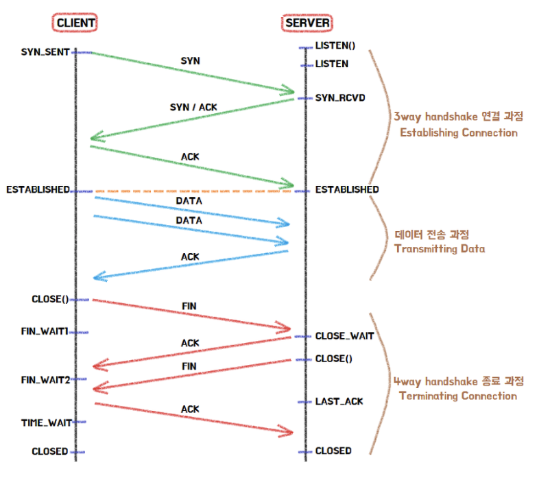
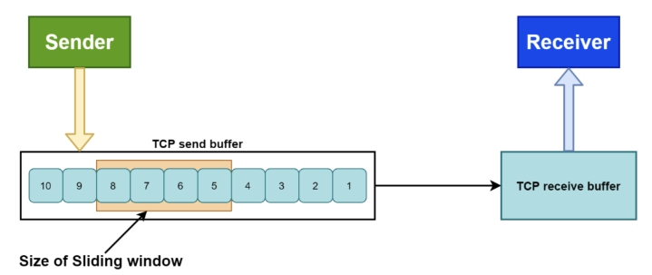

# Day 19 - OSI 7계층, TCP/UDP

# OSI 7계층

OSI(Open Systems Interconnection) 7계층은 통신에 필요한 기능을 7개의 계층으로 나눈 표준 모델이다.

각 계층은 아래 계층이 제공하는 기능을 이용해 자기 역할만 처리하고 고유한 데이터 단위(PDU, Protocol Data Unit)로 정보를 주고 받는다.

| **계층** | **이름**    | **핵심 역할**                     | **대표 프로토콜·형식·장비** | **PDU**  |
| -------- | ----------- | --------------------------------- | --------------------------- | -------- |
| 7        | 응용        | 사용자와 직접 맞닿는 서비스 제공  | HTTP, FTP, SMTP, DNS        | 데이터   |
| 6        | 표현        | 암·복호화, 압축, 코드 변환        | JPEG, MPEG, ASCII           | 데이터   |
| 5        | 세션        | 연결(세션) 설정·유지·종료, 동기화 | RPC, NetBIOS                | 데이터   |
| 4        | 전송        | 종단 간 신뢰성·흐름 제어          | TCP, UDP                    | 세그먼트 |
| 3        | 네트워크    | 경로 설정(라우팅), 논리 주소 지정 | IP, ICMP, 라우터            | 패킷     |
| 2        | 데이터 링크 | 인접 노드 간 전송, 오류 제어      | 이더넷, HDLC, 스위치        | 프레임   |
| 1        | 물리        | 비트를 전기 신호로 바꿔 전송      | 케이블, 허브, 리피터        | 비트     |

데이터를 보낼 때 응용 계층부터 내려가면서 각 계층이 자신들의 헤더를 붙이는데 이 과정을 ‘캡슐화’ 라고 한다. (반대로 받는 쪽에서 아래에서 위로 올라가며 헤더를 하나씩 벗겨내는데 이는 ‘역캡슐화’라고 한다)

계층을 내려갈 때마다 헤더가 붙으면서 PDU의 이름이 달라진다. 내려가는 순서대로 전송(세그먼트) → 네트워크(패킷) → 데이터링크(프레임) → 물리(비트)로 감싸진다.

#### 자주 묻는 질문

Q. 3계층과 4계층의 차이점은?

3계층(네트워크)은 목적지까지 최적의 경로를 찾는 라우팅을 담당한다. 반면 4계층(전송)은 그 경로를 통해 들어온 데이터가 유실되지 않도록 신뢰성을 보장하고 포트 번호를 통해 최종 프로세스(엔드 투 엔드 통신)까지 안전하게 도달하도록 제어한다.

Q. OSI 7계층과 TCP/IP 4계층 모델의 차이는 무엇이며, 왜 실제 인터넷에서는 TCP/IP 모델을 더 많이 사용함?

OSI 7계층은 통신 과정을 엄격하게 나눈 이론적 표준 모델인 반면, TCP/IP 4계층은 실제 인터넷 개발을 기반으로 만들어진 실무 중심의 프로토콜 스펙이다. OSI 모델은 개념적으로 훌륭하지만, 세션/표현 계층이 다소 모호하며 실무에서는 이들을 응용 계층 하나로 통합한 보다 효율적인 모델이 표준으로 자리잡았다.

# TCP/UDP

## TCP (Transmission Control Prootocol)

> 신뢰성 있는 데이터 전송을 보장하는 연결 지향형(Connection-Oriented) 프로토콜

통신을 시작할 때와 종료할 때 서로 준비가 되었는지를 확인하고 패킷을 전송을 순서를 정한 뒤에야 본격적인 데이터 통신이 시작된다. 이 과정이 바로 3-way Handshake와 4-way Handshake이다.

똑같은 Handshake이지만, 3-way는 시작할 떄, 4-way는 종료될 때 수행된다.



3-way/4-way Handshake는 나중에 알아보고 우선 흐름제어와 오류제어에 대해 알아보자.

### 흐름 제어(Flow Control)

수신자가 처리할 수 있는 데이터 속도가 다르기 때문에 송신 측은 수신 측의 데이터 처리 속도를 파악하고 얼마나 빠르게 어느 정도의 데이터를 전송할 지 제어해야 한다.

이를 위해 TCP에서는 슬라이딩 윈도우(Sliding Window) 방식을 사용한다.

수신자가 ACK를 보낼 때 `window size = N Byte`라고 알려준다. (난 지금 최대 N byte까지 더 받을 수 있다)

그럼 송신 측에서는 최대 N byte까지 ACK를 기다리지 않고 전송한다. 이후 ACK를 수신하면 윈도우를 앞으로 밀어 또 새로운 데이터를 전송한다. 즉, ACK를 수신하지 않더라도 여러 개의 프레임을 연속적으로 전송한다.



송신측에서 8, 7, 6, 5 프레임을 보냈고 추후 수신 측으로부터 8, 7에 대한 ACK를 수신하면 윈도우 사이즈를 앞으로 밀어 ACK 프레임에 따른 프레임 수만큼 오른쪽으로 민다.

Q. Stop-and-wait는 안쓰나?

Stop-and-Wait는 흐름 제어의 기본 개념을 설명하는 가장 단순한 ARQ 방식이다. 하지만 한 번에 1개의 패킷만 전송이 가능하고 ACK를 받아야 다음 패킷을 전송하기 때문에 성능을 높은 슬라이딩 윈도우 기반의 흐름 제어를 사용한다.

### 오류 제어 (Error Control)

통신 과정에서 데이터가 유실되거나 잘못된 데이터가 수신되었을 때 대처하는 방법이다.

ARQ 기법을 사용해 프레임이 손상 혹은 유실된 경우 재전송을 통해 오류를 복구한다. 이를 위해서 대표적으로 Go-Back-N ARQ와 Selective Repeat ARQ가 있다.

1. Go-Back-N
   - 여러 패킷을 연속으로 전송
   - 하나가 손실되면 그 패킷 이후를 모두 재전송
2. Selective Repeat
   - 여러 패킷을 연속으로 전송
   - 손실된 패킷만 선택적으로 재전송

### 혼잡 제어 (Conjestion Control)

네트워크가 불안정하여 데이터가 원활히 통신이 안되면 제어를 통해 재전송을 하게 되는데, 재전송 작업이 반복되면 네트워크가 붕괴될 수도 있따. 따라서 네트워크 혼잡 상태가 감지되면 송신 측의 전송 데이터 크기를 조절해 전송량을 조절한다. (Congestion Window, cwnd,를 조절하는 것임)

#### 기본 메커니즘

```
TCP 혼잡 제어
│
├─ Slow Start
│
├─ Congestion Avoidance
│     └── AIMD
│          ├─ Additive Increase
│          └─ Multiplicative Decrease
│
├─ Fast Retransmit
│
└─ Fast Recovery
```

1. Slow Start : cwnd를 RTT(Round Trip Time)마다 2배씩 증가시킴(지수 증가)
2. Congestion Avoidance : Slow Start Threshold에 도달하면 Slow Start를 종료하고 Congestion Avoidance 단계로 진입. AIMD를 사용하여 cwnd를 선형적으로 증가시킴.
   - AIMD란?
     - Additive Increase : 송신 측의 windosw size를 손실을 감지할 때까지 매 RTT마다 1씩 증가
     - Mutiplicative Decrease : 손실을 감지했다면 송신측의 window size를 절반으로 감소시킴
3. Fast Retransmit

   패킷이 1, 2, 3이 전송되었는데 수신 측에서 1, 3만 수신되면 순서대로 잘 도착한 마지막 패킷의 다음 순번(2)을 ACK에 담아서 전송한다. 따라서 중간에 패킷 하나가 유실되면 송신측에서는 순번이 중복된 ACK를 받게 되고, 문제가 되는 순번의 패킷부터 재전송을 수행한다. 기존에는 패킷이 유실되었음을 알려면 Timeout을 기다려야하지만 Fast Restransmit을 통해 Timeout까지 기다리지 않고 빠르게 재전송을 할 수 있다.

4. Fast Recovery

   Fast Retransmit 이후 혼잡 윈도우를 1로 초기화하지 않고 일정 수준(일반적으로 절반)으로만 감소시킨 뒤 Congestion Avoidance를 수행하여 전송 성능을 유지하는 기법

#### 알고리즘

> 메커니즘들을 조합하여 동작하는 혼잡 제어 알고리즘

1. Tahoe
   - Slow Start
   - Congestion Avoidance
   - Fast Retransmit 지원
   - 손실 발생 시 cwnd를 1로 초기화하고 Slow Start부터 다시 시작
2. Reno
   - Tahoe 개선
   - Fast Recovery 추가
   - 손실 시 cwnd를 절반으로 줄이고 Congestion Avoidance 수행
3. New Reno
   - Reno 개선
   - 여러 패킷이 동시에 손실되는 상황을 더 효율적으로 처리
4. Cubic
   - Linux의 기본 TCP 혼잡 제어 알고리즘
   - Reno처럼 선형 증가하지 않고 3차 함수(Cubic) 를 이용하여 cwnd를 조절
   - 고속·장거리 네트워크에서 성능이 우수
5. Elastic TCP
   - Cubic 이후 제안된 알고리즘 중 하나
   - RTT 변화와 네트워크 상태를 더 적극적으로 반영하여 cwnd를 조절
   - 고속 네트워크 환경에서 처리량 향상을 목표로 함

## UDP

UDP는 TCP와 달리(TCP는 가상 회선 방식) 데이터그램 방식을 사용하는 프로토콜로 각각의 패킷 간의 순서가 존재하지 않는 독립적인 패킷을 사용한다.

데이터그램 방식은 목적지만 정해져 있다면 중간 경로는 어디로 가든 상관 없기 때문에 핸드쉐이크 같은 연결 과정이 필요 없다. 그렇기 때문에 TCP 보다 속도가 더 빠르고 네트워크 부하도 적다.

대표적으로 DNS, VoIP, 실시간 스트리밍, 온라인 게임 등에서 쓰인다.
