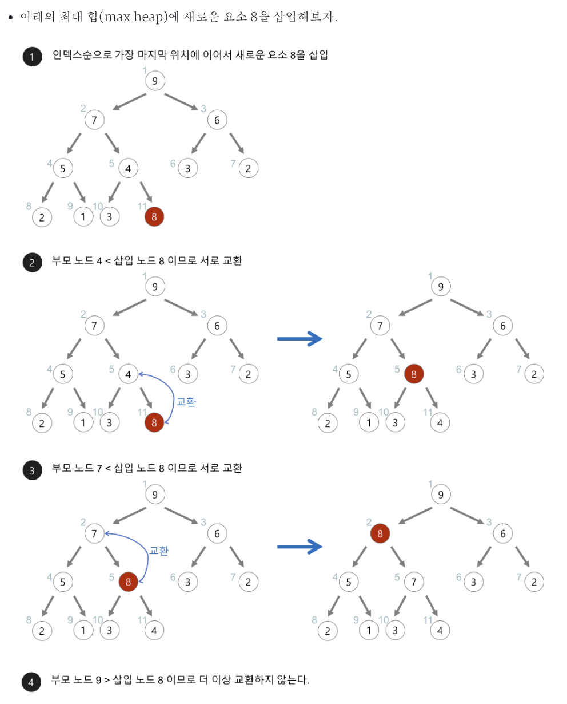
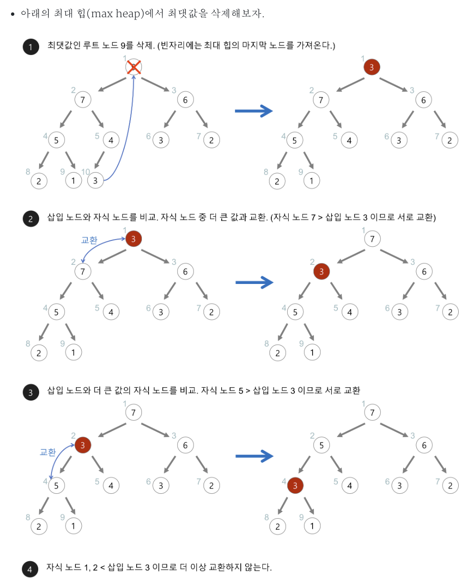

# Heap Sort

Status: Done

# 개념

<aside>
📜

Heap(최소 힙, 최대 힙)을 사용해서 정렬하는 방식

최소 힙 : 부모 노드 ≤ 자식 노드, 루트 노드에는 항상 최솟값

최대 힙 : 부모 노드 ≥ 자식 노드, 루트 노드에는 항상 최댓값 → 정통 방식의 heap sort에서 사용

</aside>

---

# 과정

1. 입력 배열을 최대 힙으로 빌드한다. → heapify
2. 빌드한 힙의 루트 노드(최댓값)과 마지막 노드를 바꾼다
3. 힙 크기를 1만큼 줄인다.(최댓값이 마지막으로 이동했으니, 정렬된 최댓값을 힙에서 제외)
4. 루트에 최대 힙 구성에 맞지 않는 값이 있으므로 다시 최대 힙을 빌드한다. → heapify
5. 원소가 하나 남을 때까지 2, 3, 4를 무한 반복한다.





---

# 구현

## Python - heapify 구현

```java
def quick_sort(arr, left, right):
    if left < right:
        # 피벗의 최종 위치 구하기.
        pivot = partition(arr, left, right)

        # 피벗을 제외한 왼쪽과 오른쪽 배열을 재귀적으로 정렬
        quick_sort(arr, left, pivot - 1)
        quick_sort(arr, pivot + 1, right)

def partition(arr, left, right):
    pivot = arr[left]
    low = left + 1
    high = right

    while low <= high:
        while low <= right and arr[low] <= pivot:
            low += 1

        while high > left and arr[high] >= pivot:
            high -= 1

        if low < high:
            arr[low], arr[high] = arr[high], arr[low]

    arr[left], arr[high] = arr[high], arr[left]

    return high  # 새롭게 배치된 피벗의 인덱스를 반환

if __name__ == '__main__':
    test_case = [3, 9, 6, 1, 5, 2, 0]
    print("정렬 전: ", test_case)
    quick_sort(test_case, 0, len(test_case) - 1)
    print("정렬 후: ", test_case)
```

## Python - heapq 사용

```python
import heapq

def heapq_sort(arr):
    # 기존 배열을 최소 힙 구조로 변경 -> O(n)
    heapq.heapify(arr)

    # 하나씩 꺼내서 정렬된 새 리스트 반환 (heappop은 최소 원소를 반환)
    return [heapq.heappop(arr) for _ in range(len(arr))]

if __name__ == '__main__':
    test_case = [3, 9, 6, 1, 5, 2, 0]
    print("정렬 전: ", test_case)
    sorted_arr = heapq_sort(test_case)
    print("정렬 후: ", sorted_arr)
```

## Java - heapify 구현

```java
import java.util.Arrays;

public class PureHeapSort {

    public static void heapSort(int[] arr) {
        int n = arr.length;

        for (int i = n / 2 - 1; i >= 0; i--) {
            heapify(arr, i, n);
        }

        // 2. 하나씩 꺼내서 배열 뒤부터 채우며 정렬
        for (int i = n - 1; i > 0; i--) {
            int temp = arr[0];
            arr[0] = arr[i];
            arr[i] = temp;

            heapify(arr, 0, i);
        }
    }

    private static void heapify(int[] arr, int idx, int heapSize) {
        int maxIdx = idx;
        int left = 2 * idx + 1;
        int right = 2 * idx + 2;

        if (left < heapSize && arr[left] > arr[maxIdx]) {
            maxIdx = left;
        }

        if (right < heapSize && arr[right] > arr[maxIdx]) {
            maxIdx = right;
        }

        if (maxIdx != idx) {
            int temp = arr[idx];
            arr[idx] = arr[maxIdx];
            arr[maxIdx] = temp;

            heapify(arr, maxIdx, heapSize);
        }
    }

    public static void main(String[] args) {
        int[] testCase = {64, 25, 12, 22, 11};

        System.out.println("정렬 전: " + Arrays.toString(testCase));
        heapSort(testCase);
        System.out.println("정렬 후: " + Arrays.toString(testCase));
    }
}
```

## Java - PriorityQueue 사용

```java
import java.util.ArrayList;
import java.util.Arrays;
import java.util.List;
import java.util.PriorityQueue;

public class HeapSort {
    public static List<Integer> heapSort(List<Integer> arr) {
        // 최소 힙(PriorityQueue) 생성 및 데이터 삽입
        PriorityQueue<Integer> minHeap = new PriorityQueue<>(arr);

        List<Integer> sortedList = new ArrayList<>();

        // 가장 작은 값부터 하나씩 꺼내서 결과 리스트에 담기
        while (!minHeap.isEmpty()) {
            sortedList.add(minHeap.poll());
        }

        return sortedList;
    }

    public static void main(String[] args) {
        List<Integer> testCase = Arrays.asList(64, 25, 12, 22, 11);
        System.out.println("정렬 전: " + testCase);

        List<Integer> sortedArr = heapSort(testCase);
        System.out.println("정렬 후 (오름차순): " + sortedArr);
    }

}

```

---

# 시간복잡도

O(nlogn)