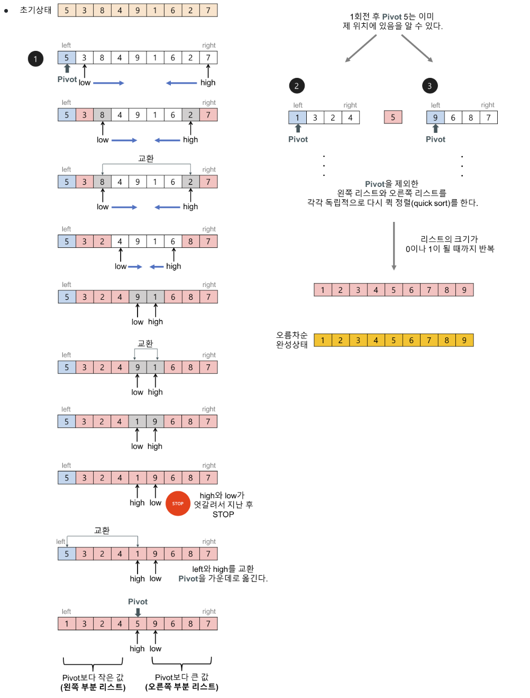

# Quick Sort

Date: 2026년 7월 2일
Status: Done

# 개념

<aside>
📜

Divide & Conquer 방법으로, pivot 하나를 기준으로 작은 값들은 왼쪽에, 큰 값들은 오른쪽에 위치시키는 동작을 반복해 나감으로써 전체 배열을 정렬하는 방식

</aside>

---

# 과정

1. 임의의 pivot을 선택한 후(보통 가장 왼쪽에 있는 값), pivot보다 작은 값들은 왼쪽에, 큰 값들은 오른쪽에 위치하도록 한다.
    1. 나머지 원소들에 대해서 two pointer들을 이동하면서 pivot과의 대소비교를 통해 low와 high가 가리키는 값들을 서로 swap한다.
    2. low ≥ high인 순간에 high가 가리키는 원소와 pivot을 swap함으로써 pivot의 최종 위치를 알 수 있다.
2. pivot 기준으로 왼쪽과, 오른쪽에 있는 부분 배열들에 대해서 1을 반복한다. (부분 배열의 크기가 0 또는 1이 되는 순간까지)



---

# 구현

## Python

```python
def quick_sort(arr, left, right):
    if left < right:
        # 피벗의 최종 위치 구하기.
        pivot = partition(arr, left, right)

        # 피벗을 제외한 왼쪽과 오른쪽 배열을 재귀적으로 정렬
        quick_sort(arr, left, pivot - 1)
        quick_sort(arr, pivot + 1, right)

def partition(arr, left, right):
    pivot = arr[left]
    low = left + 1
    high = right

    while low <= high:
        while low <= right and arr[low] <= pivot:
            low += 1

        while high > left and arr[high] >= pivot:
            high -= 1

        if low < high:
            arr[low], arr[high] = arr[high], arr[low]

    arr[left], arr[high] = arr[high], arr[left]

    return high  # 새롭게 배치된 피벗의 인덱스를 반환

if __name__ == '__main__':
    test_case = [3, 9, 6, 1, 5, 2, 0]
    print("정렬 전: ", test_case)
    quick_sort(test_case, 0, len(test_case) - 1)
    print("정렬 후: ", test_case)
```

## Java

```java
import java.util.Arrays;

public class QuickSort {

    private static void quickSort(int[] arr, int left, int right) {
        if (left < right) {
            int pivot = partition(arr, left, right);

            quickSort(arr, left, pivot - 1);
            quickSort(arr, pivot + 1, right);
        }
    }

    private static int partition(int[] arr, int left, int right) {
        int pivot = arr[left];
        int low = left + 1;
        int high = right;

        while (low < high) {
            while (low <= right && arr[low] <= pivot) {
                low++;
            }
            while (high > left && arr[high] >= pivot) {
                high--;
            }

            if (low < high) {
                int tmp = arr[low];
                arr[low] = arr[high];
                arr[high] = tmp;
            }
        }

        int tmp = arr[left];
        arr[left] = arr[high];
        arr[high] = tmp;

        return high;
    }

    public static void main(String[] args) {
        int[] arr = {64, 25, 12, 22, 22, 11};

        System.out.println("정렬 전: " + Arrays.toString(arr));
        quickSort(arr,  0, arr.length - 1);
        System.out.println("정렬 후: " + Arrays.toString(arr));
    }
}

```

---

# 시간복잡도

최악 O(n^2), 나머지의 경우 O(nlogn)