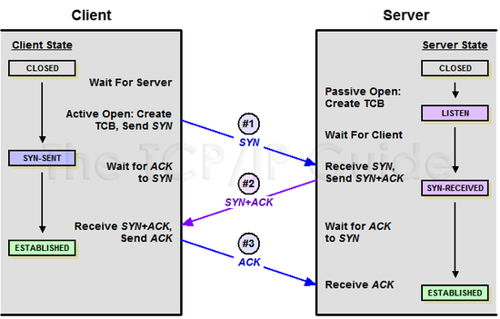
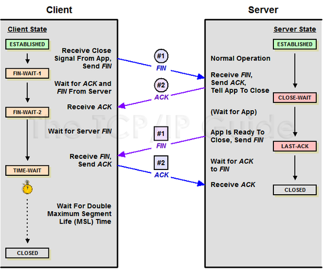

# Day 20-1 handshake

##  TCP 3-way Handshake
- TCP/IP 프로토콜을 이용해서 통신을 하는 응용프로그램이 데이터를 전송하기 전에 먼저 `정확한 전송을 보장하기 위해 상대방 컴퓨터와 사전에 세션을 수립하는 과정`을 의미

```text
Client > Server : TCP SYN
Server > Client : TCP SYN ACK
Client > Server : TCP ACK

* SYN: synchronize sequence numbers
  ACK: acknowledgment
```


### 역할
- 양쪽 모두 데이터를 전송할 준비가 되었다는 것을 보장
- 실제 데이터 전달이 시작하기 전에 한쪽이 다른 쪽이 준비되었다는 것을 알 수 있도록 함
- 양쪽 모두 상대편에 대한 초기 순차일련번호를 얻을 수 있도록 함




### 과정
1. A 클라이언트가 B 서버에 접속을 요청하는 SYN 패킷 보냄. 이때 A 클라이언트는 SYN을 보내고 SYN_SENT 상태가 됨

2. B 서버는 SYN 요청을 받고 A 클라이언트에게 요청을 수락한다는 ACK와 SYN flag가 설정된 패킷을 발송하고 A가 다시 ACK으로 응답하기를 기다림. 이때 B 서버는 SYN_RECEIVED 상태가 됨

3. A 클라이언트는 B 서버에게 ACK을 보내고 이후로부터는 연결이 이루어지고 데이터가 오가게 됨. 이떄의 B 서버의 상태는 ESTABLISHED.

## 4-way Handshake
- 3-way Handshake는 TCP 연결을 초기화할 때 사용, 4-way Handshake는 세션을 종료하기 위해 수행되는 절차




### 과정
1. 클라이언트가 연결을 종료하겠다는 FIN 플래그를 전송

2. 서버는 일단 확인메시지를 보내고 자신의 통신이 끝날 대까지 기다리는데, 이 상태가 TIME_WAIT 상태임

3. 서버가 통신이 끝났으면 연결이 종료되었다고 클라이언트에게 FIN 플래그를 전송함

4. 클라이언트는 확인했다는 메시지를 보냄


## 참고

####  만약 "Server에서 FIN을 전송하기 전에 전송한 패킷이 Routing 지연이나 패킷 유실로 인한 재전송 등으로 인해 FIN패킷보다 늦게 도착하는 상황"이 발생한다면 어떻게 될까?

- Client에서 세션을 종료시킨 후 뒤늦게 도착하는 패킷이 있다면 이 패킷은 Drop되고 데이터는 유실됨
- 이러한 현상에 대비하여 Client는 Server로부터 FIN을 수신하더라도 일정시간(디폴트 240초)동안 세션을 남겨놓고 잉여 패킷을 기다리는 과정을 거침(TIME_WAIT)


[출처](https://mindnet.tistory.com/entry/%EB%84%A4%ED%8A%B8%EC%9B%8C%ED%81%AC-%EC%89%BD%EA%B2%8C-%EC%9D%B4%ED%95%B4%ED%95%98%EA%B8%B0-22%ED%8E%B8-TCP-3-WayHandshake-4-WayHandshake)

