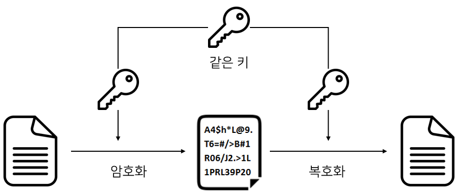
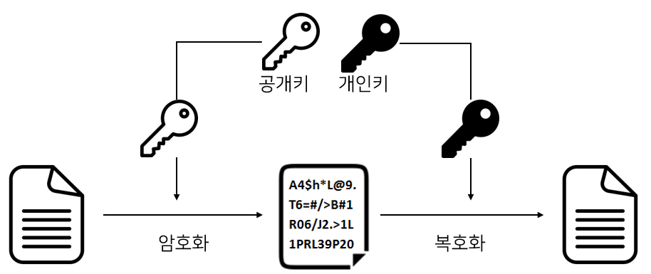
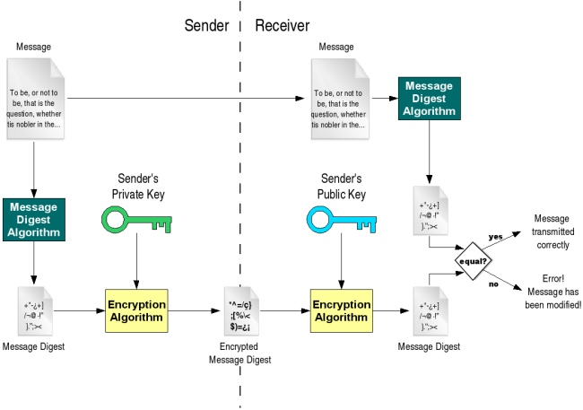

# Day 20-2 Public Key vs 

보안에서는 키를 이용해 평문을 암호문으로 `암호화`하고, 키를 사용해 암호문을 평문으로 `복호화`한다. 암호화 방식에는 크게 대칭키 암호화 방식과 공개키(비대칭키) 암호화 방식이 있다.


## 1. 대칭키 암호화 방식

- 암호화와 복호화에 사용되는 키가 동일한 암호화 방식
- DES, 3DES, AES, SEED




### 장점
- 공개키 암호화 방식에 비해 속도가 빠르다

### 단점
- 키 배송 문제가 발생함(키를 어떻게 상대방에게 전달할 것인가?)
- 사람이 증가할수록 관리해야 할 키가 증가한다. 이로인해 키 관리가 어렵게 됨

키 배송 문제를 해결하기 위해 키의 사전 공유에 의한 해결, 키 배포센터에 의한 해결, 공개키 암호에 의한 해결 등이 있음


## 2. 공개키(비대칭키) 암호화 방식
- 대칭키 암호화 방식의 키 배송 문제를 극복하기 위해 등장
- 암호화와 복호화에 사용되는 키가 다른 암호화 방식
- 서로 다른 두 개의 키인 공개키(Public Key), 개인키(Private Key)를 사용
    - 공개키(Public Key): 배포해도 되는 키
    - 개인키(Private Key): 절대로 유출해서는 안되는 키


- 공개키로 암호화한 암호문은 오직 개인키로만 복호화할 수 있음
- RSA, DSA, ECC




### 동작과정(단방향)
1. 나에게 암호문을 전달하고 싶은 대상에게 공개키를 전달(공개키는 바로 네트워크를 통해 전달해도 됨)
2. 공개키를 받은 사람은 공개키를 사용하여 암호화하고 나에게 암호문을 보냄. 암호문을 복호화할 수 있는 건 비밀키를 가진 '나' 뿐임
3. 나는 암호문을 받아 비밀키로 복호화함

### 동작과정(양방향)
1. A와 B는 각자 개인키와 공개키를 가지고 있음
2. A는 B에게 자신의 공개키를, B도 A에게 자신의 공개키를 전달
3. 상대방에게 전달받은 공개키로 암호화해 암호문을 보냄. A는 B의 공개키로 암호화하고 B는 A의 공개키로 암호화함. 암호문을 복호화할 수 있는건 비밀키를 가진 '상대방' 뿐임
4. 암호문을 받으면 자신의 비밀키로 복호화함

### 장점
- 대칭키 암호화 방식의 키 배송 문제를 해결할 수 있음

### 단점
- 대칭키 암호화 방식보다 속도가 느림


## 참고

### 전자 서명
- 전자 서명: 원본 데이터가 자신의 것이라는 의미, 원본 데이터에 추가적으로 붙이는 데이터
- B가 A로부터 원본 데이터를 받을 때 전자 서명을 사용한다면 B가 받은 원본 데이터가 위변조되지 않은 A의 데이터임을 확실할 수 있음.
    - 위조: 원래부터 진짜가 아님
    - 변조: 원래 진짜였지만 동일성을 해치고 변하게 만들어서 가짜가 됨

```text
B는 A로부터 암호문을 받기 위해 공개키를 보냈다. 하지만 악의적인 사용자가 공개키를 가져가 B에게 암호문을 보냈다. B는 받은 데이터가 A가 보낸 데이터임을 확인하고 싶다. 이때 전자 서명을 사용한다면 받은 데이터가 A의 것인지 확인할 수 있다.

 
B는 A로부터 계약에 동의한다는 전자 문서를 받았다. B는 계약을 진행했는데 갑자기 A가 계약에 동의하지 않았다고 발뺌을 한다. 계약이 중간에 취소될경우 크게 손해를 볼 B는 전자 문서를 보여주며 항의를 하는데 A는 전자 문서가 자신의 것이 아니라고 주장한다. 이때 전자 서명을 사용한다면 해당 전자 문서를 A가 보냈음을 인증할 수 있다.
```

#### 동작 방식
- A는 전자 서명을 하며 B는 전자 서명을 확인(검증) 한다. 아래 그림에서 Sender가 A이고 Receiver가 B임




##### A 동작 방식
1. A는 원본 데이터에 해시 함수를 적용해 메시지 다이제스트를 생성함
2. A는 자신의 개인키로 메시지 다이제스트를 암호화함. 암호화된 메시지 다이제스트가 전자서명임
3. 원본데이터에 암호화된 메시지 다이제스트를 붙여 보냄


##### B 동작 방식
1. B는 원본 데이터와 메시지 다이제스트를 수신함
2. B는 A의 공개키로 암호화된 메시지 다이제스트를 복호화함
3. 원본 데이터에 A와 동일한 해시함수를 사용해 메시지 다이제스트를 얻음
4. 2번의 메시지 다이제스트와 3번의 메시지 다이제스트를 비교함. 같다면 A가 보낸 데이터라는 걸 확신할 수 있으며 다르면 위변조 됬다는걸 확실할 수 있음.

```text
위 동작 방식에서 원본 데이터는 암호화되지 않고 전송하기에 노출될 수 있다. 중요한 데이터라면 A는 원본 데이터를 B의 공개키로 암호화한 뒤 암호문을 토대로 전자 서명을 생성해 보내면 된다. 결론으로 A의 개인키가 노출되지 않는 이상 B는 받은 원본 데이터가 위변조 되지 않은 A의 데이터임을 확신할 수 있다.
```

[출처](https://gunjoon.tistory.com/149)