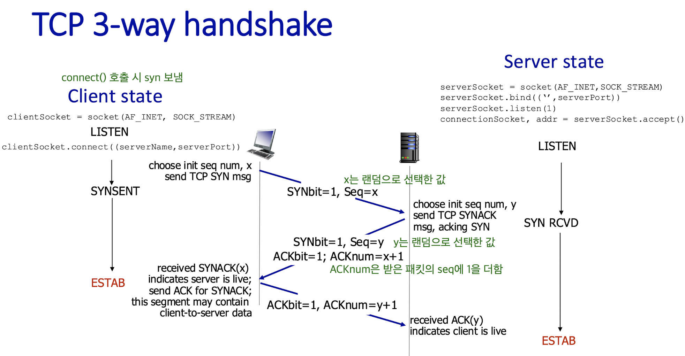
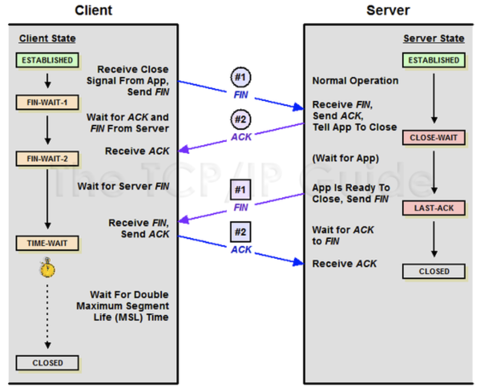

# 3-way & 4-way handshake

Date: 2026년 7월 29일
Status: Done

# 개념

<aside>
📜

**3-way & 4-way handshake**

TCP에서 데이터를 보내기 전에 연결하는 과정(3-way), 끝날 때 연결을 해제하는 과정(4-way)

</aside>

---

# 3-way Handshake

- PORT 상태 정보
    - CLOSED: 포트가 닫힌 상태
    - LISTEN: 포트가 열린 상태로 연결 요청 대기 중
    - SYN_RCV: SYNC 요청을 받고 상대방의 응답을 기다리는 중
    - ESTABLISHED: 포트 연결 상태
- 작동 방식
    - SYN
        - 송신자가 최초로 데이터를 전송할 때 Sequence Number를 임의의 랜덤 숫자로 지정하고, SYN 플래그 비트를 1로 설정한 세그먼트를 전송한다.
        - PORT 상태
            - 송신 측: `CLOSED → SYN_SENT`
            - 수신 측: `LISTEN`
    - SYN + ACK
        - ACK Number필드를 Sequence Number + 1 로 지정하고 SYN과 ACK 플래그 비트를 1로 설정한 새그먼트 전송
        - PORT 상태
            - 송신 측: `SYN_SENT`
            - 수신 측: `SYN_RCV`
    - ACK
        - 수락 확인을 보내 연결을 맺음
        - PORT 상태
            - 송신 측: `ESTABLISHED`
            - 수신 측: `ESTABLISHED`

---

# 4-way Handshake

- 작동 방식
    - FIN (client → server)
        - 데이터 다 보냈으니 이제 끊을게~
        - PORT 상태
            - client: `ESTABLISHED`  → `FIN_WAIT`
            - server: `ESTABLISHED`  → `CLOSE_WAIT`
    - ACK (server → client)
        - 알겠어, 확인해볼테니 잠깐 기다려봐
        - PORT 상태
            - server: `ESTABLISHED`  → `CLOSE_WAIT`
    - FIN (server → client)
        - 확인해보니까 다 끝났네, 이제 진짜 끝내자~
        - PORT 상태
            - server: `CLOSE_WAIT`  → `LAST_ACK`
    - ACK (client → server)
        - 수고했어~
        - PORT 상태
            - client: `FIN_WAIT`  → `TIME_WAIT`  → `CLOSED`
            - server: `LAST_ACK`  → `CLOSED`

