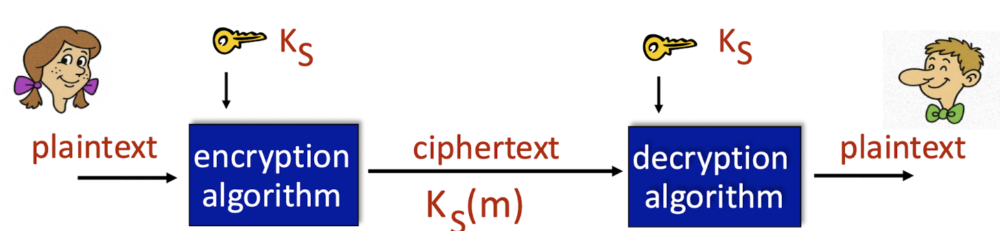
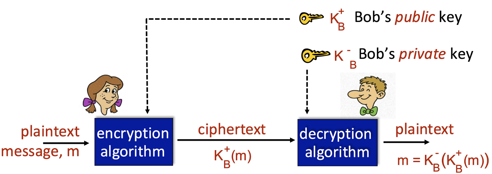

# 공개키 vs 대칭키

Status: Done

# 개념

<aside>
📜

**대칭키**

암호화, 복호화 두 과정에서 쓰는 키가 서로 동일한 방식

**공개키**

암호화, 복호화 두 과정에서 쓰는 키가 서로 다른 방식

</aside>

---

# 대칭키

- 원리
    - 암호화 할 때 사용한 키를 알려줄테니, 이걸로 복호화 해라!
    - 속도가 빠르지만, 송수신 이벤트가 많아질수록 관리해야할 키가 방대하게 많아짐
- 활용
    - DES(Data Encryption Standard), AES(Advanced Encryption Standard), SEED, ARIA 등
- 문제점
    - receiver에게 key를 어떻게 알려주지? → 탈취될 가능성 높음 → 공개키 사용하자!

---

# 공개키

- 원리
    - 공개키, 개인키를 쌍으로 생성하여 사용
    - RSA 알고리즘으로 활용하여 두 키 중 하나로 암호화 하면, 다른 하나로 복호화 할 수 있음
- 대칭키를 사용하는 방법에 비해 속도가 느림
- 활용
    - authentication, digital signature, message integrity, symmetric-key agreement

