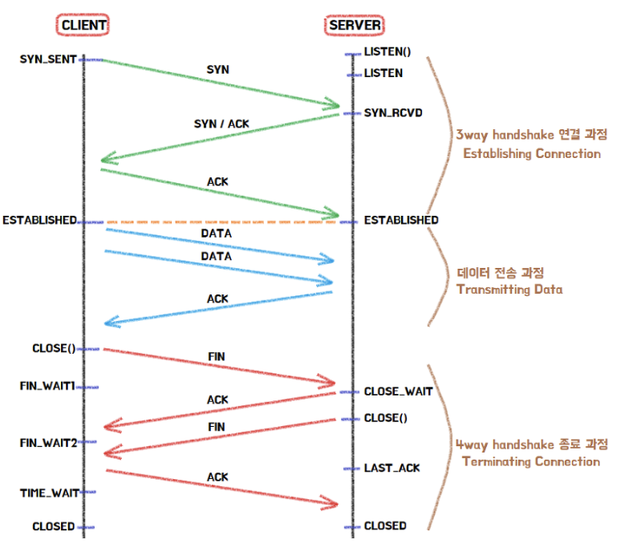

# Day 20 - 3-way & 4-way handshake, 공개키 vs 대칭키

# 3-way & 4-way Handshake

우선 전체적인 TCP 통신 과정을 아래 사진과 같다.

이 과정에서 두 번에 Handshake가 발생하는데 통신을 시작하고 종료할 때 서로 준비가 되었는지 확인하기 위한 과정이다.

## 3-way Handshake

1. 클라이언트는 접속을 요청하는 SYN 패킷을 보낸다.

   이때 클라이언트는 응답을 기다리기 위해 SYN_SENT 상태로 변한다.

2. LISTEN 상태였던 서버는 SYN 요청을 받으면, 클라이언트에게 요청을 수락하는 ACK 패킷과 SYN 패킷을 보낸다.

   그리고 SYN_RCVD 상태로 변하여 클라이언트가 ACK 패킷을 보낼 때까지 기다린다.

3. 클라이언트는 다시 서버에 ACK 패킷을 보내고 이후 ESTABLISHED 상태가 되어 데이터 통신이 가능하게 된다.

## 4-way Handshake

1. 서버와 클라이언트가 TCP 연결이 되어있는 상태에서 클라이언트가 접속을 끊기 위해 CLOSE() 함수를 호출한다. 그러면 FIN 플래그를 보내게 되고 클라이언트는 FIN_WAIT1 상태로 변한다.
2. 서버는 클라이언트가 CLOSE() 한다는 것을 알게되고 CLOSE_WAIT 상태로 바꾼 후 ACK 플래그를 전송한다. 만일 서버에서 클라이언트로 보낼 남은 데이터가 있을 경우 이때 나머지를 모두 전송시킨다.
3. ACK를 받은 클라이언트는 FIN_WAIT2로 변환되고, 이때 서버는 CLOSE() 함수를 호출하고 FIN 플래그를 클라이언트에게 보낸다.
4. 서버도 연결을 닫았다는 신호를 클라이언트가 수신하면 ACK 플래그를 보낸 후 TIME_WAIT 상태로 전환된다.이 후 모든것이 끝나면 CLOSED 상태로 변환된다.

# 공개키 vs 대칭키

대칭키는 암호화와 복호화에 동일한 키를 사용하는 방식이고, 공개키(비대칭키)는 공개키와 개인키를 분리하는 방식이다.

## 대칭키

대칭키 암호화는 암호화와 복호화에 동일한 키를 사용하는 방식이다. 크게 블록 암호화와 스트림 암호화로 나뉜다.

블록 암호화 : 데이터를 고정된 크기의 블록으로 나누어 암호화 (DES, AES, SEED, IDEA, Skipjack)

스트림 암호화 : 데이터를 비트 단위로 순차적으로 암호화 (RC4, ChaCha20 등)

## 비대칭키(공개키)

암호화 키와 복호화 키를 분리하여 사용하는 방식이다. 공개키는 모두에게 공개하고 개인키만 비밀로 관리한다. 대칭키보다 속도는 느리지만, 키를 안전하게 교환할 수 있다는 장점이 있다. 대표적으로 디피-헬만, RSA, ECC 등이 있다.
