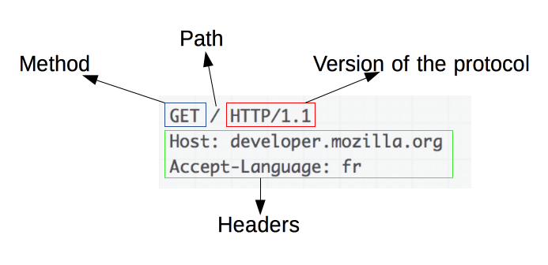
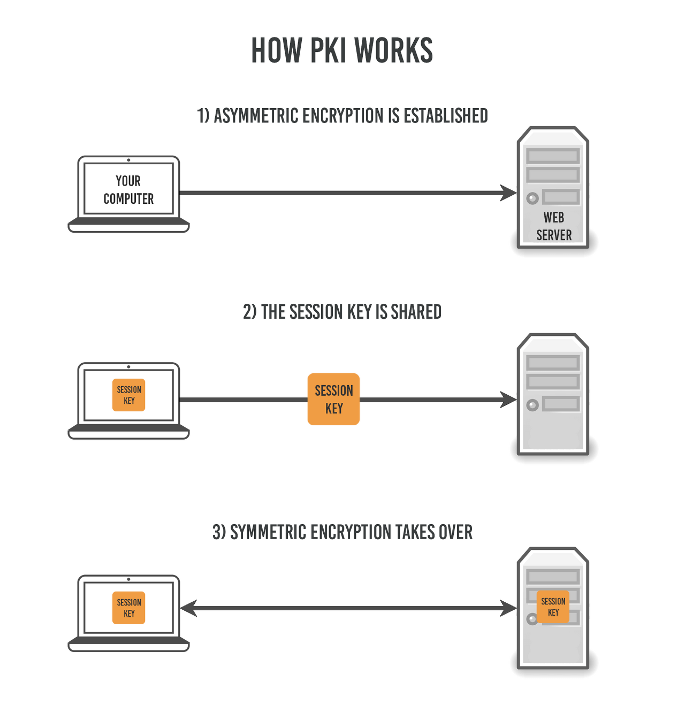
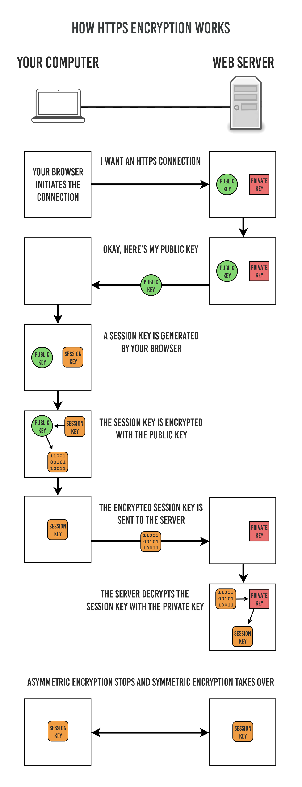
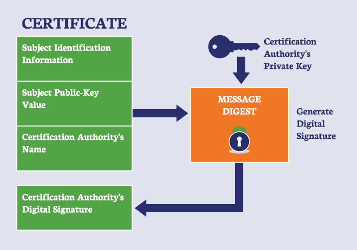

# day 21 HTTP HTTPS

## HTTP

- OSI(Open Systems Interconnection) 네트워크 통신 모델의 애플리케이션 계층 프로토콜
- 데이터를 평문 형태로 전송하기 때문에 데이터 탈취 위험성 있음
- 80번 포트 사용
- 데이터 민감 정보 노출될 수 있음(보안 레벨 낮음)
- HTTPS에 비해 구현과 운영 단순

### HTTP 구조





- HTTP는 애플리케이션 레벨의 프로토콜로 TCP/IP 위에서 작동함
- 상태를 가지고 있지 않는 Stateless 프로토콜
- `Method, Path, Version, Headers, Body` 등으로 구성

### HTTP 동작 과정

1. 사용자가 브라우저에 URL을 입력함
2. DNS를 통해 도메인에 해당되는 서버의 IP 주소를 확인함
3. 클라이언트와 서버가 TCP 연결을 수립함
4. 클라이언트가 서버에 HTTP 요청을 전송함
5. 서버가 요청을 처리함
6. 서버가 클라이언트에게 HTTP 응답을 전송함
7. 브라우저가 응답 데이터를 해석하여 화면에 표시함


### HTTP 메소드

| 메소드       | 의미                       |
| --------- | ------------------------ |
| `GET`     | 서버의 데이터를 조회              |
| `POST`    | 서버에 새로운 데이터를 전달하거나 생성 요청 |
| `PUT`     | 데이터를 전체 수정하거나 대체         |
| `PATCH`   | 데이터의 일부를 수정              |
| `DELETE`  | 데이터를 삭제                  |
| `HEAD`    | 응답 본문 없이 헤더만 조회          |
| `OPTIONS` | 서버가 지원하는 메소드 등을 확인       |


```http
GET /users/1 HTTP/1.1
Host: example.com
```

```http
POST /users HTTP/1.1
Content-Type: application/json

{
  "name": "Hoon"
}
```


## HTTPS

- HTTP에 데이터 암호화가 추가된 프로토콜
- 데이터를 암호화하여 전송하기 때문에 중간 공격자가 데이터를 읽거나 수정하는 것을 방지
- 443번 포트 사용
- 보안 수준 높음(데이터 전송 중 가로채기 방지)
- 서버의 신원을 확인하는 `SSL/TLS 인증서`가 필요하며, 이로 인해 사용자에게 신뢰성을 제공함
- 암호화/복호화 과정으로 인해 성능 오버헤드가 발생할 수 있음(현대 하드웨어에서는 큰 문제가 되지 않음) 
- HTTP보다 구현과 운영이 복잡함

### HTTPS 동작 과정





1. 클라이언트(브라우저)가 서버로 최초 연결 시도를 함
2. 서버는 공개키와 CA의 전자서명이 포함된 인증서를 전달함
3. 브라우저는 내장된 CA 공개키를 이용해 인증서의 전자서명, 도메인, 유효기간 등을 검증
4. 인증서가 유효하면 브라우저는 해당 공개키가 실제 서버의 것이라 신뢰
5. 클라이언트와 서버는 RSA 또는 ECDHE 등의 키 교환 방식으로 공유 비밀을 만듦 
6. 양쪽은 공유 비밀로부터 동일한 세션키를 생성
7. 이후 HTTP 요청과 응답은 세션키를 이용한 대칭키 암호화 방식으로 보호함








## 참고

### 면접용 정리

```text
HTTP는 데이터를 평문으로 전송하는 인터넷 프로토콜이며, 기본적으로 80번 포트를 사용합니다.
보안 레벨이 낮으나, 구현과 운영이 간단합니다.

HTTPS는 HTTP에서 SSL/TLS를 사용한 암호화 과정이 추가된 프로토콜이며, 443 포트를 사용합니다.
보안레벨이 높으나 인증서가 필요합니다.

HTTP는 암호화가 없기 때문에 데이터를 중간에서 공격자가 데이터를 가로채거나 변조할 수 있습니다.
HTTPS는 데이터가 보호됩니다.

HTTPS는 암호화로 인해 HTTP보다 성능이 떨어질 수 있지만, 현대 하드웨어에선 크게 부각되지 않습니다.

HTTPS는 인증서를 통해 서버의 신원을 확인하기 때문에 사용자에게 신뢰성을 제공합니다
```


[출처](https://mangkyu.tistory.com/98)
[출처2](https://kimgrang1202.tistory.com/81)