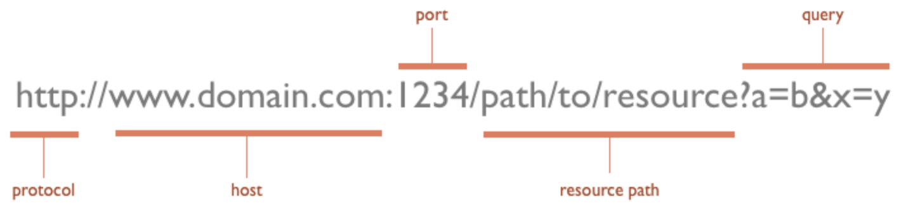
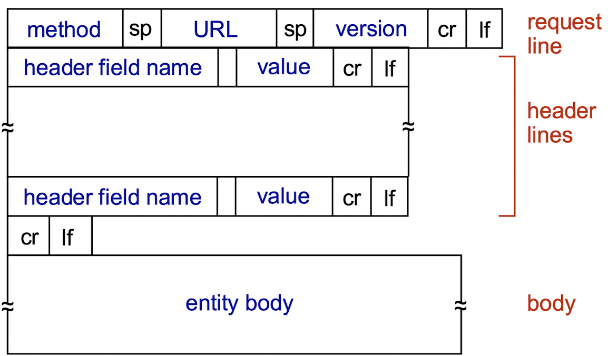
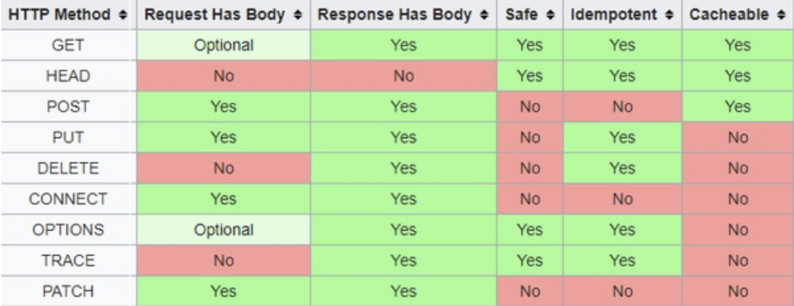
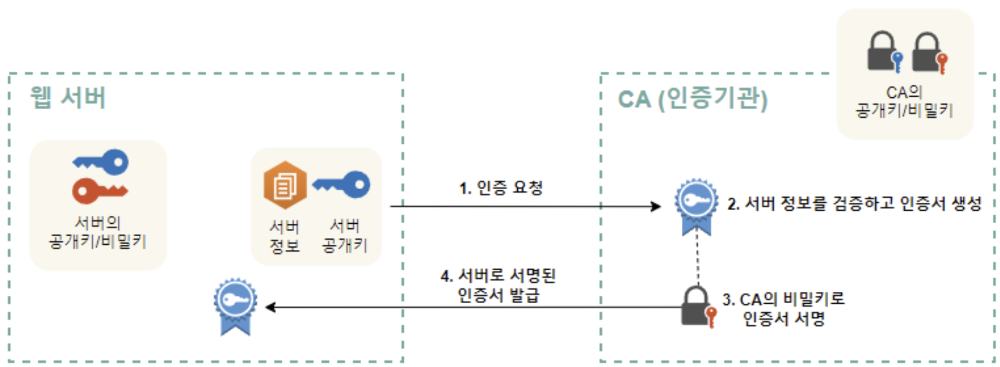
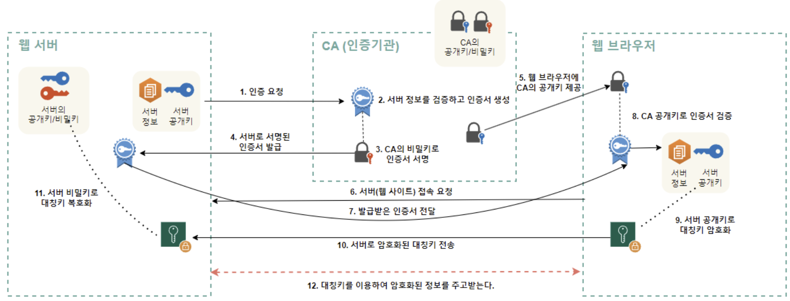

# HTTP vs HTTPS, 동작 과정과 메소드

Date: 2026년 7월 30일
Status: Done

# 개념

<aside>
📜

**HTTP (Hypertext Transfer Protocol)**

클라이언트와 서버 간 통신을 위한 프로토콜로서, OSI 7계층 모델의 애플리케이션 계층에서의 프로토콜이다.

**HTTPS (Hypertext Transfer Protocol Secure)**

HTTP에 안전하고 암호화된 연결을 추가한 버전

</aside>

---

# HTTP

- 기본 포트로 80번을 사용하며, 데이터를 암호화하지 않고 Plaintext 그대로 전송
- 클라이언트-서버 모델 사용
- 동작 과정 및 특징
    - 비연결성: 클라이언트가 요청을 보내고 서버가 응답을 보내면, 그 즉시 통신 연결을 끊음
    - 무상태성: 연결이 끊기면 서버는 방금 요청했던 클라이언트의 정보를 잊어버림
        - 초기 HTTP의 이런 특성을 보완하고자 세션, 쿠키와 같은 기술 등장
    - 연결(3-way handshake) → 데이터 요청과 응답 → 종료(4-way handshake)
- 브라우저 주소창에 URL을 입력하면 
해당 주소(host)에 맞는  서버컴퓨터로 가게되고 
포트(port)를 통해  서버컴퓨터의  특정 WAS로 가게되고  
나머지 resource path를 통해  특정 페이지까지 요청이 도달한다.





## HTTP 요청 메소드 및 상태 코드

#### 요청

- **GET**: 자원 조회
- **POST**: 자원 생성
- **PUT**: 자원 변경
- **DELETE**: 자원 삭제
- **HEAD**: 헤더 정보만 조회



### 응답 상태 코드

[모든 상태 코드](https://namu.wiki/w/HTTP/%EC%9D%91%EB%8B%B5%20%EC%BD%94%EB%93%9C) ← 모든 정보들은 여기서 자세히 알아보자

- **2xx - 성공**
    - 200 : OK
    - 201 : Created
    - 202 : Accepted
    - 203 : Non-Authoritative Information
    - 204 : No Content. 성공했으나 응답 본문에 데이터가 없음
    - 205 : Reset Content. 성공했으나 클라이언트의 화면을 새로 고침하도록 권고
    - 206 : Partial Conent. 성공했으나 일부 범위의 데이터만 반환
- **3xx - 리다이렉션**
    - 301 : Moved Permanently, 요청한 자원이 새 URL에 존재
    - 303 : See Other, 요청한 자원이 임시 주소에 존재
    - 304 : Not Modified, 요청한 자원이 변경되지 않았으므로 클라이언트에서 캐싱된 자원을 사용하도록 권고. ETag와 같은 정보를 활용하여 변경 여부를 확인
- **4xx - 클라이언트 에러**
    - 400 : Bad Request, 잘못된 요청
    - 401 : Unauthorized, 권한 없이 요청. Authorization 헤더가 잘못된 경우
    - 403 : Forbidden, 서버에서 해당 자원에 대해 접근 금지
    - 404 : Not Found
    - 405 : Method Not Allowed, 허용되지 않은 요청 메서드
    - 409 : Conflict, 최신 자원이 아닌데 업데이트하는 경우. ex) 파일 업로드 시 버전 충돌
- **5xx - 서버 에러**
    - 501 : Not Implemented, 요청한 동작에 대해 서버가 수행할 수 없는 경우
    - 503 : Service Unavailable, 서버가 과부하 또는 유지 보수로 내려간 경우

---

# HTTPS

**암호화 전(HTTP)**

**암호화 후(HTTPS)/**

```
완전히 읽을 수 있는 텍스트 문자열입니다
```

```
ITM0IRyiEhVpa6VnKyExMiEgNveroyWBPlgGyfkflYjDaaFf/Kn3bo3OfghBPDWo6AfSHlNtL8N7ITEwIXc1gU5X73xMsJormzzXlwOyrCs+9XCPk63Y+z0=

```

- 기본 포트로 443번을 사용하여 HTTP와 구분하고, HTTP에 TLS/SSL 기능을 추가하여 암호화 제공
- TLS/SSL 인증서 발급
    - 서버에서 공개키, 개인키 한 쌍을 생성
    - 인증기관인 CA에 서버의 공개키와 서버 정보를 제공
    - CA에서 검증 후 TLS/SSL 인증서를 발급하고, CA의 개인키를 사용하여 인증서에 서명
    - 인증서를 서버에 전달
    
    
    
- 동작 과정
    - 사용자가 웹 페이지 연결
    - 웹 페이지에서 보안 세션을 시작하는 데 필요한 **공개키가 포함된 TLS/SSL 인증서**를 전송
    - TLS/SSL handshake를 통해 클라이언트-서버 보안 연결 (대칭키를 별도의 공개키/개인키로 암,복호화 하는 하이브리드 방식을 사용)
        
        