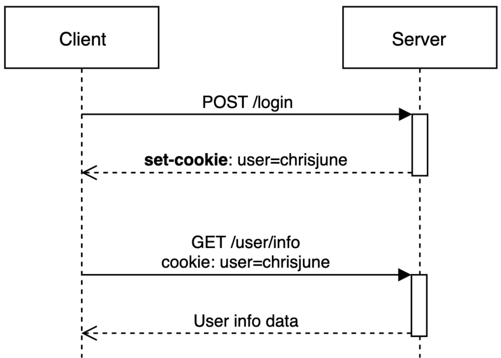
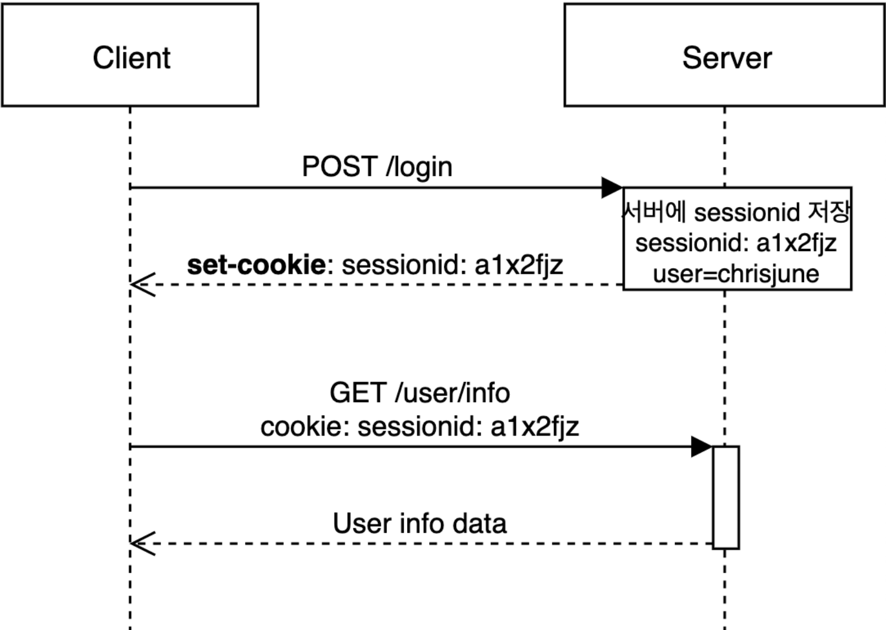

# 쿠키와 세션

Status: Done

# 개념

<aside>
📜

**쿠키**

HTTP의 일종으로 사용자가 어떤 웹 사이트를 방문할 경우, 해당 사이트가 사용하고 있는 서버에서 사용자의 컴퓨터에 저장하는 작은 기록 정보 파일

**세션**

일정 시간 동안 같은 사용자(브라우저)로부터 들어오는 일련의 요구를 하나의 상태로 보고, 그 상태를 유지시키는 기술

| **비교 항목** | **쿠키 (Cookie)** | **세션 (Session)** |
| --- | --- | --- |
| 저장 위치 | 클라이언트 (웹 브라우저) | 서버 (메모리 또는 DB) |
| 보안성 | 취약함 (탈취 및 변조 위험) | 뛰어남 (세션 ID만 탈취 가능) |
| 속도 | 빠름 (내 컴퓨터에서 바로 꺼냄) | 비교적 느림 (서버에서 확인 과정 필요) |
| 서버 자원 | 전혀 사용하지 않음 | 사용자가 많을수록 서버 메모리 차지 |
</aside>

---

# 쿠키

- 목적
    - Session Management
    - Personalization
    - Tracking
- 종류
    - Session Cookie
        - 일반적으로 만료시간(Expire Date)를 설정하고 메모리에만 저장되며, 브라우저 종료 시 쿠키를 삭제
    - Persistent Cookie
        - 장기간 유지되는 쿠키이다. 파일로 저장되어 브라우저 종료와 관계없이 사용할 수 있다.
    - Secure Cookie
        - HTTPS 프로토콜에서만 사용하며, 쿠키 정보가 암호화되어 전송된다.
    - Third-Party Cookie
        - 방문한 도메인과 다른 도메인의 쿠키이다. 일반적으로 광고 배너 등을 관리할 때 유입 경로를 추적하기 위해 사용한다.
- HTTP에서 클라이언트의 상태 정보를 쿠키 형태로 Client PC에 저장했다가 필요 시 정보를 참조하거나 재사용할 수 있음
- Key-Value 쌍으로 구성
    - 쿠키 이름, 쿠키 값, 만료 시간, 전송 도메인명, 전송 경로, 보안 연결 여부, HttpOnly 여부로 구성

---

# 세션

- 목적
    - 노출되면 안되는 중요한 정보들을 **서버** 안에서 다루기 위해 사용
- 웹 컨테이너의 상태를 유지하기 위한 정보를 저장
- 웹 서버에 저장되는 쿠키라고 할 수 있음 (Session Cookie)

