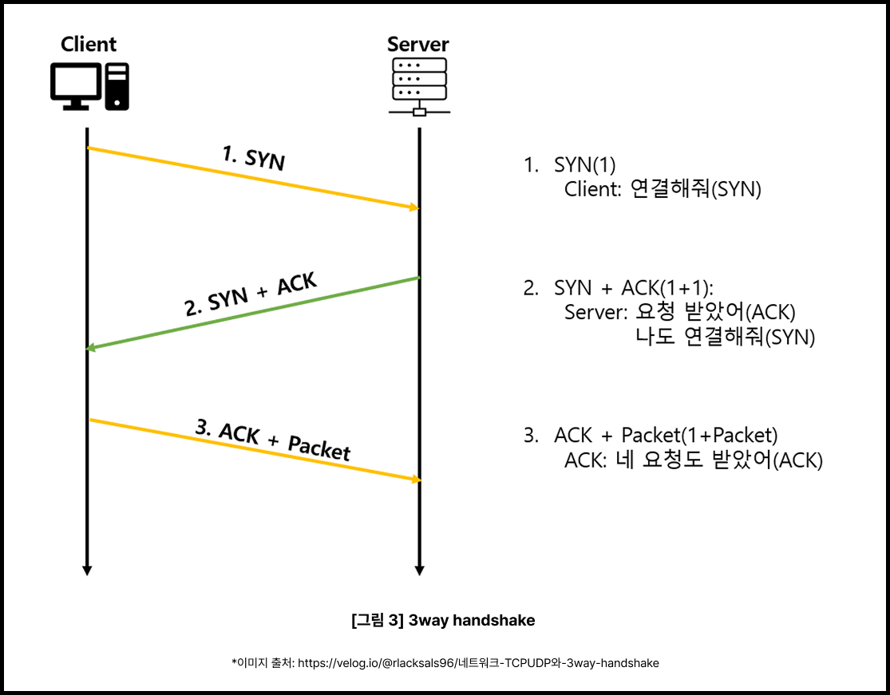

# Day 23 주소창에 URL을 입력하면 일어나는 일들

## 웹 흐름

1. **URL 파싱**: 입력한 주소 해석하기
2. **DNS 조회**: 도메인을 IP 주소로 변환하기
3. **TCP 연결**: 서버와 통신 채널 열기
4. **HTTP 요청**: 웹페이지 요청 보내기
5. **서버 응답**: HTMP, CSS, JS 파일 받기
6. **브라우저 렌더링v: 화면에 웹페이지 그리기

```text
편지를 보내는 과정과 유사함

받는 사람의 주소 확인 -> 우체국을 거쳐 편지 전달 -> 답장을 받는 과정
```

## 1. URL 파싱: 주소 해석하기

사용자가 `https://www.google.com/search?q=frontend`를 입력했다 갖정

URL 분해를 아래와 같이 함
- **프로토콜**: `https://` (보안 HTTP 통신)
- **도메인**: `www.google.com` (서버 주소)
- **경로**: `/search` (요청할 페이지)
- **쿼리 파라미더**: `?q=frontend` (검색어)

프로토콜이 생략되었다면 브라우저가 자동으로 `https://`를 붙여줌


## 2. DNS 조회: 도메인을 IP 주소로 변환

- `www.google.com` -> `172.217.175.4`와 같은 IP 주소로 변환

### DNS 조회 순서
1. **브라우저 캐시 확인** - 최근에 방문한 사이트라면 기억하고 있을 수 있음
2. **운영체제 캐시 확인** - OS 레벨에서 저장된 DNS 정보 확인
3. **라우터 캐시 확인** - 공유기에서 캐시된 정보 확인
4. **ISP DNS 서버 조회** - 인터넷 제공 업체(KT, SK, LG 등)의 DNS 서버에 물어보기
5. **루트 DNS 서버부터 순차 조회** - 전 세계 DNS 시스템을 통해 최종 IP 주소 찾기

> 전화번호부에서 이름으로 전화번호를 찾는 과정이라 생ㄱ각


## 3. TCP 연결: 서버와 통신 채널 열기

서버와 연결하는 과정. **TCP 3-Way Handshake** 과정 거침

### TCP 3-Way Handshake




```text
클라이언트 -> 서버 : SYN (연결 요청)
서버 -> 클라이언트 : SYN-ACK (연결 승인 + 역방향 연결 요청)
클라이언트 -> 서버 : ACK (최종 연결 확인)
```

> HTTPS의 경우 **TLS Handshake**(보안 통신을 위한 암호화 키 교환하는 과정) 추가로 필요


## 4. HTTP 요청: 웹페이지 요청 보내기

연결이 완료되었다면 브라우저는 서버에 HTTP 요청을 보냄

```http
GET / search?q=frontend HTTP/1.1
Host: www.google.com
User-Agent: Mozilla/5.0 (Windows NT 10.0; Win64; x64) Chrome/118.0.0.0
Accept: text/html,application/xhtml+xml,application/xml;q=0.9,*/*;q=0.8
Accept-LanguageL ko-KR,ko;q=0.8,en-US;q=0.5,en;q=0.3
Connection: keep-alive
```

### 주요 구성 요소
- 요청 방식: GET (데이터 조회)
- 경로: `/search?q=frontend`
- 헤더: 브라우저 정보, 언어 설정 등


## 5. 서버 응답: HTML, CSS, JS 파일 받기

```http
HTTP/1.1 200 OK
Content-type: text/html; charset=UTF-8
Content-Length: 12345
Cache-Control: max-age=3600

<!DOCTYPE html>
  <html>
  <head>
  	<title>검색 결과</title>
	<link rel="stylesheet" href="stye.css">
  </head>
  <body>
    <!-- HTML 콘텐츠 -->
    <script src="app.js"></script>
  </body>
  </html>
```

브라우저는 HTML을 파싱하면서 추가로 필요한 리소스들(CSS, JS, 이미지 등)을 발견하면 추가 요청을 보냄


## 6. 브라우저 렌더링: 화면에 웹페이지 그리기

### 렌더링 과정
1. **HTML 파싱** -> DOM 생성
2. **CSS 파싱** -> CSSOM 생성
3. **DOM + CSSOM** -> Render Tree 구성
4. **Layout (Reflow)** -> 요소 위치/크기 계산
5. **Paint (Repaint)** -> 픽셀 채우기
6. **Composite** -> 레이어 합성


## 참고

- **파싱 (Parsing)**: 브라우저가 단순한 텍스트 파일인 HTML 문서를 읽어 들여 컴퓨터가 이해할 수 있는 구조로 해석하고 분석하는 과정

- **DOM (Document Object Model)**: HTML의 태그 구조를 트리 형태로 변환한 객체 모델. 자바스크립트가 웹 페이지의 글자나 색상을 바꿀 때 이 DOM을 제어

- **CSSOM (CSS Object Model)**: HTML에 스타일을 입히기 위해 CSS 파일이나 <style> 태그 안의 내용을 해석하여 만든 스타일 전용 트리 모델

- **Render Tree (렌더 트리)**: 화면에 실제로 보여질 요소들만 골라내어 DOM과 CSSOM을 결합한 새로운 트리

- **Layout (레이아웃)**: 브라우저 화면(Viewport)의 크기를 기준으로 각 요소들이 어느 위치에, 어떤 크기(픽셀 단위)로 배치되어야 하는지 계산하는 단계

- **Reflow (리플로우)**: 웹 페이지 이용 중 자바스크립트로 인해 요소의 크기가 바뀌거나 위치가 변경되면, 이 레이아웃 과정을 다시 계산해야 하는데 이를 리플로우라고 부름