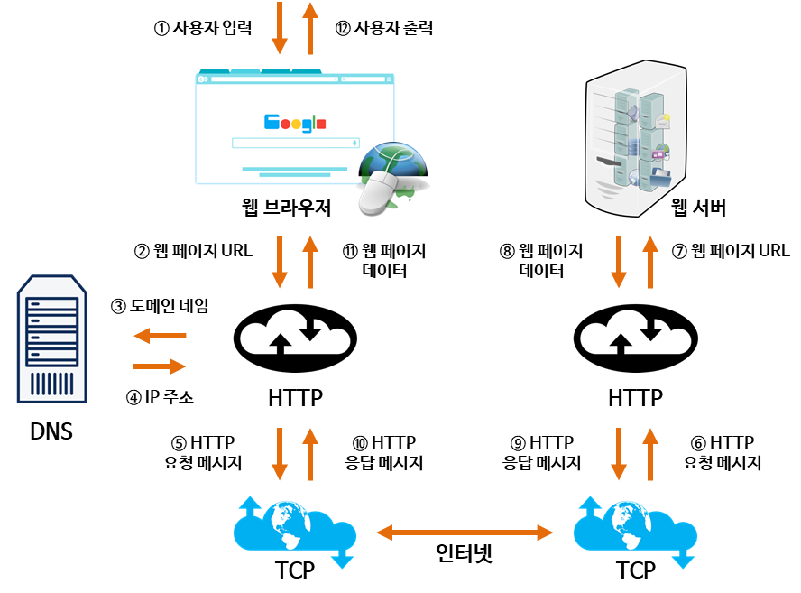
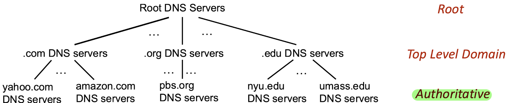

# URL 입력 시 일어나는 일

Date: 2026년 8월 3일
Status: Done

# 개념

<aside>
📜

**웹 브라우저에 URL 입력 시 어떤 일이 일어날까?**

지금까지 학습한 내용을 바탕으로 간단하게 알아보자~

- DNS 캐싱
- ARP (Address Resolution Protocol)
- TCP connection
    - 3-way handshake
    - SSL/TLS
- Browser Rendering
</aside>

---

## 1. 브라우저 주소 파싱 및 캐시 확인

- 입력한 텍스트가 검색어인지, URL인지 파악
- 브라우저 캐시와 OS 캐시를 뒤져서 저장해둔 IP 주소가 있는지 확인
    - 없다면 DNS로부터 IP 주소를 조회해야함

## 2. DNS 조회 - “전화번호부 뒤지기”

- 예를 들어, ‘www.naver.com’ 이라는 영어 주소를 IP 주소로 바꿔주는 DNS 서버에 요청을 보냄
- 도로명 주소처럼 ‘대구’ → ‘수성구’ → ‘청호로’ → ‘123’ 이렇게 말단 DNS 서버를 찾은 다음, 그 서버에 저장된 record를 반환 받음

## 3. 실제 서버에 연결

- 알아낸 IP 주소를 **ARP를 통해 MAC 주소로 번환**한 다음, MAC 주소로 실제 서버를 찾음
- 찾은 서버에 TCP 연결
    - **3-way handshake**
    - **SSL/TLS 보안 인증서 발급 및 연결**

## 4. 데이터 받아오기

- TCP 연결을 바탕으로, 서버에 원하는 데이터를 요청 후 웹 브라우저에 데이터를 출력
    - **브라우저 렌더링**