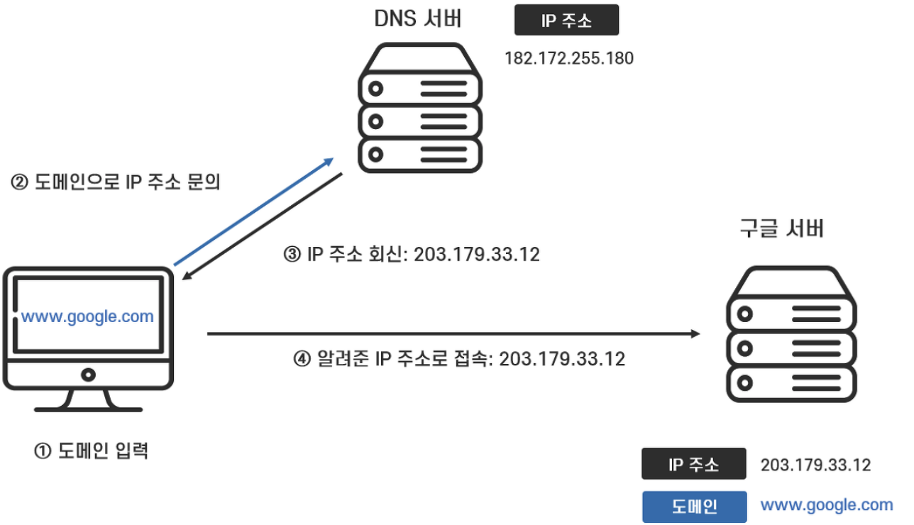

# Day 23 - 주소창에 www.google.com을 입력했을 때 일어나는 과정

](./image.png)

### 1. 브라우저 캐시 체크

사용자가 입력한 `www.google.com`을 컴퓨터는 읽을 수가 없다. 그래서 서버가 이해하는 IP 주소라는걸로 변환을 시켜줘야한다(DNS Resolution). 만약 내가 과거에 `google.com`을 요청한 적이 있다면, 브라우저 캐시에 `google.com`에 대한 IP 주소가 저장되어 있을 것이다.

### 2. DNS 조회

요청한 도메인의 IP 주소가 캐시에 없으면 Recursive DNS Resolver에 도메인의 IP 주소를 물어본다(DNS Query). 만약 Recursive DNS Resolver의 캐시에도 해당 정보가 없다면 Root DNS 서버에 요청을 보낸다.

Root DNS 서버 또한 `google.com`에 대한 IP 주소를 직접 알고 있지는 않지만 대신 `.com` 도메인을 관리하는 TLD(Top-Level Domain) DNS 서버의 정보는 알고 있다. 따라서 Root DNS 서버는 해당 TLD DNS 서버의 정보를 Recursive DNS Resolver에게 반환한다.

Recursive DNS Resolver는 전달받은 TLD DNS 서버에 다시 질의하고, TLD DNS 서버는 [`google.com`](http://google.com) 도메인을 관리하는 Authoritative DNS 서버의 정보를 반환한다.

마지막으로, Recursive DNS Resolver가 해당 Authoritative DNS 서버에 DSN Query를 보내 [`www.google.com`](http://www.google.com)의 IP 주소를 획득한다.

### 3. TCP 연결

IP 주소를 확인하면 브라우저는 해당 IP 주소의 서버와 TCP 연결을 시작한다. 3-way-handshake 방식으로 수행되며 클라이언트와 서버 간의 안정적인 연결을 확인한다.

### 4. HTTP 요청

TCP 연결이 완료되면, 브라우저는 HTTP 프로토콜을 사용해 서버에 필요한 데이터 요청을 보낸다.

### 5. HTTP 응답

서버는 응답 메세지를 작성하여 브라우저에게 데이터를 전송한다.

### 6. 렌더링

브라우저는 받은 데이터를 토대로 화면에 렌더링한다.
