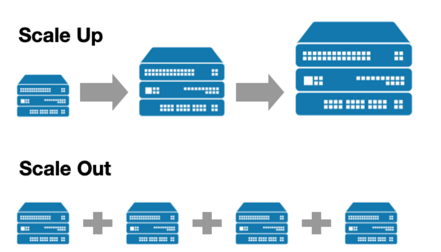
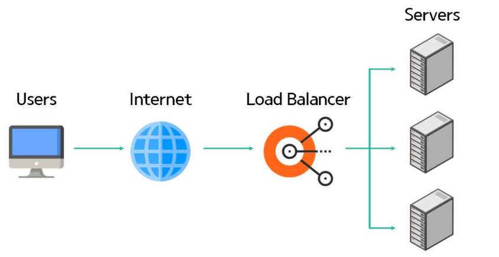

# day 24 로드 밸런싱(Load Balancing)

## 1. 로드 밸런싱(Load Balancing)

### 1.1. 정의
- 로드 밸런싱이란 네트워크 또는 서버에 가해지는 **부하 트래픽을 분산시켜주는 기술**


### 1.2. 필요성

- 현대의 웹 서비스 애플리케이션은 `사용자의 요구가 늘어나고` `비즈니스 복잡도도 증가`함
- 이에 따라 `클라이언트의 수도 기하급수적으로 늘게 됨`
- 결과적으로 `서버의 부하 크게 증가`

-> 서버의 부하를 줄일 기술이 필요해짐 -> 로드 밸런싱

## 2. Scale up, Scale out (서버 확장 방식)

- 서버의 부담을 줄이기 위해 **서버를 확장** 할 때 Scale up, Scale down 방법 사용




| 구분     | Scale Up      | Scale Out      |
| ------ | ------------- | -------------- |
| 방식     | 기존 서버 성능 향상   | 서버 대수 증가       |
| 예시     | CPU, RAM 증설   | 서버 1대 → 3대     |
| 다른 표현  | 수직 확장         | 수평 확장          |
| 로드 밸런서 | 보통 불필요        | 일반적으로 필요       |
| 장점     | 구조가 단순함       | 확장성과 장애 대응이 좋음 |
| 단점     | 성능 향상에 한계가 있음 | 시스템 구성이 복잡해짐   |


## 3. 로드 밸런서(Load Balancer)

### 3.1. 정의와 역할




- 클라이언트와 서버 Pool(서버 그룹들) 사이에 위치해 `서버의 부하를 분산시키는 하드웨어나 소프트웨어`를 의미
- 이러한 로드 밸런서는 네트워크 트래픽과 클라이언트의 요청을 여러 서버에 적절하게 분배시킴
- 정상적으로 운영되고 있는 서버에게만 요청 전송(다운된 서버가 있을 경우 유연하게 다른 서버로 Redirection함)
- 서비스의 직접적인 중단 없이 서버를 추가하거나 뺼 수 있음

### 3.2. 로드 밸런서의 종류

#### L4 로드 밸런서
- OSI 7계층 중 `전송 계층`에서 동작함

```text
[요청 분배 기준]
- 출발지 IP
- 목적지 IP
- 포트 번호
- TCP, UDP 프로토콜

> 요청의 구체적인 내용은 확인하지 않고 IP와 포트 정보를 중심으로 빠르게 분배함
```

##### 특징
- 처리 속도가 빠름
- 구조가 비교적 단순함
- TCP, UDP 트래픽 모두 처리 가능
- URL이나 쿠키 등 애플리케이션 내용에 따른 분배는 어려움


#### L7 로드 밸런서
- OSI 7계층 중 `응용 계층`에서 동작

```text
[요청 분배 기준: HTTP 요청의 내용을 분석하여 요청을 분배함]
- URL
- HTTP 헤더
- 쿠키
- 요청 메서드
- 도메인
- 파일 형식

[ex]
/images 요청 → 이미지 서버
/api 요청    → API 서버
/video 요청  → 동영상 서버

www.example.com/api/users
        ↓
API 서버로 전달

www.example.com/images/a.jpg
        ↓
이미지 서버로 전달
```

##### 특징
- 요청 내용에 따라 세밀하게 분배할 수 잇음
- 특정 사용자나 URL별 라우팅 가능
- SSL 종료, 인증, 캐싱 등의 기능을 제공하기도 함
- L4보다 처리 과정이 복잡하고 부하가 큼


| 구분    | L4 로드 밸런서       | L7 로드 밸런서            |
| ----- | --------------- | -------------------- |
| 동작 계층 | 전송 계층           | 응용 계층                |
| 기준    | IP, 포트, TCP/UDP | URL, 헤더, 쿠키, HTTP 내용 |
| 속도    | 빠름              | 상대적으로 느림             |
| 분배 방식 | 단순한 트래픽 분배      | 요청 내용에 따른 세밀한 분배     |
| 대표 대상 | TCP, UDP 서비스    | HTTP, HTTPS 웹 서비스    |


#### 구현 방식에 따른 종류(구현 형태에 다라 나눔)

##### 하드웨어 로드 밸런서
- 전용 장비 사용

##### 소프트웨어 로드 밸런서
- 일반 서버에 프로그램 설치하여 사용(Nginx, HAProxy, Apache HTTP Server 등)

##### 클라우드 로드 밸런서
- 클라우드 사업자가 제공하는 관리형 서비스


## 4. 로드 밸런싱 알고리즘 (Load Balancing Algorithm)

| 알고리즘                           | 설명                          |
| ------------------------------ | --------------------------- |
| **Round Robin**                | 요청을 서버에 순서대로 하나씩 분배         |
| **Weighted Round Robin**       | 성능이 좋은 서버에 더 많은 요청을 분배(서버별 가중치 설정)     |
| **Least Connections**          | 현재 연결 수가 가장 적은 서버에 요청 전달    |
| **Weighted Least Connections** | 서버 성능과 현재 연결 수를 함께 고려(Least Connections에 서버 성능 반영한 방식)       |
| **IP Hash**                    | 클라이언트 IP를 해시하여 특정 서버에 고정 배정 |
| **Least Response Time**        | 응답 시간이 가장 짧은 서버에 요청 전달      |
| **Random**                     | 서버를 무작위로 선택하여 요청 분배         |
