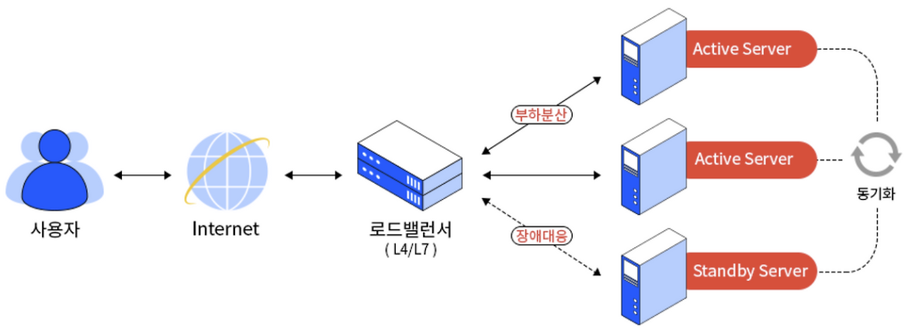

# 로드밸런싱

Date: 2026년 8월 4일
Status: Done

# 개념

<aside>
📜

Load Balancing

Load Balancer가 서버 앞단에 위치하여, 클라이언트로부터 쏟아지는 엄청난 네트워크 요청을 여러 대의 서버로 안전하고 공평하게 분산시켜주는 기술

</aside>

---

# 종류

- Network Load Balancer
    - IP 주소 및 기타 네트워크 정보를 검사하여 트래픽을 최적으로 리디렉션
    - 애플리케이션 트래픽의 소스를 추적하고 여러 서버에 고정 IP 주소를 할당
- Application Load Balancer
    - HTTP 헤더 또는 SSL 세션 ID와 같은 요청 콘텐츠를 확인하여 트래픽을 리디렉션
- DNS Load Balancer
    - 도메인의 리소스 풀에서 네트워크 요청을 라우팅하도록 도메인을 구성
- Global Server Load Balancer
    - 서버 장애가 발생한 경우에만 클라이언트의 지리적 영역 외부의 서버로 트래픽을 리디렉션

---

# Algorithms

## Static Load Balancing

고정된 규칙을 따르며 현재 서버 상태와 무관

- RR (Round Robin)
    - 들어온 요청을 순서대로 돌아가며 공평하게 배정
- Weighted RR
    - 서버별로 가중치를 두어, 가중치가 높을수록 트래픽을 더 많이 수신함
- IP Hash
    - 클라이언트의 IP 주소를 계산(해싱)하여 숫자로 변환한 다음, 특정 사용자는 항상 동일한 서버로만 연결되도록 고정

## Dynamic Load Balancing

트래픽을 배포하기 전에 서버의 현재 상태를 검사

- Least Connection
    - 클라이언트-서버 간 활성 연결이 가장 적은 서버로 트래픽을 전송
    - 모든 서버는 모든 연결에 대해 동일한 처리 능력을 가짐
- Weighted Least Connection
    - 일부 서버가 더 많은 활성 연결을 처리할 수 있다는 가정
    - 각 서버의 용량 대비 연결이 가장 적은 서버로 요청을 전송
- Least Response
    - 서버 응답 시간이 가장 적은 서버를 결정
- Resource
    - 각 서버에서 에이전트라는 특수 소프트웨어가 서버 리소스를 계산한 후, 현재 서버 부하가 적은 쪽으로 트래픽을 분산

---

# 장점

- 가용성
    - 애플리케이션 가동 중지 없이 애플리케이션 서버 유지 관리 또는 업그레이드 실행
- 확장성
    - 한 서버에서 트래픽 병목 현상 방지
    - 필요한 경우 다른 서버를 추가하거나 제거할 수 있도록 애플리케이션 트래픽을 예측
- 보안
    - 트래픽 모니터링 및 악성 콘텐츠 차단
    - 공격 트래픽을 여러 백엔드 서버로 자동으로 리디렉션하여 영향 최소화
    - 추가 보안을 위해 네트워크 방화벽 그룹을 통해 트래픽 라우팅
- 성능
    - 서버 간에 로드를 균등하게 배포하여 애플리케이션 성능 향상
    - 클라이언트 요청을 지리적으로 더 가까운 서버로 리디렉션하여 지연 시간 단축
    - 물리적 및 가상 컴퓨팅 리소스의 신뢰성 및 성능 보장

---

# L4 vs L7 Load Balancer

## L4 Load Balancer

- OSI 7계층 중 Transport Layer를 기반으로, 포트 번호, IP 주소, Mac 주소 등을 바탕으로 부하를 분산시킴
- 속도가 매우 빠르고, 처리량이 높음

## L7 Load Balancer

- OSI 7계층 중 Application Layer를 기반으로, HTTP Header, Cookie와 같은 사용자의 요청 정보를 기준으로 특정 서버에 대한 부하를 분산시킴
- URI, HTTP Header 등을 기준으로 Request를 세분화하여 서버로 전달
- 패킷 내용을 보기 때문에 서버에 연산 부하가 있음