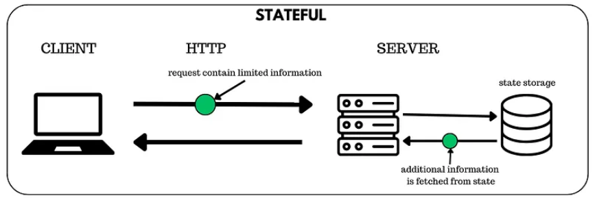
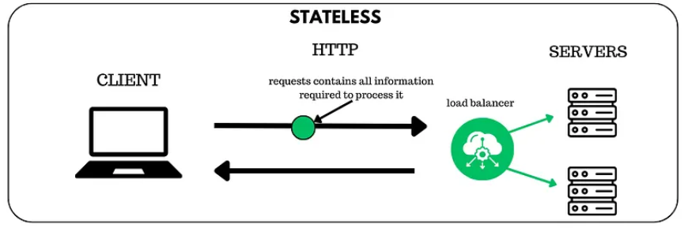

# Day 25 Stateful vs Stateless

## Stateful Architecture
- Stateful 아키텍처는 `서버가 클라이언트의 상태(state)를 기억`하는 구조임

### Stateful 구조의 처리 흐름



1. **클라이언트 -> 서버 요청 (정보 제한적)**
클라이언트는 최소한의 정보만 보내고, 나머지 상태 정보는 서버가 기억한다 가정

2. **서버가 상태 저장소에서 사용자 상태 조회**
서버는 요청에 담긴 세션 ID 등을 기반으로 `state storage(DB•Memory)`에서 이전 상태를 불러옴

3. **서버가 상태 + 요청 내용을 조합해 처리**
서버는 저장도니 상태와 새 요청을 결합해 필요한 로직을 수행함

4. **서버 -> 클라이언트 응답**
상태를 반영한 결과를 클라이언트에게 보냄
로그인 유지, 장바구니 유지, 게임 상태 유지 등이 여기에 해당


### Stateful 구조 특징
- 서버가 세션/상태 저장
- 클라이언트가 세션 ID만 보내면 서버가 사용자 식별
- 흐름이 오래 이어지는 서비스(장바구니, 결제 단계, 게임 진행 등)에 적합
- 서버 확장(Scaling)이 어려움(특정 사용자 요청은 상태를 가진 같은 서버가 처리해야함)

### 예시
- 세션(Session 기반 로그인)
- 온라인 게임 서버(플레이어 상태 실시간 저장)
- 워크플로우가 긴 기업 시스템
- TCP 기반 Websocket(연결 자체가 상태를 유지)


## Stateless Architecture
- `서버가 클라이언트의 상태를 전혀 저장하지 않는 구조`
- 서버는 요청마다 `처음 보는 사람`처럼 처리, 요청 자체에 필요한 데이터(사용자 정보•인증 정보 등)가 모두 담겨 있어야 함

### Stateless 구조의 처리 흐름



1. **클라이언트가 완전한 정보를 담아 요청을 보냄**
요청(request)에 처리를 위해 필요한 모든 정보가 포함되어 있음
(ex) JWT 토큰, 필요한 파라미터, 사용자 정보 등

2. **로드 밸런서가 여러 서버 중 하나로 요청을 분배**
요청이 특정 서버에 고정되지 않음
로드 밸런서가 트래픽을 여러 서버로 균등하게 배분함

3. **서버는 저장된 상태 없이 요청만으로 처리**
서버는 과거 상태나 세션 정보를 보지 않음
`오직 요청에 담긴 정보만`으로 작업을 수행

4. **서버 -> 클라이언트 응답**
처리 결과를 바로 응답
서버는 클라이언트 상태를 저장하지 않음

### Stateless 구조 트징
- 서버는 이전 요청을 기억하지 않음
- 모든 요청은 `독립적(Independent)`이고 `자급자족(Self-contained)`해야 함
- 서버 확장성이 매우 뒤어남
- 장애 복구가 쉬움 -> 어떤 서버가 죽어도 다른 서버가 아무 문제 없이 요청을 처리할 수 있기 때문

### 예시
- RESTful API
- JWT 기반 인증
- 서버리스(Function as a Service)
- CDN 기반 API Gateway 구조


## 참고

### Stateful이 필수적인 실제 서비스 예시
- **금융 서비스(OTP, 이체 단계 유지)**
- **쇼핑물 장바구니**
- **상담/챗봇 서비스(대화 상태 유지)**
- **실시간 게임(플레이어 위치, HP, 인벤토리 유지)**


### 현대 아키텍처의 접근 방식
- Stateful은 완전히 버려지는 것이 아닌 `필요한 특정 기능에 한해서만 State를 유지`하고 그 외의 `API는 Stateless로 설계`하는 하이브리드 전략을 씀

```text
(ex)
- 전체 API 서버는 Stateless로 운영
- 장바구니나 인증 세션은 Redis 같은 중앙 세션 저장소에 Stateful하게 유지
- 게임 서버나 실시간 상담 서버는 Stateful한 별도 서비스로 분리 운영
```

[출처](https://velog.io/@ngtm/Stateful-Stateless)