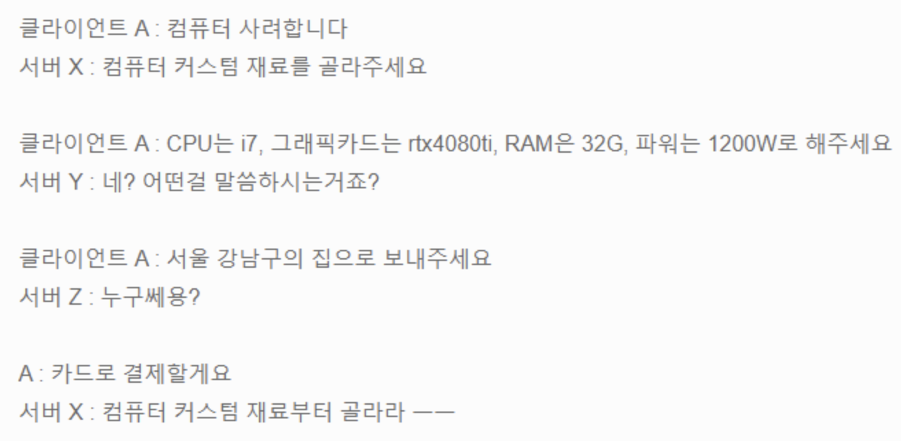
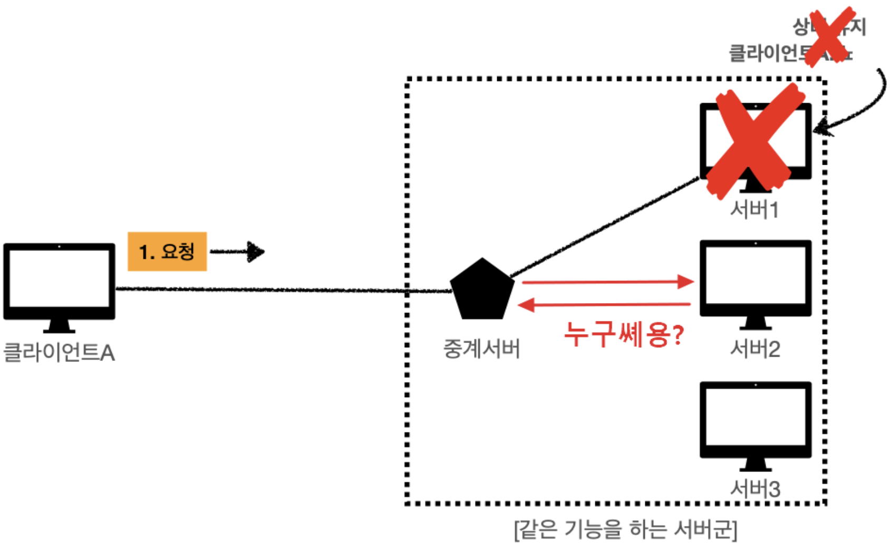
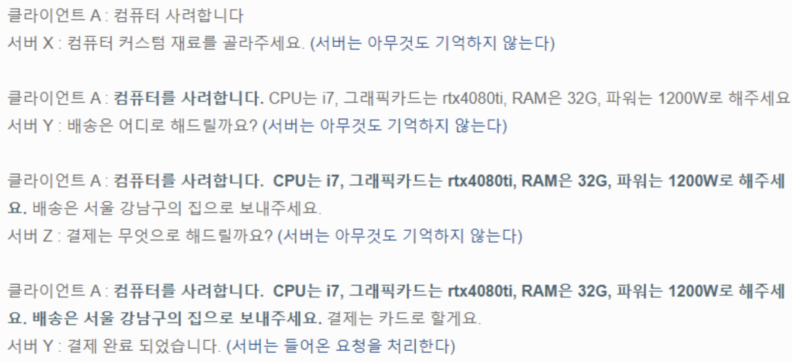
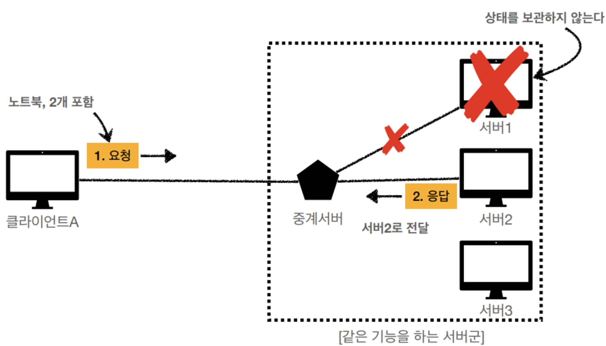

# Stateful vs Stateless

Status: Done

# 개념

<aside>
📜

**Stateful**

서버가 클라이언트의 이전 상태를 저장하고 있는 통신 방식

**Stateless**

서버가 클라이언트의 상태를 기억하지 않는 통신 방식으로, 클라이언트는 요청할 때마다 필요한 모든 정보를 다 담아서 보내야 함

</aside>

---

# Stateful

- 브라우저의 쿠기 또는 서버의 세션에 클라이언트의 정보를 저장하고, 통신할 때마다 읽음
- 예시
    - 대표적으로 홈페이지에서 한번 로그인을 하면 페이지를 이동해도 로그인이 풀리지않고 계속 유지되는 것
    - TCP 3-way handshaking
- 문제점
    - 사용 중인 서버를 못 쓰게 되어 다른 서버를 사용해야 할 때 새로운 서버에서는 클라이언트의 상태 정보들을 가지고 있지 않아 이전에 했던 동작들을 반복해야함 → 현업에서는 Redis(중앙세션저장소 개념)에다가 클라이언트의 상태 데이터를 따로 저장하여 사용함
    - 서버에서 상태 관리에 대한 부하가 큼
        
        
        

---

# Stateless

- 서버는 단순히 요청에 대한 응답만 보내며, 상태 관리는 전적으로 클라이언트 측에서 수행
- 클라이언트가 통신에 필요한 모든 상태 정보들을 매번 실어 보내야 함
- 서버에서 상태 유지에 대한 부하가 현저히 줄어듦
- 다른 서버 간에 트래픽을 나눠 처리하는 것에 부담이 없고, 확장성이 좋음
- 로그인 유지와 같은 상태는 유지하는 것이 좋은데, stateless 하게 유지하는 기술로 JWT 토큰이 있음
- 예시
    - UDP, HTTP
- 문제점
    - 클라이언트 요청에 매번 부가정보를 실어야 하므로 상대적으로 더 많은 데이터를 소모해야함

