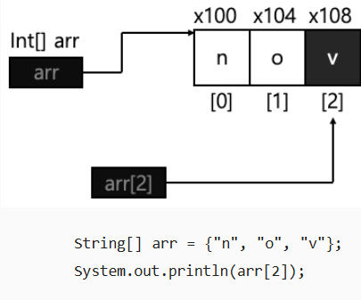
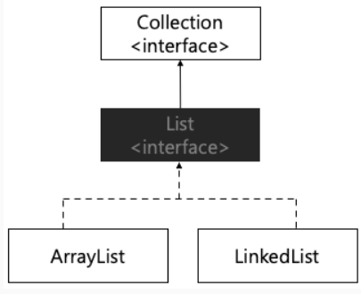
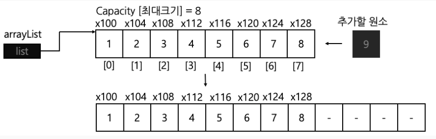
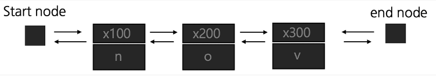
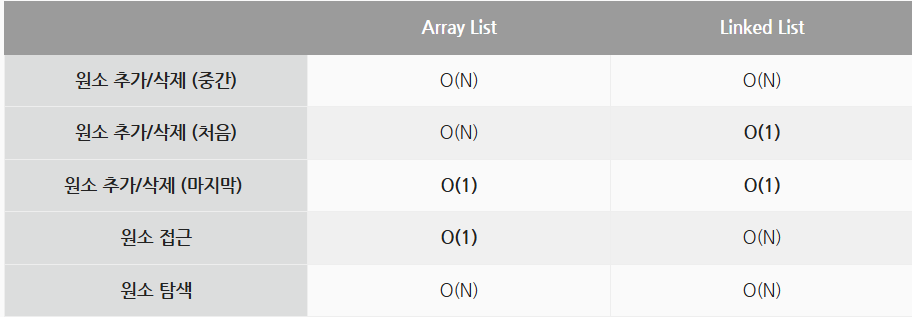
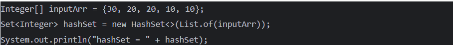
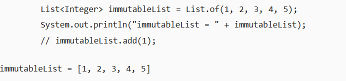

# day 26 Array vs ArrayList vs LinkedList

## 1. Array(배열)
- 내부 원소가 연속된 메모리 공간에 저장되어 있음
- 원소가 저장된 위치만 알고 있다면 즉시 원소에 접근할 수 있음




- 일반 배열은 크기가 고정되어 있다는 한계를 가짐
- 고정되어 있는 배열의 특징 -> `정적 할당(static allocation)`

## 2. List(리스트)

```text
[리스트 특징]
1. 데이터의 순서가 존재함
2. 데이터의 중복을 허용함
3. 리스트의 크기는 필요에 따라 동적으로 변함
```

- 자바에서는 `Collection framework`에서 다양한 형태의 최적화된 자료구조를 제공
    - 그중에 리스트도 제공(Arraylist, LinkedList)




### 2.1. ArrayList
- 배열을 사용하여 데이터를 관리하는 리스트
- 리스트 내부의 원소가 가득차면 대략 리스트의 크기를 50% 정도 늘려가는 방식으로 동작
- 동적으로 늘어난다는 점을 제외하고는 배열과 동일한 방식으로 동작 -> `특정 원소가 저장된 위치를 알고 있다면 1번의 연산 만으로 데이터에 접근 가능`




#### 배열 리스트의 원소 삽입
- 배열 리스트를 중간에 원소를 삽입하는 경우, 삽입하고자 하는 인덱스로부터 뒤에 위치한 모든 원소를 한칸씩 뒤로 미루는 방식으로 연산을 수행 -> `O(N)` 소요


### 2.2. LinkedList
- `노드(객체)`들의 집합으로 구성된 리스트
- 각 노드는 `원소와 다음 노드를 참조하는 참조값`으로 구성되어 잇음

```java
public class Node{
    object item;
    Node next;

    public Node(Object item){
        this.item = item;
    }
}
```

#### 연결 리스트의 원소 접근
- 자바는 각 노드가 앞 뒤 정보를 모두 가지고 있는 `이중 연결 리스트` 형태로 구성되어 있음




- 인덱싱을 통해 원소에 바로 접근하는 것 불가능 -> 특정 원소에 접근하고 싶다면 시작 노드(혹은 마지막 노드)부터 순차적으로 탐색을 진행해야 함 -> `O(N)`만큼의 시간복잡도 소요


#### 연결 리스트의 원소 추가

- 중간에 원소를 추가하는 경우 해당 원소가지 접근하는 과정 필요 -> `O(N)` 시간복잡도 소요
- 맨 앞(혹은 맨 뒤) 원소를 추가하는 경우 `O(1)`만에 원소 추가할 수 있음(자바는 이중 연결 리스트 구조)


## 3. ArrayList vs LinkedList 성능 비교




> 앞과 뒤에 빈번한 원소 삽입 및 삭제 -> 연결 리스트 / 특정 인덱스의 원소에 자주 접근 -> 배열 리스트


## 참고

### List Interface
#### List.of() static method
- `List.of() 정적 메서드`에 배열을 넣어주면 `배열을 기반으로 불변 리스트 생성` 가능






### Java Array 예시
```java
import java.util.Arrays;

public class Main {
    public static void main(String[] args) {
        // 크기와 값을 함께 지정
        int[] numbers = {10, 20, 30, 40};

        // 조회
        System.out.println(numbers[1]); // 20

        // 수정
        numbers[1] = 25;

        // 배열의 길이
        System.out.println(numbers.length); // 4

        // 순회
        for (int number : numbers) {
            System.out.println(number);
        }

        // 전체 출력
        System.out.println(Arrays.toString(numbers));
        // [10, 25, 30, 40]
    }
}
```

- 배열은 중간에 원소를 삽입하거나 삭제하는 메서드가 없으므로 직접 옮겨야 함

```java
int[] oldArray = {10, 20, 30};
int[] newArray = new int[oldArray.length + 1];

System.arraycopy(oldArray, 0, newArray, 0, oldArray.length);

newArray[3] = 40;
```

### Java ArrayList 예시
```java
import java.util.ArrayList;

public class Main {
    public static void main(String[] args) {
        ArrayList<Integer> numbers = new ArrayList<>();

        // 뒤에 추가
        numbers.add(10);
        numbers.add(20);
        numbers.add(30);

        // 특정 위치에 삽입
        numbers.add(1, 15);

        System.out.println(numbers);
        // [10, 15, 20, 30]

        // 조회
        System.out.println(numbers.get(2)); // 20

        // 수정
        numbers.set(2, 25);

        // 값으로 삭제
        numbers.remove(Integer.valueOf(15));

        // 인덱스로 삭제
        numbers.remove(0);

        // 원소 포함 여부
        System.out.println(numbers.contains(30)); // true

        // 크기
        System.out.println(numbers.size());

        // 순회
        for (int number : numbers) {
            System.out.println(number);
        }
    }
}

// numbers.remove(1)은 값 1을 삭제하는 것이 아닌 1번 인덱스의 원소를 삭제
// 값 1을 삭제하려면 -> numbers.remove(Integer.valueOf(1));
```


### Java LinkedList 예시
```java
import java.util.LinkedList;

public class Main {
    public static void main(String[] args) {
        LinkedList<Integer> numbers = new LinkedList<>();

        // 뒤에 추가
        numbers.add(20);
        numbers.add(30);

        // 앞에 추가
        numbers.addFirst(10);

        // 뒤에 추가
        numbers.addLast(40);

        // 특정 위치에 삽입
        numbers.add(2, 25);

        System.out.println(numbers);
        // [10, 20, 25, 30, 40]

        // 조회
        System.out.println(numbers.get(2)); // 25

        // 첫 번째, 마지막 원소 조회
        System.out.println(numbers.getFirst()); // 10
        System.out.println(numbers.getLast());  // 40

        // 수정
        numbers.set(2, 27);

        // 앞에서 삭제
        numbers.removeFirst();

        // 뒤에서 삭제
        numbers.removeLast();

        // 특정 값 삭제
        numbers.remove(Integer.valueOf(27));

        // 순회
        for (int number : numbers) {
            System.out.println(number);
        }
    }
}
```

### Python 예시
```python
# python List
numbers = [10, 20, 30]

# 뒤에 추가
numbers.append(40)

# 특정 위치에 삽입
numbers.insert(1, 15)

print(numbers)
# [10, 15, 20, 30, 40]

# 조회
print(numbers[2])  # 20

# 수정
numbers[2] = 25

# 값으로 삭제
numbers.remove(15)

# 인덱스로 삭제하고 삭제된 값 반환
removed = numbers.pop(0)

print(removed)  # 10
print(numbers)  # [25, 30, 40]

# 원소 포함 여부
print(30 in numbers)  # True

# 길이
print(len(numbers))

# 순회
for number in numbers:
    print(number)
```


```python
# python array
from array import array

# i는 signed integer를 의미
numbers = array("i", [10, 20, 30])

numbers.append(40)
numbers.insert(1, 15)

print(numbers)
# array('i', [10, 15, 20, 30, 40])

print(numbers[2])  # 20

numbers[2] = 25
numbers.remove(15)

removed = numbers.pop()

print(removed)       # 40
print(numbers.tolist())  # [10, 25, 30]
```


```python
# python deque(LinkedList 클래스가 없어 collections.deque 사용)

from collections import deque

numbers = deque()

# 뒤에 추가
numbers.append(20)
numbers.append(30)

# 앞에 추가
numbers.appendleft(10)

print(numbers)
# deque([10, 20, 30])

# 앞에서 삭제
first = numbers.popleft()

# 뒤에서 삭제
last = numbers.pop()

print(first)    # 10
print(last)     # 30
print(numbers)  # deque([20])
```