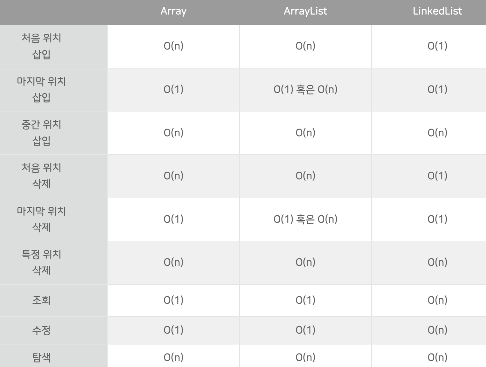

# Array, Dynamic Array (ArrayList), LinkedList

Date: 2026년 8월 6일
Status: Done

# 개념

<aside>
📜

**Array**

칸막이가 정해진 주차장

**Dynamic Array (ArrayList)**

자동 확장형 주차장

**LinkedList**

보물찾기 쪽지

</aside>

---

# Array

- 특징
    - 크기가 고정적 (선언 시 배열 크기 결정)
    - 데이터 간의 논리적 위치와 물리적 위치가 동일함
    - 조회 시 인덱스를 알고 있다면 해당 위치로 한 번에 찾아갈 수 있음 (시간복잡도 O(1))
    - 데이터의 개수가 제한돼 있고, 조회가 빈번한 경우에 사용
- 장점
    - 조회 속도가 빠름
- 단점
    - 크기 고정

---

# Dynamic Array (Array List)

- 특징
    - 공식 명칭은 Dynamic Array로 이 자료구조의 특성이 그대로 와닿음
        - 자바에선 ArrayList, C++에선 Vector
    - 기본적으로 List의 특성을 그대로 가져가지만, 내부적으로 Array를 사용한다 → 크기가 가변적인 Array
    - 데이터 간의 논리적 위치와 물리적 위치가 동일함
    - 조회 시 인덱스를 알고 있다면 해당 위치로 한 번에 찾아갈 수 있음 (시간복잡도 O(1))
    - 데이터의 개수를 정확히 모르지만, 조회가 빈번한 경우에 사용
- 장점
    - 조회 속도가 빠름
    - 데이터의 개수를 신경 쓸 필요 X
- 단점
    - 데이터 추가 시 기존 데이터를 이동시켜야하고, 크기가 꽉 찰 경우 확장(150%)하기 때문에 속도가 느려짐

---

# LinkedList

- 특징
    - 연속적이지 않는 데이터들이 연결되어 있음 → 각 데이터에 이전 및 이후 데이터의 위치 정보가 저장됨
    - 크기가 가변적
    - 데이터 조회 시 처음 또는 끝에서 순차적으로 접근해야함 (시간복잡도 O(n))
    - 삽입 및 삭제 시 데이터를 밀거나 당길 필요가 없음 (시간복잡도 O(1))
- 장점
    - 삽입 및 삭제 속도가 빠름
- 단점
    - 순차 접근으로 인해 조회 속도가 느림
    - 각 노드에 데이터 자체 뿐만 아니라 이전, 이후 노드의 주소를 저장해야 하므로 저장 공간이 추가로 소모됨

