# Day 28 Tree, Heap

## 1. 트리

### 1.1. 정의 및 특징
- **계층적 데이터 구조**, 노드(Node)와 간선(Edge)로 구성
- **비선형 자료구조** (데이터를 순차적으로 저장하지 않음)
- 사이클(Cycle) 또는 순환(Loop)을 갖지 않고 연결된 **무방향 그래프 구조**
- 두 노드 간에는 하나의 경로만 존재
- 노드가 n개인 트리는 항상 n-1개의 간선(Edge)을 가짐


### 1.2. 트리 용어
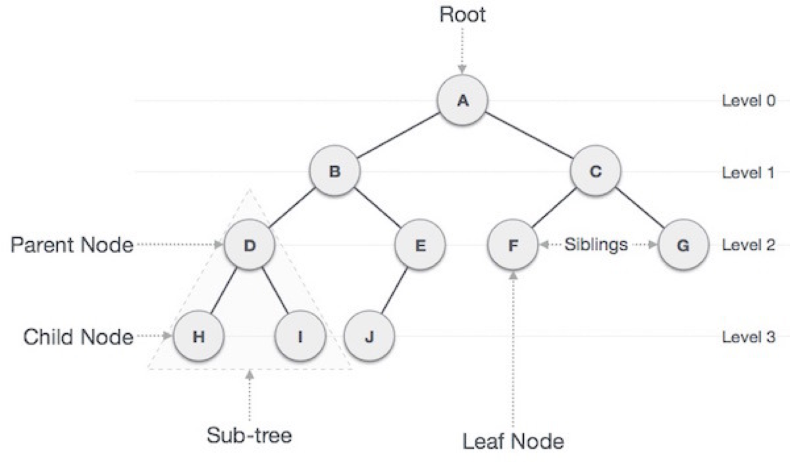


### 1.3. 이진 트리
- 각 노드가 최대 두 개의 자식을 갖는 트리
- 이진 트리 순회
    - **중회 순회(in-order traversal)**: 왼쪽 가지 -> 현재 노드 -> 오른쪽 가지
    - **전위 순회(pre-order traversal)**: 현재 노드 -> 왼쪽 가지 -> 오른쪽 가지
    - **후위 순회(post-order traversal)**: 왼쪽 가지 -> 오른쪽 가지 -> 현재 노드

#### 이진 트리의 유형
1. **전 이진 트리(Full Binary Tree)**: 모든 노드가 0개 또는 2개의 자식을 가지는 트리
2. **완전 이진 트리(Compelete Binary Tree)**: 모든 레벨이 꽉 차 있으며, 마지막 레벨은 왼족부터 노드가 채워진 트리
3. **포화 이진 트리(Perfect Binary Tree)**: 전 이진 트리이면서 완전 이진 트리인 경우. 모든 레벨이 완전히 채워진 트리

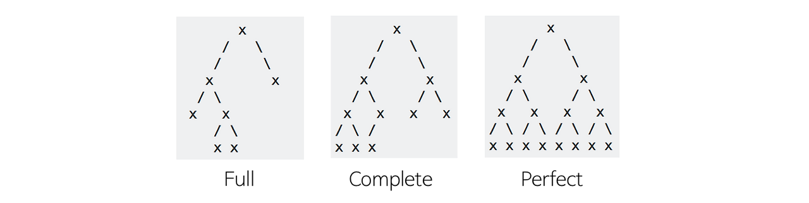


### 1.4. 트리 종류

#### 이진 탐색 트리(Binary Search Tree, BST)

##### 정의
- 각 노드가 최대 두 개의 자식을 가지는 **이진 트리(Binary Tree)**의 한 형태, 왼쪽 자식 노드의 값은 부모 노드보다 작고, 오른쪽 자식 노드의 값은 부모 노드보다 큼

##### 특징
- **정렬된 데이터 저장**: 왼쪽 서브트리는 항상 부모보다 작고, 오른쪽 서브트리는 항상 부모보다 큼
- **효율적인 탐색**: 평균 O(logN)의 시간 복잡도로 탐색, 삽입, 삭제 가능

##### 장단점
- 장점
    - 정렬된 데이터 저장
    - 평균적으로 빠른 탐색, 삽입, 삭제

- 단점
    - 편향 트리가 될 경우(예: 정렬된 데이터 삽입) 시간 복잡도가 O(n)으로 증가

##### 활용 사례
- 데이터베이스 인덱스
- 정렬된 데이터 저장 및 검색


#### AVL 트리(Adelson-Velsky and Landis Tree)

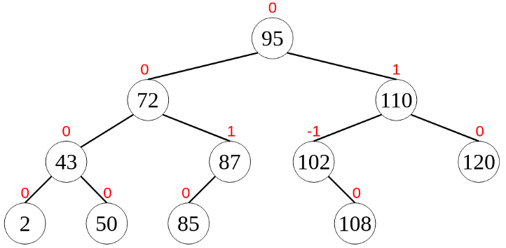

##### 정의
- 잊진 탐색 트리의 일종, 모든 노드에서 왼쪽과 오른쪽 서브트리 높이 차이가 -1,0,1로만 유지되도록 자동으로 균형을 맞춰줌

```text
BF = 0 → 왼쪽과 오른쪽 높이가 같음
BF = 1 → 왼쪽이 1만큼 더 높음
BF = -1 → 오른쪽이 1만큼 더 높음
```

##### 특징
- **균형 유지**: 높이 차이가 2 이상 발생할 경우 회전을 통해 균형을 유지
- **탐색, 삽입 삭제**: O(logn)

##### 삽입 및 삭제
- **삽입**: 새 노드 삽입 후, 높이 차이를 점검하여 불균형이 발생하면 회전 수행
- **삭제**: 노드 삭제 후, 높이 차이를 점검하여 불균형이 발생하면 회전 수행

##### 균형 유지 방법
- **LL 회전**: 왼쪽 서브트리의 왼쪽에 삽입 시
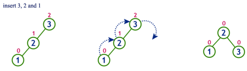


- **RR 회전**: 오른쪽 서브트리의 오른쪽에 삽입 시
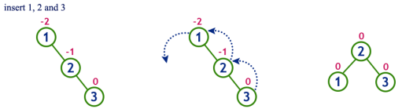


- **LR 회전**: 왼쪽 서브트리의 오른쪽에 삽입 시
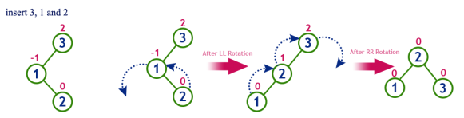


- **RL 회전**: 오른쪽 서브트리의 왼쪽에 삽입 시
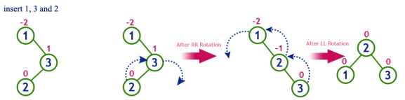


##### 장단점
- **장점**: 항상 균형이 유지되어 탐색 성능 보장
- **단점**: 삽입/삭제 시 회전 연산으로 추가 오버헤드 발생

##### 활용 사례
- 검색 시스템
- 대규모 데이터 저장 및 관리


#### 레드-블랙 트리(Red-Black Tree)

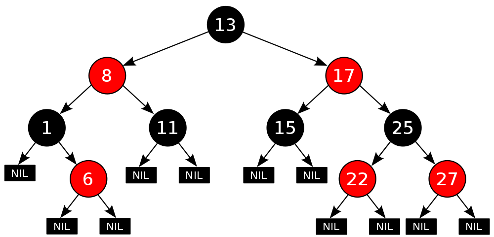

##### 정의
- **자기 군형 이진 탐색 트리**, 각 노드에 색상(빨강/검정) 부여하여 균형 유지

##### 특징
- **균형 조건**
    1. 노드는 빨강 또는 검정
    2. 루트 노드는 항상 검정
    3. 모든 리프(널) 노드는 검정
    4. 빨강 노드의 자식은 항상 검정
    5. 모든 경로에서 검정 노드의 개수는 동일

- **탐색, 삽입, 삭제**: O(logn)

##### 삽입 및 삭제
- **삽입**: 새 노드 삽입 후, 색상 및 구조를 수정하여 균형 유지
- **삭제**: 노드 삭제 후, 색상 및 구조를 수정하여 균형 유지

##### 장단점
- **장점**
    - 효율적인 균형 유지로 탐색 성능이 안정적
    - 회전 연산이 AVL 트리보다 적음

- **단점**
    - AVL 트리에 비해 균형이 덜 정밀하여 탐색이 약간 느릴 수 있음

##### 활용 사례
- 자바의 TreeMap, TreeSet 구현
- 데이터베이스 인덱스


## 2. 힙

### 2.1 정의
- 데이터의 최댓값과 최솟값을 빠르게 찾기 위해 고안된 **완전 이진 트리**
    - **최대 힙(Max-Heap)**: 부모 노드의 값이 자식 노드의 값보다 크거나 같음
    - **최소 힙(Min-Heap)**: 부모 노드의 값이 자식 노드의 값보다 작거나 같음

- 우선순위 큐를 구현하거나 정렬 알고리즘에 사용됨

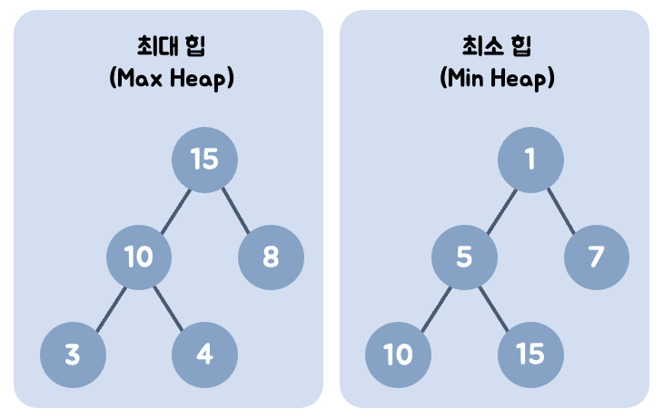

### 2.2. 특징
- **힙 속성 유지**: 삽입과 삭제 시 항상 힙 속성을 유지
- **완전 이진 트리**: 마지막 레벨을 제외한 모든 레벨이 채워지고, 마지막 레벨은 왼쪽부터 순서대로 채워짐
- **효율적인 삽입/삭제**: 삽입과 삭제는 O(logn)의 시간 복잡도를 가짐
- **정렬되지 않은 노드 간 관계**: 같은 레벨에 있는 노드 간에는 특정한 순서 관계가 없음


### 2.3. 삽입과 삭제

#### 삽입

- 트리의 가장 마지막 위치에 새 노드 삽입
- 힙 속성을 만족할 때까지 부모 노드와 비교하며 위치를 교한(상향시 조정, Up-Heap)

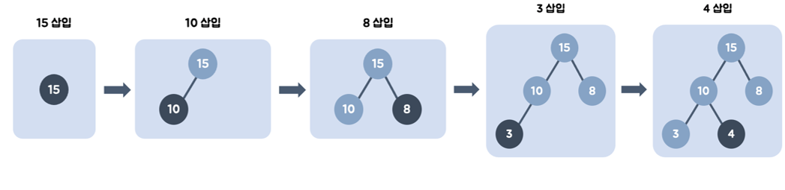

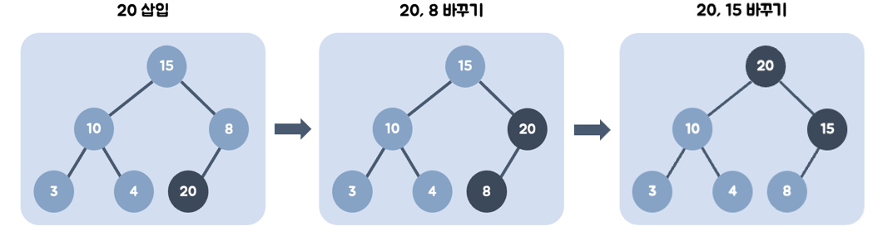


#### 삭제
- 루트 노드를 삭제(최대/최소 값 추출)
- 트리의 가장 마지막 노드를 루트로 이동
- 힙 속성을 만족할 때까지 자식 노드와 비교하며 위치를 교환(하향식 조정, Down-Heap)

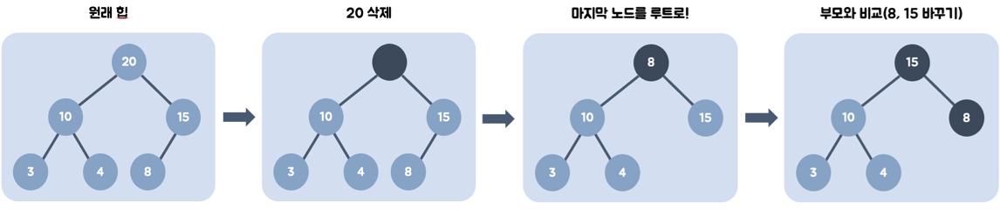


#### 활용 사례
- **우선순위 큐(Priority Queue)**: 최소/최대 값을 빠르게 추출
- **힙 정렬(Heap Sort)**: 힙을 활용한 정렬 알고리즘
- **다익스트라 알고리즘**: 최소 비용 경로 탐색


## 참고
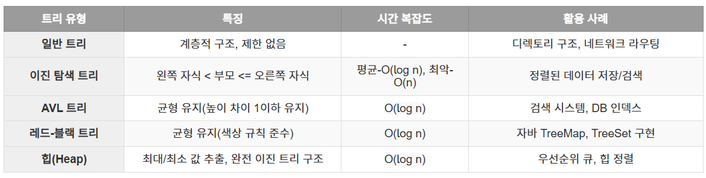