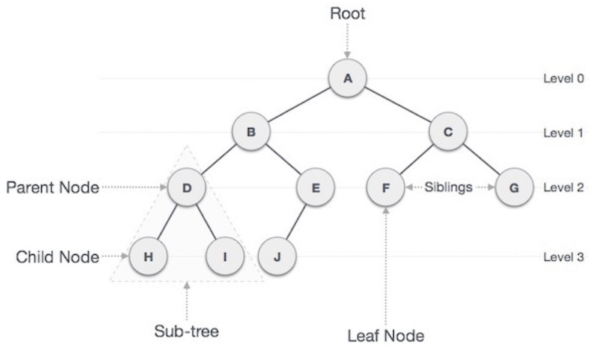
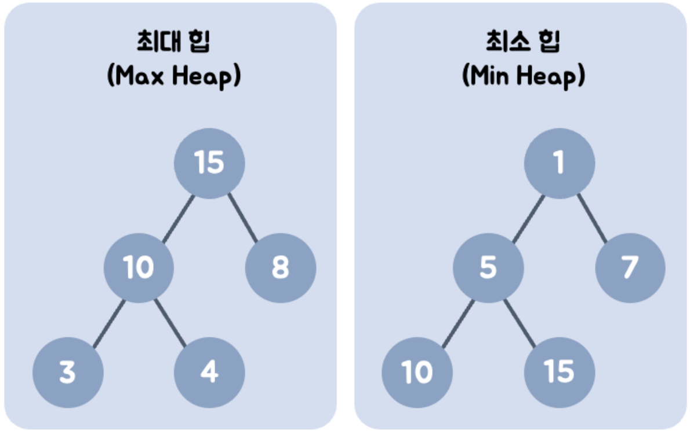
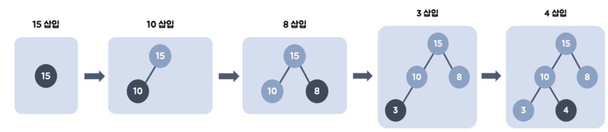
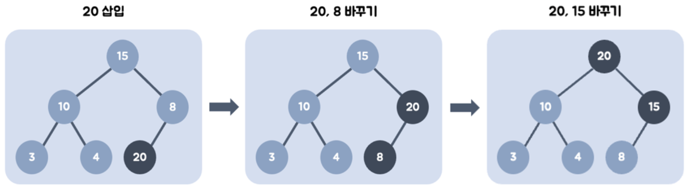
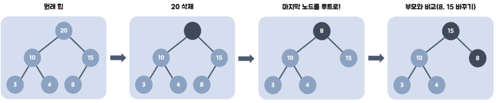

# Tree, Heap

Date: 2026년 8월 10일
Status: Done

# 개념

<aside>
📜

**Tree**

계층적 또는 부모-자식 구조로, 각 노드들이 간선으로 구성된다.

**Heap**

트리의 일종으로, 여러 개의 값 중에서 **가장 큰 값이나 가장 작은 값**을 뽑아내기 위해 고안된 **완전 이진 트리**이다.

최소 힙 : 부모 노드 ≤ 자식 노드, 루트 노드에는 항상 최솟값

최대 힙 : 부모 노드 ≥ 자식 노드, 루트 노드에는 항상 최댓값 → 정통 방식의 heap sort에서 사용

</aside>

---

# Tree

개념 자체는 이미 아니까, Tree 용어를 잘 알아두자.

- 루트 노드(root node): 부모가 없는 노드, 트리는 하나의 루트 노드만을 가진다.
- 단말 노드(leaf node): 자식이 없는 노드, ‘말단 노드’ 또는 ‘잎 노드’라고도 부른다.
- 내부(internal) 노드: 단말 노드가 아닌 노드
- 간선(edge): 노드를 연결하는 선 (link, branch 라고도 부름)
- 형제(sibling): 같은 부모를 가지는 노드
- 노드의 크기(size): 자신을 포함한 모든 자손 노드의 개수
- 노드의 깊이(depth): 루트에서 어떤 노드에 도달하기 위해 거쳐야 하는 간선의 수
- 노드의 레벨(level): 트리의 특정 깊이를 가지는 노드의 집합
- 노드의 차수(degree): 하위 트리 개수 / 간선 수 (degree) = 각 노드가 지닌 가지의 수
- 트리의 차수(degree of tree): 트리의 최대 차수
- 트리의 높이(height): 루트 노드에서 가장 깊숙히 있는 노드의 깊이

---

# Heap

구현 및 코드 상에서의 사용은 Heap Sort를 참고하고, 여기선 Heap의 특징을 잘 알아보자

- **힙 속성 유지**: 삽입과 삭제 시 항상 힙 속성을 유지.
- **완전 이진 트리**: 마지막 레벨을 제외한 모든 레벨이 채워지고, 마지막 레벨은 왼쪽부터 순서대로 채워짐.
- **효율적인 삽입/삭제**: 삽입과 삭제는 O(log n)의 시간 복잡도를 가짐.
- **정렬되지 않은 노드 간 관계**: 같은 레벨에 있는 노드 간에는 특정한 순서 관계가 없음.
- **삽입**
    - 트리의 가장 마지막 위치에 새 노드를 삽입.
    - 힙 속성을 만족할 때까지 부모 노드와 비교하며 위치를 교환(상향식 조정, Up-Heap).
    
    
    
    
    
- **삭제**
    - 루트 노드를 삭제(최대/최소 값 추출).
    - 트리의 가장 마지막 노드를 루트로 이동.
    - 힙 속성을 만족할 때까지 자식 노드와 비교하며 위치를 교환(하향식 조정, Down-Heap).

